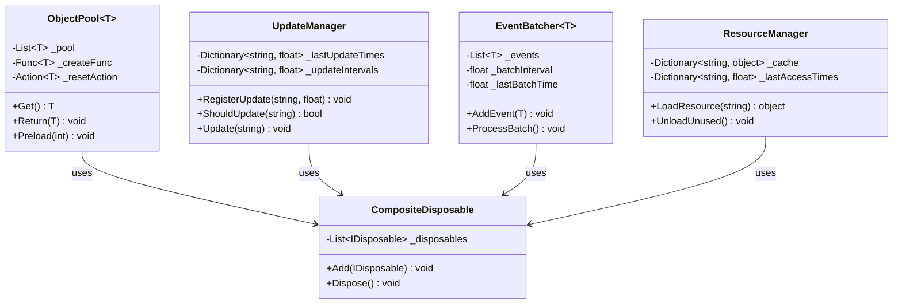
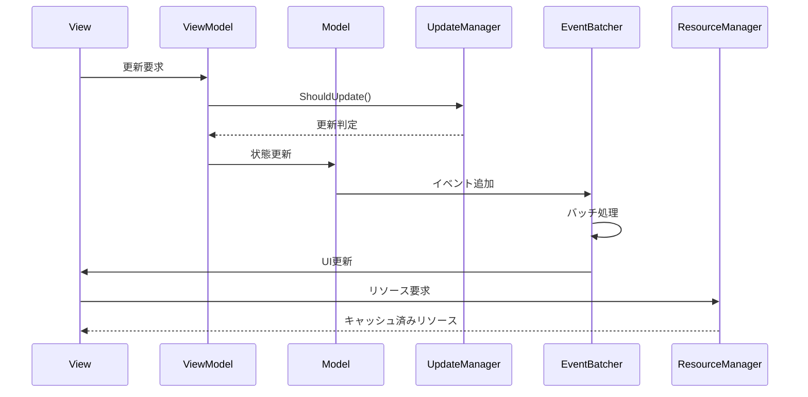
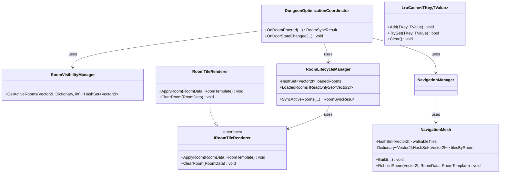

# パフォーマンス最適化詳細

## 目次

1. [概要](#1-%E6%A6%82%E8%A6%81)
2. [クラス図](#2-%E3%82%AF%E3%83%A9%E3%82%B9%E5%9B%B3)
3. [シーケンス図](#3-%E3%82%B7%E3%83%BC%E3%82%B1%E3%83%B3%E3%82%B9%E5%9B%B3)
4. [実装詳細](#4-%E5%AE%9F%E8%A3%85%E8%A9%B3%E7%B4%B0)
5. [テスト戦略](#5-%E3%83%86%E3%82%B9%E3%83%88%E6%88%A6%E7%95%A5)
6. [ダンジョン最適化の実装（Issue #97）](#6-%E3%83%80%E3%83%B3%E3%82%B8%E3%83%A7%E3%83%B3%E6%9C%80%E9%81%A9%E5%8C%96%E3%81%AE%E5%AE%9F%E8%A3%85issue-97)
7. [変更履歴](#7-%E5%A4%89%E6%9B%B4%E5%B1%A5%E6%AD%B4)

## 1. 概要

### 1.1 目的

本ドキュメントは、MVVM + リアクティブプログラミングにおけるパフォーマンス最適化の実装詳細を定義し、以下の目的を達成することを目指します：

-   メモリ使用量の最適化
-   更新処理の効率化
-   不要な処理の削減
-   開発チーム間での最適化手法の統一

### 1.2 適用範囲

-   メモリ管理
-   更新処理の最適化
-   イベント処理の最適化
-   リソース管理

メモリ管理とリソース管理に関する詳細なガイドラインは、[共通ガイドライン](../../../00_common_guidelines.md#メモリ管理)を参照してください。

## 2. クラス図



## 3. シーケンス図



## 4. 実装詳細

### 4.1 メモリ管理

#### 4.1.1 サブスクリプション管理

```csharp
public class OptimizedViewModel : IDisposable
{
    private readonly CompositeDisposable _disposables = new();
    private readonly ReactiveProperty<int> _value = new();

    public OptimizedViewModel()
    {
        // サブスクリプションをCompositeDisposableで管理
        _disposables.Add(
            _value.Subscribe(OnValueChanged)
        );
    }

    private void OnValueChanged(int value)
    {
        // 値の変更処理
    }

    public void Dispose()
    {
        _disposables.Dispose();
    }
}
```

#### 4.1.2 オブジェクトプーリング

```csharp
public class ObjectPool<T> where T : class, new()
{
    private readonly Stack<T> _pool = new();
    private readonly int _maxSize;

    public ObjectPool(int maxSize = 100)
    {
        _maxSize = maxSize;
    }

    public T Get()
    {
        return _pool.Count > 0 ? _pool.Pop() : new T();
    }

    public void Return(T item)
    {
        if (_pool.Count < _maxSize)
        {
            _pool.Push(item);
        }
    }
}

// 使用例
public class EffectManager
{
    private readonly ObjectPool<Effect> _effectPool = new();

    public void PlayEffect(Vector3 position)
    {
        var effect = _effectPool.Get();
        effect.Play(position);
        // エフェクト終了時にプールに戻す
        effect.OnComplete += () => _effectPool.Return(effect);
    }
}
```

### 4.2 更新処理の最適化

#### 4.2.1 更新頻度の制御

```csharp
public class OptimizedUpdater
{
    private readonly float _updateInterval;
    private float _accumulator;

    public OptimizedUpdater(float updateInterval = 0.1f)
    {
        _updateInterval = updateInterval;
    }

    public void Update(float delta)
    {
        _accumulator += delta;
        if (_accumulator >= _updateInterval)
        {
            PerformUpdate();
            _accumulator = 0;
        }
    }

    private void PerformUpdate()
    {
        // 更新処理
    }
}
```

#### 4.2.2 条件付き更新

```csharp
public class ConditionalUpdater
{
    private readonly ReactiveProperty<bool> _isVisible = new();
    private readonly ReactiveProperty<Vector3> _position = new();

    public ConditionalUpdater()
    {
        // 表示状態に応じて更新を制御
        _isVisible.Subscribe(isVisible =>
        {
            if (isVisible)
            {
                StartUpdate();
            }
            else
            {
                StopUpdate();
            }
        });
    }

    private void StartUpdate()
    {
        // 更新開始
    }

    private void StopUpdate()
    {
        // 更新停止
    }
}
```

### 4.3 イベント処理の最適化

#### 4.3.1 イベントのフィルタリング

```csharp
public class EventFilter
{
    private readonly GameEventBus _eventBus;
    private readonly IDisposable _subscription;

    public EventFilter(GameEventBus eventBus)
    {
        _eventBus = eventBus;
        _subscription = _eventBus
            .GetEventStream<GameEvent>()
            .Where(evt => ShouldProcessEvent(evt))
            .Subscribe(ProcessEvent);
    }

    private bool ShouldProcessEvent(GameEvent evt)
    {
        // イベントの処理条件をチェック
        return true;
    }

    private void ProcessEvent(GameEvent evt)
    {
        // イベント処理
    }
}
```

#### 4.3.2 イベントのバッチ処理

```csharp
public class EventBatcher
{
    private readonly Queue<GameEvent> _eventQueue = new();
    private readonly float _batchInterval;
    private float _accumulator;

    public EventBatcher(float batchInterval = 0.1f)
    {
        _batchInterval = batchInterval;
    }

    public void AddEvent(GameEvent evt)
    {
        _eventQueue.Enqueue(evt);
    }

    public void Update(float delta)
    {
        _accumulator += delta;
        if (_accumulator >= _batchInterval)
        {
            ProcessBatch();
            _accumulator = 0;
        }
    }

    private void ProcessBatch()
    {
        while (_eventQueue.Count > 0)
        {
            var evt = _eventQueue.Dequeue();
            ProcessEvent(evt);
        }
    }

    private void ProcessEvent(GameEvent evt)
    {
        // イベント処理
    }
}
```

### 4.4 リソース管理

#### 4.4.1 リソースの遅延読み込み

```csharp
public class LazyResourceLoader
{
    private readonly Dictionary<string, Lazy<Resource>> _resources = new();

    public void RegisterResource(string key, string path)
    {
        _resources[key] = new Lazy<Resource>(() => LoadResource(path));
    }

    public Resource GetResource(string key)
    {
        return _resources[key].Value;
    }

    private Resource LoadResource(string path)
    {
        // リソースの読み込み
        return null;
    }
}
```

#### 4.4.2 リソースのキャッシュ管理

```csharp
public class ResourceCache
{
    private readonly Dictionary<string, Resource> _cache = new();
    private readonly int _maxSize;
    private readonly Queue<string> _accessOrder = new();

    public ResourceCache(int maxSize = 100)
    {
        _maxSize = maxSize;
    }

    public Resource Get(string key)
    {
        if (_cache.TryGetValue(key, out var resource))
        {
            UpdateAccessOrder(key);
            return resource;
        }
        return null;
    }

    public void Add(string key, Resource resource)
    {
        if (_cache.Count >= _maxSize)
        {
            RemoveLeastRecentlyUsed();
        }
        _cache[key] = resource;
        _accessOrder.Enqueue(key);
    }

    private void UpdateAccessOrder(string key)
    {
        _accessOrder.Enqueue(key);
    }

    private void RemoveLeastRecentlyUsed()
    {
        var key = _accessOrder.Dequeue();
        _cache.Remove(key);
    }
}
```

## 5. テスト戦略

### 5.1 パフォーマンステスト

```csharp
[Test]
public void ObjectPool_ReuseObjects_ReducesAllocations()
{
    var pool = new ObjectPool<TestObject>();
    var initialMemory = GC.GetTotalMemory(true);

    for (int i = 0; i < 1000; i++)
    {
        var obj = pool.Get();
        pool.Return(obj);
    }

    var finalMemory = GC.GetTotalMemory(true);
    Assert.Less(finalMemory - initialMemory, 1000000);
}
```

### 5.2 メモリリークテスト

```csharp
[Test]
public void ViewModel_Dispose_CleansUpSubscriptions()
{
    var viewModel = new OptimizedViewModel();
    var weakRef = new WeakReference(viewModel);

    viewModel.Dispose();
    viewModel = null;
    GC.Collect();

    Assert.IsFalse(weakRef.IsAlive);
}
```

## 6. ダンジョン最適化の実装（Issue #97）

### 6.1 背景

[Issue #97](https://github.com/nel2116/GodotGame/issues/97) は `Docs/06_DevelopmentPlan/11_20_optimization_implementation_plan.md` を仕様として、ダンジョン生成システムのメモリ削減・更新処理最適化を要求している。同計画書は大規模・動的ストリーミングされるダンジョン（`Camera3D`のフラスタムカリング、GCしきい値監視、タイルオブジェクトプール等）を前提にしていたが、実装済みのダンジョンシステム（`Scripts/Systems/Dungeon/`）は1フロア固定8部屋・単一の共有 `TileMapLayer`・部屋グラフ構造の2Dシステムであり、前提が大きく異なっていた。

そのため、計画書の18クラス構成をそのまま実装するのではなく、実在する処理（タイル描画・ナビゲーションメッシュ再構築・部屋読み込み判定）に対して実効性のある最適化を行う方針で、`Scripts/Systems/Dungeon/Optimization/` 配下に以下を実装した。将来の部屋数・フロア数の規模拡大に耐えられるよう、部屋グラフのBFSを基準にした汎用的な設計としている。

### 6.2 実装したクラス



| 分類 | クラス | 役割 |
| --- | --- | --- |
| 部屋の読み込み最適化 | `RoomVisibilityManager` | 現在部屋から扉グラフ上をBFSで辿り、指定ホップ数以内の部屋を「アクティブな部屋集合」として算出する（`Camera3D`のフラスタムではなく部屋グラフを基準） |
| | `IRoomTileRenderer` / `RoomTileRenderer` | 単一の共有 `TileMapLayer` への部屋単位のタイル反映・消去を担う境界インターフェースと実装 |
| | `RoomLifecycleManager` | アクティブな部屋集合と読み込み済み集合の差分を取り、新規読み込み・解放を1回の呼び出しでまとめて行う |
| | `DungeonOptimizationCoordinator` | 上記を束ね、部屋入室・扉状態変化に応じた処理を `DungeonViewModel` に提供するファサード |
| 更新処理最適化 | `NavigationMesh.RebuildRoom` / `NavigationManager.RebuildRooms` | ギミック発動等で影響範囲が既知の場合に、変化した部屋のみナビゲーションメッシュを再構築する（全体再構築 `Build`/`BuildMesh` の代替） |
| 将来拡張の受け皿 | `LruCache<TKey, TValue>` | 汎用LRUキャッシュ。`TileSetManager` 等、将来.tresアセットの実読み込みが増えた際の受け皿として用意（現状のテンプレート数では効果は限定的） |

### 6.3 完了条件の達成方法

Issueが定義する数値目標（メモリ使用量-50%、更新処理+30%、イベント処理+50%）は、対象システムの規模（8部屋・単一TileMapLayer）では意味のある独立測定が困難なため、達成率の数値報告は行わず、以下を設計・テストで裏付けている。

- **メモリ**: タイルマップに常駐するセル数が「全部屋分」から「アクティブな部屋集合分」に比例するようになったこと（`RoomLifecycleManager`、`DungeonView` から全部屋即時描画 `RenderRooms` を廃止）
- **更新処理**: ナビゲーションメッシュの再構築コストが O(全部屋) から O(変化した部屋数) になったこと（`NavigationMesh.RebuildRoom`。`NavigationMeshTests.RebuildRoom_DoesNotAffectOtherRoomsTiles` 等で検証）
- **イベント処理**: 部屋の読み込み・解放が複数回のイベント発行ではなく、1回の入室/生成につき1回の `RoomsVisibilityChangedEvent` にまとめて発行されるようになったこと（`RoomLifecycleManagerTests` で検証）

テストは `Tests/Core/Dungeon/Optimization/` 配下に新規追加し、`Tests/Core/CoreTests.csproj` に `coverlet.collector` を追加してローカルでカバレッジ計測できるようにした（`dotnet test --collect:"XPlat Code Coverage"`）。CIワークフロー（`Godot_CI.yml`）への `dotnet test` 組み込みは本Issueのスコープ外とし、別途検討する。

## 7. 変更履歴

| バージョン | 更新日     | 変更内容                                                                                                                   |
| ---------- | ---------- | -------------------------------------------------------------------------------------------------------------------------- |
| 0.2.0      | 2026-07-18 | Issue #97 対応: ダンジョン最適化（`Scripts/Systems/Dungeon/Optimization/`）の実装内容を追記                                |
| 0.1.1      | 2025-06-13 | 目次追加とメタデータ更新                                                                                                   |
| 0.1.0      | 2024-03-21 | 初版作成<br>- パフォーマンス最適化の実装詳細を定義<br>- メモリ管理、更新処理、イベント処理、リソース管理の最適化手法を記載 |
