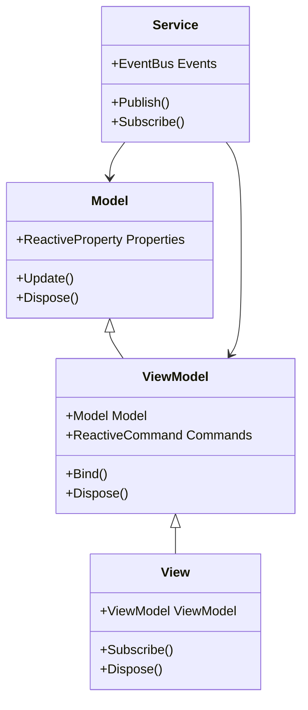
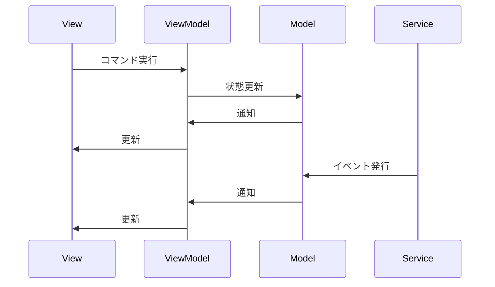
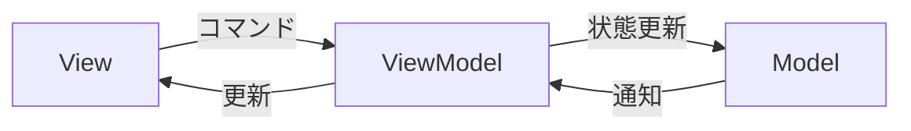

# MVVM+RX 詳細設計書

## 目次

1. [概要](#1-概要)
2. [コアコンポーネント](#2-コアコンポーネント)
3. [システム設計](#3-システム設計)
4. [インターフェース設計](#4-インターフェース設計)
5. [データフロー](#5-データフロー)
6. [エラー処理](#6-エラー処理)
7. [ベストプラクティス](#7-ベストプラクティス)
8. [制限事項](#8-制限事項)
9. [変更履歴](#9-変更履歴)

## 1. 概要

### 1.1 目的

-   MVVM パターンとリアクティブプログラミングの統合
-   保守性と拡張性の高いアーキテクチャの実現
-   テスト容易性の確保

### 1.2 対象システム

-   プレイヤーシステム
-   スキルシステム
-   アニメーションシステム
-   サウンドシステム
-   UI システム

## 2. コアコンポーネント

### 2.1 システム全体のクラス図



### 2.2 システム間の相互作用



## 3. システム設計

### 3.1 プレイヤーシステム

```csharp
public class PlayerModel
{
    public ReactiveProperty<float> Health { get; } = new();
    public ReactiveProperty<float> MaxHealth { get; } = new();
    public ReactiveProperty<int> ShadowFragments { get; } = new();

    public void TakeDamage(float damage)
    {
        Health.Value = Math.Max(0, Health.Value - damage);
    }

    public void Heal(float amount)
    {
        Health.Value = Math.Min(MaxHealth.Value, Health.Value + amount);
    }
}

public class PlayerViewModel
{
    private readonly PlayerModel _model;
    public ReactiveProperty<string> HealthText { get; } = new();
    public ReactiveProperty<float> HealthPercentage { get; } = new();
    public ReactiveCommand TakeDamageCommand { get; }
    public ReactiveCommand HealCommand { get; }

    public PlayerViewModel(PlayerModel model)
    {
        _model = model;
        _model.Health.Subscribe(UpdateHealthDisplay);
        TakeDamageCommand = new ReactiveCommand<float>(damage => _model.TakeDamage(damage));
        HealCommand = new ReactiveCommand<float>(amount => _model.Heal(amount));
    }

    private void UpdateHealthDisplay(float health)
    {
        HealthText.Value = $"HP: {health}/{_model.MaxHealth.Value}";
        HealthPercentage.Value = health / _model.MaxHealth.Value;
    }
}
```

### 3.2 スキルシステム

```csharp
public class SkillModel
{
    public ReactiveProperty<float> Cooldown { get; } = new();
    public ReactiveProperty<bool> IsReady { get; } = new();
    public ReactiveProperty<float> ManaCost { get; } = new();

    public void UseSkill()
    {
        if (!IsReady.Value) return;
        IsReady.Value = false;
        StartCooldown();
    }

    private async void StartCooldown()
    {
        await Task.Delay(TimeSpan.FromSeconds(Cooldown.Value));
        IsReady.Value = true;
    }
}

public class SkillViewModel
{
    private readonly SkillModel _model;
    public ReactiveProperty<string> CooldownText { get; } = new();
    public ReactiveProperty<bool> CanUse { get; } = new();
    public ReactiveCommand UseSkillCommand { get; }

    public SkillViewModel(SkillModel model)
    {
        _model = model;
        _model.Cooldown.Subscribe(UpdateCooldownDisplay);
        _model.IsReady.Subscribe(UpdateCanUse);
        UseSkillCommand = new ReactiveCommand(() => _model.UseSkill());
    }

    private void UpdateCooldownDisplay(float cooldown)
    {
        CooldownText.Value = cooldown > 0 ? $"{cooldown:F1}s" : "Ready";
    }

    private void UpdateCanUse(bool isReady)
    {
        CanUse.Value = isReady;
    }
}
```

## 4. インターフェース設計

### 4.1 基本インターフェース

```csharp
public interface IModel
{
    void Update();
    void Dispose();
}

public interface IViewModel
{
    void Bind();
    void Dispose();
}

public interface IView
{
    void Subscribe();
    void Dispose();
}

public interface IService
{
    void Publish<T>(T eventData);
    IDisposable Subscribe<T>(Action<T> onNext);
}
```

### 4.2 イベントインターフェース

```csharp
public interface IEventBus
{
    void Publish<T>(T eventData);
    IDisposable Subscribe<T>(Action<T> onNext);
    void Dispose();
}

public interface IEventFilter
{
    bool ShouldPublish<T>(T eventData);
    bool ShouldSubscribe<T>(Action<T> onNext);
}
```

## 5. データフロー

### 5.1 一方向データフロー



### 5.2 イベントフロー


## 6. エラー処理

### 6.1 エラーハンドリング

```csharp
public class ErrorHandler
{
    private readonly ILogger _logger;
    private readonly IEventBus _eventBus;

    public ErrorHandler(ILogger logger, IEventBus eventBus)
    {
        _logger = logger;
        _eventBus = eventBus;
    }

    public void HandleError(Exception ex, string context)
    {
        _logger.LogError($"Error in {context}: {ex.Message}");
        _eventBus.Publish(new ErrorEvent(ex, context));
    }
}
```

### 6.2 リカバリー処理

```csharp
public class RecoveryManager
{
    private readonly IEventBus _eventBus;
    private readonly Dictionary<string, Action> _recoveryActions;

    public RecoveryManager(IEventBus eventBus)
    {
        _eventBus = eventBus;
        _recoveryActions = new Dictionary<string, Action>();
    }

    public void RegisterRecovery(string context, Action recoveryAction)
    {
        _recoveryActions[context] = recoveryAction;
    }

    public void HandleRecovery(string context)
    {
        if (_recoveryActions.TryGetValue(context, out var action))
        {
            action();
        }
    }
}
```

## 7. ベストプラクティス

### 7.1 メモリ管理

-   適切なタイミングで Dispose を呼び出す
-   循環参照を避ける
-   リソースを適切に解放する

### 7.2 パフォーマンス

-   重い処理は非同期で実行する
-   更新頻度を最適化する
-   リソース使用量を制御する

### 7.3 テスト

-   単体テストを書く
-   統合テストを書く
-   モックを活用する

## 8. 制限事項

### 8.1 メモリ管理

-   適切なタイミングで Dispose を呼び出す必要がある
-   循環参照に注意が必要
-   リソースの適切な解放

### 8.2 パフォーマンス

-   重い処理は非同期で実行する
-   更新頻度の最適化
-   リソース使用量の制御

### 8.3 スレッドセーフ

-   マルチスレッド環境での使用には注意が必要
-   適切な同期処理を実装する
-   UI スレッドとの連携に注意

## 9. 変更履歴

| バージョン | 更新日     | 変更内容                                                                                       |
| ---------- | ---------- | ---------------------------------------------------------------------------------------------- |
| 0.2.0      | 2024-03-23 | 機能拡張<br>- コアコンポーネントの追加<br>- システム設計の追加<br>- インターフェース設計の追加 |
| 0.1.0      | 2024-03-21 | 初版作成<br>- 基本設計の追加<br>- エラー処理の定義<br>- ベストプラクティスの追加               |
