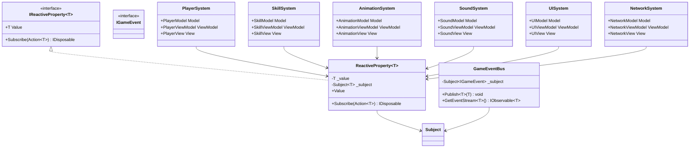

# MVVM + リアクティブプログラミング 詳細設計書

## 1. 概要

### 1.1 目的

本ドキュメントは、Shrine of the Lost Ones における MVVM + リアクティブプログラミングの詳細な実装方針を定義し、以下の目的を達成することを目指します：

-   具体的な実装パターンの確立
-   開発チーム間での実装の一貫性確保
-   保守性と拡張性の高いコードベースの構築
-   パフォーマンス最適化の指針提供

### 1.2 適用範囲

-   ゲームコアシステム
-   UI/UX システム
-   データ管理システム
-   イベントシステム
-   アニメーションシステム
-   サウンドシステム

## 2. 詳細設計

### 2.1 コアコンポーネント

#### 2.1.1 システム全体のクラス図



#### 2.1.2 システム間の相互作用


### 2.2 システム別実装詳細

#### 2.2.1 プレイヤーシステム

```csharp
// Model
public class PlayerModel
{
    public ReactiveProperty<float> Health { get; } = new(100f);
    public ReactiveProperty<float> MaxHealth { get; } = new(100f);
    public ReactiveProperty<int> ShadowFragments { get; } = new(0);
    public ReactiveProperty<Vector2> Position { get; } = new(Vector2.Zero);
    public ReactiveProperty<PlayerState> State { get; } = new(PlayerState.Idle);

    public void TakeDamage(float damage)
    {
        Health.Value = Mathf.Max(0, Health.Value - damage);
        if (Health.Value <= 0)
        {
            State.Value = PlayerState.Dead;
            GameEventBus.Publish(new PlayerDeathEvent());
        }
    }
}

// ViewModel
public class PlayerViewModel
{
    private readonly PlayerModel _model;
    public ReactiveProperty<string> HealthText { get; } = new();
    public ReactiveProperty<float> HealthPercentage { get; } = new();
    public ReactiveProperty<bool> IsDead { get; } = new();

    public PlayerViewModel(PlayerModel model)
    {
        _model = model;
        SetupSubscriptions();
    }

    private void SetupSubscriptions()
    {
        _model.Health.Subscribe(UpdateHealthDisplay);
        _model.State.Subscribe(state => IsDead.Value = state == PlayerState.Dead);
    }

    private void UpdateHealthDisplay(float health)
    {
        HealthText.Value = $"HP: {health}/{_model.MaxHealth.Value}";
        HealthPercentage.Value = health / _model.MaxHealth.Value;
    }
}

// View
public partial class PlayerView : Node2D
{
    private PlayerViewModel _viewModel;
    private IDisposable _healthSubscription;
    private IDisposable _stateSubscription;

    public override void _Ready()
    {
        _viewModel = new PlayerViewModel(new PlayerModel());
        SetupBindings();
    }

    private void SetupBindings()
    {
        _healthSubscription = _viewModel.HealthText.Subscribe(text =>
            GetNode<Label>("HealthLabel").Text = text);

        _stateSubscription = _viewModel.IsDead.Subscribe(isDead =>
            GetNode<AnimationPlayer>("AnimationPlayer").Play(isDead ? "Death" : "Idle"));
    }

    public override void _ExitTree()
    {
        _healthSubscription?.Dispose();
        _stateSubscription?.Dispose();
    }
}
```

#### 2.2.2 スキルシステム

```csharp
// Model
public class SkillModel
{
    public ReactiveProperty<bool> IsUnlocked { get; } = new(false);
    public ReactiveProperty<int> Level { get; } = new(0);
    public ReactiveProperty<float> Cooldown { get; } = new(0f);
    public ReactiveProperty<float> MaxCooldown { get; } = new(5f);

    public void UseSkill()
    {
        if (IsUnlocked.Value && Cooldown.Value <= 0)
        {
            Cooldown.Value = MaxCooldown.Value;
            GameEventBus.Publish(new SkillUsedEvent(this));
        }
    }

    public void UpdateCooldown(float delta)
    {
        if (Cooldown.Value > 0)
        {
            Cooldown.Value = Mathf.Max(0, Cooldown.Value - delta);
        }
    }
}

// ViewModel
public class SkillViewModel
{
    private readonly SkillModel _model;
    public ReactiveProperty<string> StatusText { get; } = new();
    public ReactiveProperty<bool> IsAvailable { get; } = new();
    public ReactiveProperty<float> CooldownPercentage { get; } = new();

    public SkillViewModel(SkillModel model)
    {
        _model = model;
        SetupSubscriptions();
    }

    private void SetupSubscriptions()
    {
        _model.IsUnlocked.Subscribe(UpdateStatus);
        _model.Cooldown.Subscribe(UpdateCooldown);
    }

    private void UpdateStatus(bool isUnlocked)
    {
        StatusText.Value = isUnlocked ? "使用可能" : "未解放";
        IsAvailable.Value = isUnlocked && _model.Cooldown.Value <= 0;
    }

    private void UpdateCooldown(float cooldown)
    {
        CooldownPercentage.Value = 1 - (cooldown / _model.MaxCooldown.Value);
        IsAvailable.Value = _model.IsUnlocked.Value && cooldown <= 0;
    }
}
```

### 2.3 パフォーマンス最適化

#### 2.3.1 メモリ管理

```csharp
public class DisposableManager
{
    private readonly List<IDisposable> _disposables = new();

    public void Add(IDisposable disposable)
    {
        _disposables.Add(disposable);
    }

    public void DisposeAll()
    {
        foreach (var disposable in _disposables)
        {
            disposable.Dispose();
        }
        _disposables.Clear();
    }
}
```

#### 2.3.2 更新最適化

```csharp
public class UpdateOptimizer
{
    private readonly float _updateInterval;
    private float _timeSinceLastUpdate;

    public UpdateOptimizer(float updateInterval = 0.1f)
    {
        _updateInterval = updateInterval;
    }

    public bool ShouldUpdate(float delta)
    {
        _timeSinceLastUpdate += delta;
        if (_timeSinceLastUpdate >= _updateInterval)
        {
            _timeSinceLastUpdate = 0;
            return true;
        }
        return false;
    }
}
```

## 3. 実装ガイドライン

### 3.1 命名規則

#### 3.1.1 クラス命名

-   Model: `[機能名]Model`
-   ViewModel: `[機能名]ViewModel`
-   View: `[機能名]View`
-   Service: `[機能名]Service`
-   Event: `[機能名]Event`

#### 3.1.2 プロパティ命名

-   リアクティブプロパティ: `[プロパティ名]`
-   通常のプロパティ: `[プロパティ名]`
-   プライベートフィールド: `_[フィールド名]`

### 3.2 ディレクトリ構造

```
Assets/
├── Scripts/
│   ├── Core/
│   │   ├── Reactive/
│   │   ├── Events/
│   │   └── Utils/
│   ├── Models/
│   │   ├── Player/
│   │   ├── Skills/
│   │   └── Items/
│   ├── ViewModels/
│   │   ├── Player/
│   │   ├── Skills/
│   │   └── UI/
│   ├── Views/
│   │   ├── Player/
│   │   ├── Skills/
│   │   └── UI/
│   └── Services/
│       ├── Resource/
│       ├── Save/
│       └── Event/
```

## 4. テスト戦略

### 4.1 単体テスト

```csharp
[Test]
public void PlayerModel_TakeDamage_HealthDecreases()
{
    var model = new PlayerModel();
    float initialHealth = model.Health.Value;
    float damage = 10f;

    model.TakeDamage(damage);

    Assert.AreEqual(initialHealth - damage, model.Health.Value);
}

[Test]
public void PlayerViewModel_HealthUpdate_TextUpdates()
{
    var model = new PlayerModel();
    var viewModel = new PlayerViewModel(model);
    string expectedText = "HP: 90/100";

    model.Health.Value = 90;

    Assert.AreEqual(expectedText, viewModel.HealthText.Value);
}
```

### 4.2 統合テスト

```csharp
[Test]
public void PlayerSystem_DeathEvent_TriggersAnimation()
{
    var model = new PlayerModel();
    var viewModel = new PlayerViewModel(model);
    var view = new PlayerView();
    bool animationTriggered = false;

    view.SetupBindings(viewModel);
    view.OnDeathAnimation += () => animationTriggered = true;

    model.TakeDamage(model.Health.Value);

    Assert.IsTrue(animationTriggered);
}
```

### 4.3 システム別テスト

#### アニメーションシステム

```csharp
[Test]
public void AnimationSystem_BlendTree_TransitionsSmoothly()
{
    var model = new AnimationModel();
    var viewModel = new AnimationViewModel(model);
    var view = new AnimationView();
    bool blendTransitioned = false;

    view.SetupBindings(viewModel);
    view.OnBlendTransition += () => blendTransitioned = true;

    model.BlendTo(AnimationState.Walk, 0.5f);

    Assert.IsTrue(blendTransitioned);
}

[Test]
public void AnimationSystem_EventHandling_TriggersCorrectly()
{
    var model = new AnimationModel();
    var viewModel = new AnimationViewModel(model);
    var view = new AnimationView();
    bool eventTriggered = false;

    view.SetupBindings(viewModel);
    view.OnAnimationEvent += (eventName) => eventTriggered = true;

    model.TriggerEvent("footstep");

    Assert.IsTrue(eventTriggered);
}
```

#### サウンドシステム

```csharp
[Test]
public void SoundSystem_Mixing_AppliesCorrectly()
{
    var model = new SoundModel();
    var viewModel = new SoundViewModel(model);
    var view = new SoundView();
    bool mixingApplied = false;

    view.SetupBindings(viewModel);
    view.OnMixingApplied += () => mixingApplied = true;

    model.ApplyMixing(new SoundMix());

    Assert.IsTrue(mixingApplied);
}

[Test]
public void SoundSystem_SpatialAudio_UpdatesPosition()
{
    var model = new SoundModel();
    var viewModel = new SoundViewModel(model);
    var view = new SoundView();
    bool positionUpdated = false;

    view.SetupBindings(viewModel);
    view.OnPositionUpdate += () => positionUpdated = true;

    model.UpdateSoundPosition(Vector3.One);

    Assert.IsTrue(positionUpdated);
}
```

#### UI システム

```csharp
[Test]
public void UISystem_Layout_UpdatesCorrectly()
{
    var model = new UIModel();
    var viewModel = new UIViewModel(model);
    var view = new UIView();
    bool layoutUpdated = false;

    view.SetupBindings(viewModel);
    view.OnLayoutUpdate += () => layoutUpdated = true;

    model.UpdateLayout(new UILayout());

    Assert.IsTrue(layoutUpdated);
}

[Test]
public void UISystem_Theme_AppliesCorrectly()
{
    var model = new UIModel();
    var viewModel = new UIViewModel(model);
    var view = new UIView();
    bool themeApplied = false;

    view.SetupBindings(viewModel);
    view.OnThemeApplied += () => themeApplied = true;

    model.ApplyTheme(new UITheme());

    Assert.IsTrue(themeApplied);
}
```

## 5. 変更履歴

| バージョン | 更新日     | 変更内容                           |
| ---------- | ---------- | ---------------------------------- |
| 0.1.0      | 2024-03-21 | 初版作成                           |
| 0.2.0      | 2024-03-23 | 更新日付とリンクドキュメントの追加 |
| 0.3.0      | 2024-03-23 | 新規システムのテストケースを追加   |
| 0.4.0      | 2024-03-23 | ネットワークシステムの削除         |
