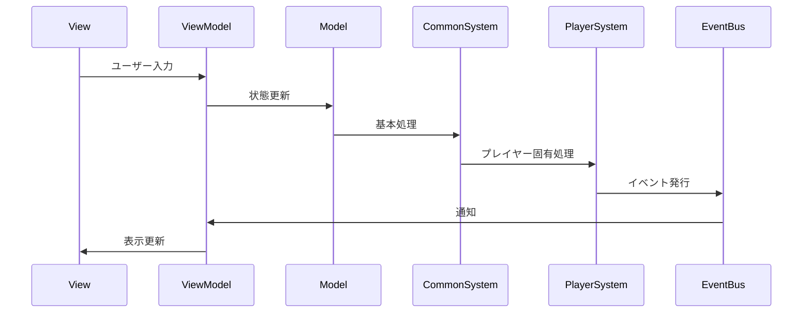
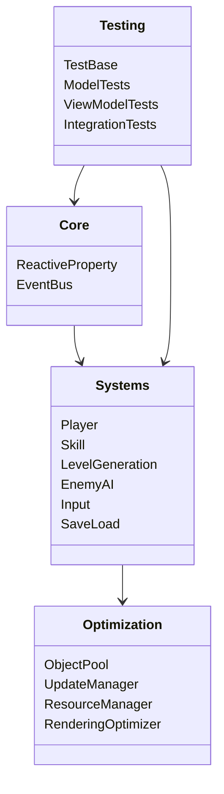
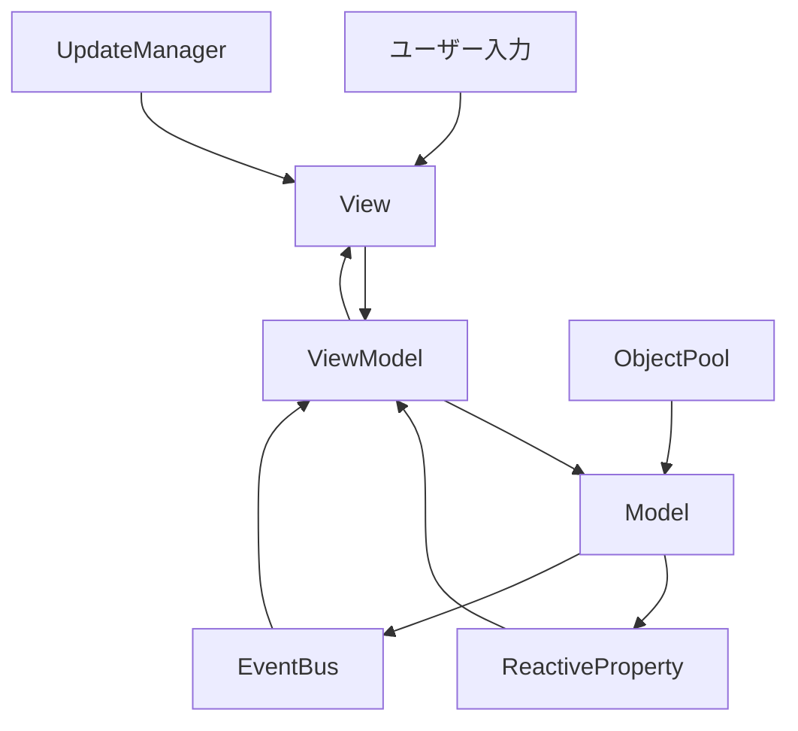

# MVVM+RX アーキテクチャ全体図

# 目次

1. [概要](#1-概要)
2. [全体クラス図](#2-全体クラス図)
3. [コンポーネント間の相互作用](#3-コンポーネント間の相互作用)
4. [パッケージ構造](#4-パッケージ構造)
5. [主要コンポーネントの説明](#5-主要コンポーネントの説明)
6. [データフロー](#6-データフロー)
7. [変更履歴](#7-変更履歴)

## 1. 概要

### 1.1 目的

本ドキュメントは、MVVM + リアクティブプログラミングアーキテクチャの全体像を視覚的に表現し、以下の目的を達成することを目指します：

-   システム全体の構造の把握
-   コンポーネント間の関係性の理解
-   データフローの可視化
-   テスト戦略の全体像の把握

### 1.2 適用範囲

-   コアコンポーネント
-   共通システム
-   システム実装
-   パフォーマンス最適化
-   テスト戦略

## 2. 全体クラス図

```mermaid
classDiagram
    %% コアコンポーネント
    class IReactiveProperty~T~ {
        <<interface>>
        +T Value
        +Subscribe(Action~T~) IDisposable
    }

    class ReactiveProperty~T~ {
        -T _value
        -Subject~T~ _subject
        +Value
        +Subscribe(Action~T~) IDisposable
    }

    class IGameEvent {
        <<interface>>
    }

    class GameEventBus {
        -Subject~IGameEvent~ _subject
        +Publish~T~(T) void
        +GetEventStream~T~() IObservable~T~
    }

    %% 共通システム
    class MovementSystemBase {
        <<interface>>
        +Move()
        +Jump()
        +Dash()
    }

    class CombatSystemBase {
        <<interface>>
        +Attack()
        +Defend()
        +UseSkill()
    }

    class AnimationSystemBase {
        <<interface>>
        +PlayAnimation()
        +StopAnimation()
        +UpdateAnimation()
    }

    class StateSystemBase {
        <<interface>>
        +ChangeState()
        +AddState()
        +RemoveState()
    }

    %% プレイヤーシステム
    class PlayerSystem {
        +PlayerInputSystem InputSystem
        +PlayerMovementSystem MovementSystem
        +PlayerCombatSystem CombatSystem
        +PlayerAnimationSystem AnimationSystem
        +PlayerStateSystem StateSystem
        +PlayerProgressionSystem ProgressionSystem
        +Initialize()
        +Update()
        +Dispose()
    }

    class PlayerMovementSystem {
        +ReactiveProperty~Vector2~ Velocity
        +ReactiveProperty~bool~ IsGrounded
        +ReactiveProperty~bool~ IsDashing
        +Move(Vector2) void
        +Jump() void
        +Dash() void
    }

    class PlayerCombatSystem {
        +ReactiveProperty~float~ AttackPower
        +ReactiveProperty~float~ Defense
        +ReactiveProperty~List~Skill~~ Skills
        +Attack() void
        +Defend() void
        +UseSkill(Skill) void
    }

    class PlayerAnimationSystem {
        +ReactiveProperty~string~ CurrentAnimation
        +ReactiveProperty~bool~ IsPlaying
        +PlayAnimation(string) void
        +StopAnimation() void
        +UpdateAnimation() void
    }

    class PlayerStateSystem {
        +ReactiveProperty~string~ CurrentState
        +ReactiveProperty~Dictionary~string, float~~ BuffEffects
        +ReactiveProperty~Dictionary~string, float~~ DebuffEffects
        +ChangeState(string) void
        +ApplyBuff(string, float) void
        +RemoveBuff(string) void
    }

    %% その他のシステム
    class SkillSystem {
        +ReactiveProperty~List~Skill~~ UnlockedSkills
        +ReactiveProperty~int~ SkillPoints
        +UnlockSkill(Skill) void
        +UpgradeSkill(Skill) void
    }

    class LevelGenerationSystem {
        +ReactiveProperty~LevelData~ CurrentLevel
        +ReactiveProperty~float~ Difficulty
        +GenerateLevel() void
        +AdjustDifficulty(float) void
    }

    class EnemyAISystem {
        +ReactiveProperty~List~EnemyBehavior~~ Behaviors
        +ReactiveProperty~float~ Difficulty
        +UpdateBehavior() void
        +AdjustDifficulty(float) void
    }

    class InputSystem {
        +ReactiveProperty~InputConfig~ Config
        +HandleKeyboardInput() void
        +HandleGamepadInput() void
        +UpdateConfig(InputConfig) void
    }

    class SaveLoadSystem {
        +ReactiveProperty~SaveData~ CurrentSave
        +AutoSave() void
        +QuickSave() void
        +LoadGame(string) void
    }

    %% パフォーマンス最適化
    class ObjectPool~T~ {
        -List~T~ _pool
        +Get() T
        +Return(T) void
        +ResizePool(int) void
    }

    class UpdateManager {
        -Dictionary~string, float~ _lastUpdateTimes
        +ShouldUpdate(string) bool
        +SetLOD(string, int) void
    }

    class ResourceManager {
        -Dictionary~string, object~ _cache
        +LoadAsync(string) Task
        +CacheResource(string, object) void
    }

    %% テスト戦略
    class TestBase {
        #GameEventBus _eventBus
        +Setup() void
        +TearDown() void
    }

    class ModelTestBase~T~ {
        #T _model
        +AssertModelState() void
        +TestValidation() void
    }

    class ViewModelTestBase~T~ {
        #T _viewModel
        +TestUIUpdates() void
        +TestCommandExecution() void
    }

    class IntegrationTestBase {
        #List~ISystem~ _systems
        +TestSystemIntegration() void
        +TestEndToEnd() void
    }

    %% 関係性
    IReactiveProperty <|.. ReactiveProperty
    ReactiveProperty --> Subject
    GameEventBus --> Subject

    MovementSystemBase <|-- PlayerMovementSystem
    CombatSystemBase <|-- PlayerCombatSystem
    AnimationSystemBase <|-- PlayerAnimationSystem
    StateSystemBase <|-- PlayerStateSystem

    PlayerSystem --> PlayerMovementSystem
    PlayerSystem --> PlayerCombatSystem
    PlayerSystem --> PlayerAnimationSystem
    PlayerSystem --> PlayerStateSystem

    PlayerMovementSystem --> ReactiveProperty
    PlayerCombatSystem --> ReactiveProperty
    PlayerAnimationSystem --> ReactiveProperty
    PlayerStateSystem --> ReactiveProperty

    TestBase --> GameEventBus
    ModelTestBase --|> TestBase
    ViewModelTestBase --|> TestBase
    IntegrationTestBase --|> TestBase
```

## 3. コンポーネント間の相互作用

## 4. パッケージ構造

## 5. 主要コンポーネントの説明

### 5.1 コアコンポーネント

-   **ReactiveProperty**: 値の変更を監視し、通知するための基本コンポーネント
    -   型安全な値の保持と変更通知
    -   複数の購読者への一括通知
    -   メモリリーク防止のための自動購読解除機能
-   **EventBus**: システム全体でのイベントの伝播を管理
    -   型安全なイベント発行と購読
    -   非同期イベント処理のサポート
    -   イベントの優先順位付け機能
-   **Subject**: リアクティブプログラミングの中核となるオブザーバブルパターンの実装
    -   複数のストリームの合成
    -   エラーハンドリング
    -   完了通知のサポート

### 5.2 共通システム

-   **MovementSystemBase**: 共通の移動システムのインターフェース
-   **CombatSystemBase**: 共通の戦闘システムのインターフェース
-   **AnimationSystemBase**: 共通のアニメーションシステムのインターフェース
-   **StateSystemBase**: 共通の状態システムのインターフェース

### 5.3 システム実装

-   **PlayerSystem**: プレイヤーシステムの統合
-   **PlayerMovementSystem**: プレイヤーの移動システム
-   **PlayerCombatSystem**: プレイヤーの戦闘システム
-   **PlayerAnimationSystem**: プレイヤーのアニメーションシステム
-   **PlayerStateSystem**: プレイヤーの状態システム
-   **SkillSystem**: スキルシステム
-   **LevelGenerationSystem**: レベル生成システム
-   **EnemyAISystem**: 敵 AI システム
-   **InputSystem**: 入力システム
-   **SaveLoadSystem**: セーブ/ロードシステム

### 5.4 パフォーマンス最適化

-   **ObjectPool**: オブジェクトの再利用によるメモリ最適化
    -   動的プールサイズ調整
    -   オブジェクトの初期化/クリーンアップ制御
    -   メモリ使用量の監視
    -   プール階層管理
    -   オブジェクトライフサイクル制御
-   **UpdateManager**: 更新頻度の制御によるパフォーマンス最適化
    -   フレームレート制御
    -   更新優先順位の管理
    -   バッチ処理の最適化
    -   LOD（Level of Detail）制御
    -   非同期更新処理
-   **ResourceManager**: リソース管理最適化
    -   非同期ロード
    -   メモリキャッシュ
    -   リソースプリロード
-   **RenderingOptimizer**: レンダリング最適化
    -   オクルージョンカリング
    -   バッチ処理
    -   シェーダー最適化

### 5.5 テスト戦略

-   **TestBase**: テストの基本クラス
    -   テスト環境のセットアップ
    -   モックオブジェクトの管理
    -   テストデータの生成
-   **ModelTestBase**: モデル層のテスト基底クラス
    -   状態変更の検証
    -   バリデーションのテスト
    -   エラー処理のテスト
-   **ViewModelTestBase**: ビューモデル層のテスト基底クラス
    -   UI 更新の検証
    -   コマンド実行のテスト
    -   エラー表示のテスト
-   **IntegrationTestBase**: 統合テスト基底クラス
    -   システム間連携のテスト
    -   エンドツーエンドテスト
    -   パフォーマンステスト

## 6. データフロー

## 7. 変更履歴

| バージョン | 更新日     | 変更内容                                                                                          |
| ---------- | ---------- | ------------------------------------------------------------------------------------------------- |
| 0.5.0      | 2024-03-23 | 共通システムの追加と構造の更新 - 共通システムのインターフェース追加 - システム間の連携強化  |
| 0.4.0      | 2024-03-23 | パフォーマンス最適化の追加 - ObjectPool 実装 - UpdateManager 実装 - ResourceManager 実装 |
| 0.3.0      | 2024-03-22 | テスト戦略の追加 - テスト基底クラスの実装 - 各層のテスト戦略の定義                          |
| 0.2.0      | 2024-03-22 | システム実装の詳細化 - プレイヤーシステムの実装 - スキルシステムの実装                      |
| 0.1.0      | 2024-03-21 | 初版作成 - アーキテクチャ全体図の作成 - 基本コンポーネントの定義                            |
