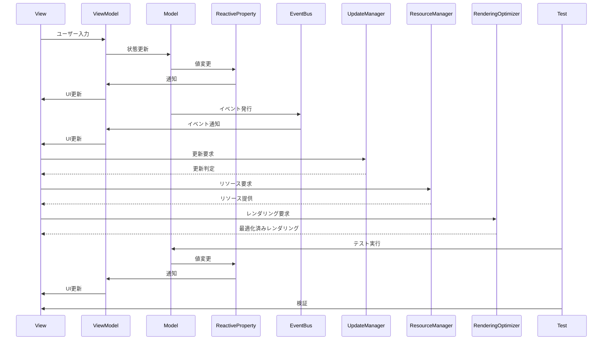
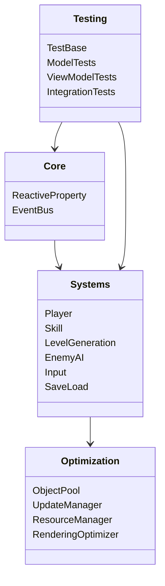
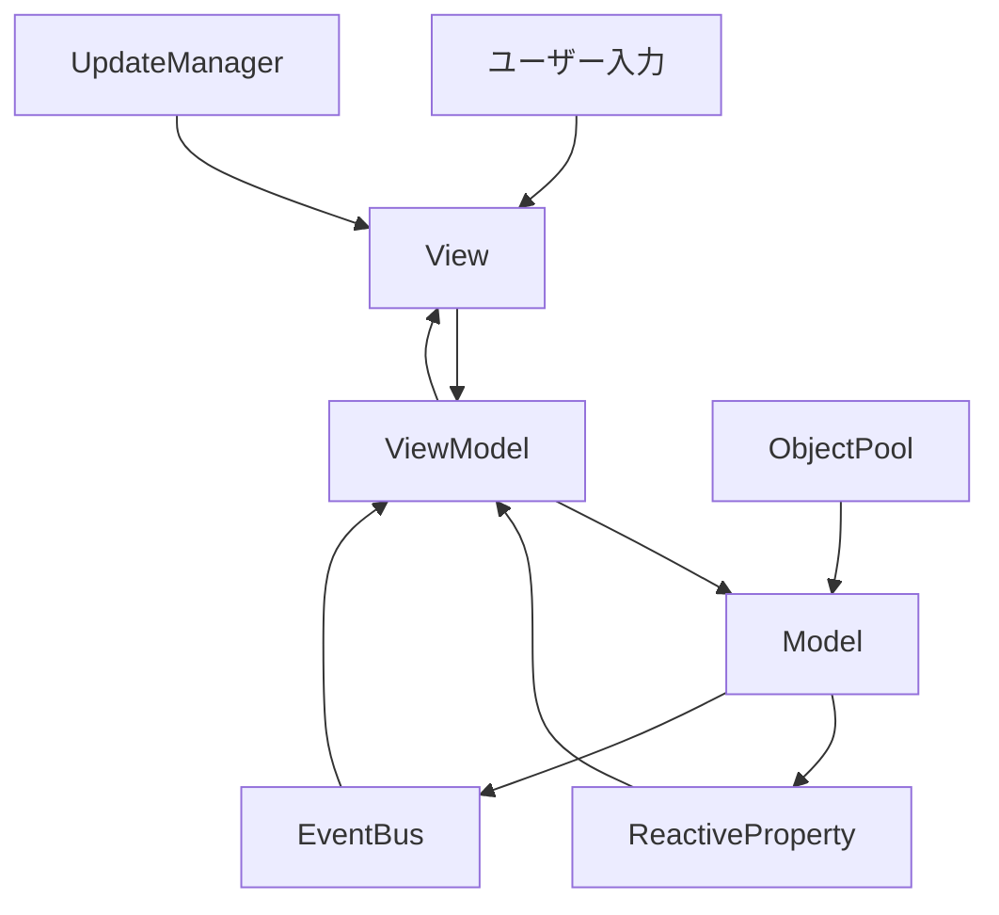

# MVVM+RX アーキテクチャ全体図

## 1. 概要

### 1.1 目的

本ドキュメントは、MVVM + リアクティブプログラミングアーキテクチャの全体像を視覚的に表現し、以下の目的を達成することを目指します：

-   システム全体の構造の把握
-   コンポーネント間の関係性の理解
-   データフローの可視化
-   テスト戦略の全体像の把握

### 1.2 適用範囲

-   コアコンポーネント
-   システム実装
-   パフォーマンス最適化
-   テスト戦略

## 2. 全体クラス図

```mermaid
classDiagram
    %% コアコンポーネント
    class IReactiveProperty~T~ {
        <<interface>>
        +T Value
        +Subscribe(Action~T~) IDisposable
    }

    class ReactiveProperty~T~ {
        -T _value
        -Subject~T~ _subject
        +Value
        +Subscribe(Action~T~) IDisposable
    }

    class IGameEvent {
        <<interface>>
    }

    class GameEventBus {
        -Subject~IGameEvent~ _subject
        +Publish~T~(T) void
        +GetEventStream~T~() IObservable~T~
    }

    %% システム実装
    class PlayerModel {
        +ReactiveProperty~float~ Health
        +ReactiveProperty~float~ MaxHealth
        +ReactiveProperty~int~ ShadowFragments
        +ReactiveProperty~Inventory~ Inventory
        +ReactiveProperty~QuestProgress~ QuestProgress
        +TakeDamage(float) void
        +Heal(float) void
        +UpdateQuestProgress(Quest) void
    }

    class PlayerViewModel {
        -PlayerModel _model
        +ReactiveProperty~string~ HealthText
        +ReactiveProperty~string~ ShadowFragmentText
        +ReactiveProperty~string~ QuestStatusText
        +ReactiveProperty~bool~ IsAnimating
        +PlayAnimation(string) void
        +PlaySound(string) void
    }

    class SkillModel {
        +ReactiveProperty~bool~ IsUnlocked
        +ReactiveProperty~int~ Level
        +ReactiveProperty~float~ Cooldown
        +ReactiveProperty~SkillCombo~ CurrentCombo
        +ReactiveProperty~List~SkillRequirement~~ Requirements
        +UseSkill() void
        +CheckRequirements() bool
    }

    class SkillViewModel {
        -SkillModel _model
        +ReactiveProperty~string~ StatusText
        +ReactiveProperty~float~ CooldownPercentage
        +ReactiveProperty~bool~ IsEffectPlaying
        +PlayEffect(string) void
        +PlaySound(string) void
    }

    class LevelGenerationSystem {
        -ReactiveProperty~LevelData~ CurrentLevel
        -ReactiveProperty~float~ Difficulty
        +GenerateLevel() void
        +AdjustDifficulty(float) void
        +ManageResources() void
    }

    class EnemyAISystem {
        -ReactiveProperty~List~EnemyBehavior~~ Behaviors
        -ReactiveProperty~float~ Difficulty
        +UpdateBehavior() void
        +AdjustDifficulty(float) void
        +ControlGroupBehavior() void
    }

    class InputSystem {
        -ReactiveProperty~InputConfig~ Config
        +HandleKeyboardInput() void
        +HandleGamepadInput() void
        +HandleTouchInput() void
        +UpdateConfig(InputConfig) void
    }

    class SaveLoadSystem {
        -ReactiveProperty~SaveData~ CurrentSave
        +AutoSave() void
        +QuickSave() void
        +LoadGame(string) void
        +EncryptSaveData() void
    }

    %% パフォーマンス最適化
    class ObjectPool~T~ {
        -List~T~ _pool
        -Dictionary~string, int~ _poolHierarchy
        +Get() T
        +Return(T) void
        +ResizePool(int) void
        +MonitorMemoryUsage() void
    }

    class UpdateManager {
        -Dictionary~string, float~ _lastUpdateTimes
        -Dictionary~string, int~ _updatePriorities
        +ShouldUpdate(string) bool
        +SetLOD(string, int) void
        +ScheduleAsyncUpdate(Action) void
    }

    class ResourceManager {
        -Dictionary~string, object~ _cache
        +LoadAsync(string) Task
        +CacheResource(string, object) void
        +PreloadResources(List~string~) void
    }

    class RenderingOptimizer {
        -List~Renderer~ _visibleRenderers
        +PerformOcclusionCulling() void
        +BatchRenderers() void
        +OptimizeShaders() void
    }

    %% テスト戦略
    class TestBase {
        #GameEventBus _eventBus
        #Dictionary~string, object~ _mocks
        +Setup() void
        +TearDown() void
        +CreateMock~T~() T
    }

    class ModelTestBase~T~ {
        #T _model
        +AssertModelState() void
        +TestValidation() void
        +TestErrorHandling() void
    }

    class ViewModelTestBase~T~ {
        #T _viewModel
        +TestUIUpdates() void
        +TestCommandExecution() void
        +TestErrorDisplay() void
    }

    class IntegrationTestBase {
        #List~ISystem~ _systems
        +TestSystemIntegration() void
        +TestEndToEnd() void
        +TestPerformance() void
    }

    %% 関係性
    IReactiveProperty <|.. ReactiveProperty
    ReactiveProperty --> Subject
    GameEventBus --> Subject
    PlayerModel --> ReactiveProperty
    PlayerViewModel --> PlayerModel
    PlayerViewModel --> ReactiveProperty
    SkillModel --> ReactiveProperty
    SkillViewModel --> SkillModel
    SkillViewModel --> ReactiveProperty
    LevelGenerationSystem --> ReactiveProperty
    EnemyAISystem --> ReactiveProperty
    InputSystem --> ReactiveProperty
    SaveLoadSystem --> ReactiveProperty
    TestBase --> GameEventBus
    ModelTestBase --|> TestBase
    ViewModelTestBase --|> TestBase
    IntegrationTestBase --|> TestBase
```

## 3. コンポーネント間の相互作用

## 4. パッケージ構造

## 5. 主要コンポーネントの説明

### 5.1 コアコンポーネント

-   **ReactiveProperty**: 値の変更を監視し、通知するための基本コンポーネント
    -   型安全な値の保持と変更通知
    -   複数の購読者への一括通知
    -   メモリリーク防止のための自動購読解除機能
-   **EventBus**: システム全体でのイベントの伝播を管理
    -   型安全なイベント発行と購読
    -   非同期イベント処理のサポート
    -   イベントの優先順位付け機能
-   **Subject**: リアクティブプログラミングの中核となるオブザーバブルパターンの実装
    -   複数のストリームの合成
    -   エラーハンドリング
    -   完了通知のサポート

### 5.2 システム実装

-   **PlayerModel**: プレイヤーの状態管理
    -   ステータス値のリアクティブな管理
    -   バリデーション機能
    -   状態変更の履歴管理
    -   インベントリ管理
    -   クエスト進捗管理
-   **PlayerViewModel**: プレイヤーの UI 表示制御
    -   モデルデータの UI 適応
    -   コマンドパターンによる操作処理
    -   エラー状態の管理
    -   アニメーション制御
    -   サウンド制御
-   **SkillModel**: スキルの状態管理
    -   スキルツリーの管理
    -   クールダウン制御
    -   スキル効果の計算
    -   スキルコンボ管理
    -   スキル習得条件管理
-   **SkillViewModel**: スキルの UI 表示制御
    -   スキル状態の視覚化
    -   使用条件の表示
    -   アニメーション制御
    -   エフェクト制御
    -   サウンド制御
-   **LevelGenerationSystem**: レベル生成管理
    -   プロシージャル生成
    -   難易度調整
    -   リソース管理
-   **EnemyAISystem**: 敵 AI 管理
    -   行動パターン制御
    -   難易度調整
    -   グループ行動制御
-   **InputSystem**: 入力管理
    -   キーコンフィグ
    -   ゲームパッド対応
    -   タッチ操作対応
-   **SaveLoadSystem**: セーブ/ロード管理
    -   自動セーブ
    -   クイックセーブ
    -   セーブデータ暗号化

### 5.3 パフォーマンス最適化

-   **ObjectPool**: オブジェクトの再利用によるメモリ最適化
    -   動的プールサイズ調整
    -   オブジェクトの初期化/クリーンアップ制御
    -   メモリ使用量の監視
    -   プール階層管理
    -   オブジェクトライフサイクル制御
-   **UpdateManager**: 更新頻度の制御によるパフォーマンス最適化
    -   フレームレート制御
    -   更新優先順位の管理
    -   バッチ処理の最適化
    -   LOD（Level of Detail）制御
    -   非同期更新処理
-   **ResourceManager**: リソース管理最適化
    -   非同期ロード
    -   メモリキャッシュ
    -   リソースプリロード
-   **RenderingOptimizer**: レンダリング最適化
    -   オクルージョンカリング
    -   バッチ処理
    -   シェーダー最適化

### 5.4 テスト戦略

-   **TestBase**: テストの基本クラス
    -   テスト環境のセットアップ
    -   モックオブジェクトの管理
    -   テストデータの生成
-   **ModelTestBase**: モデル層のテスト基底クラス
    -   状態変更の検証
    -   バリデーションのテスト
    -   エラー処理のテスト
-   **ViewModelTestBase**: ビューモデル層のテスト基底クラス
    -   UI 更新の検証
    -   コマンド実行のテスト
    -   エラー表示のテスト
-   **IntegrationTestBase**: 統合テスト基底クラス
    -   システム間連携のテスト
    -   エンドツーエンドテスト
    -   パフォーマンステスト

## 6. データフロー

## 7. 変更履歴

| バージョン | 更新日     | 変更内容                                                                                     |
| ---------- | ---------- | -------------------------------------------------------------------------------------------- |
| 0.4.0      | 2024-03-23 | システム実装の拡充、パフォーマンス最適化の詳細化、テスト戦略の更新、リンクドキュメントの追加 |
| 0.3.0      | 2024-03-22 | システム実装の拡充、パフォーマンス最適化の詳細化、テスト戦略の更新、リンクドキュメントの追加 |
| 0.2.0      | 2024-03-22 | コンポーネント説明の詳細化、パフォーマンス最適化セクションの拡充                             |
| 0.1.0      | 2024-03-21 | 初版作成                                                                                     |
