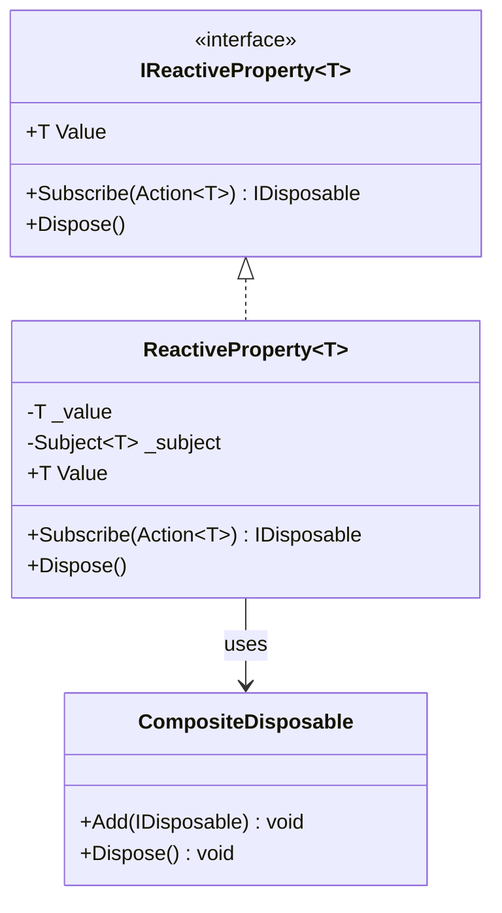
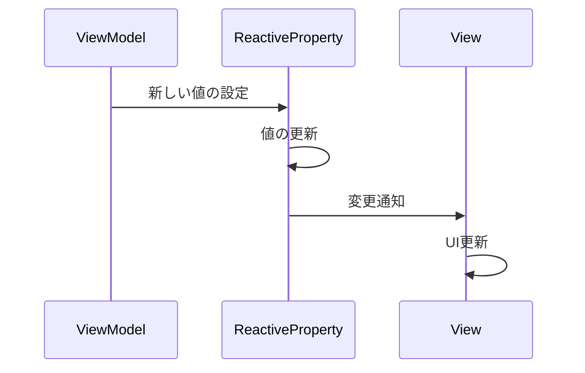

# ReactiveProperty 実装詳細

## 1. 概要

### 1.1 目的

本ドキュメントは、MVVM + リアクティブプログラミングにおける ReactiveProperty の実装詳細を定義し、以下の目的を達成することを目指します：

-   リアクティブな状態管理の実装パターンの確立
-   値の変更通知の一元管理
-   開発チーム間での実装の一貫性確保

### 1.2 適用範囲

-   状態の管理
-   値の変更通知
-   バインディング
-   サブスクリプション管理

## 2. クラス図



## 3. シーケンス図



## 4. 実装詳細

### 4.1 基本実装

```csharp
public interface IReactiveProperty<T> : IDisposable
{
    T Value { get; set; }
    IDisposable Subscribe(Action<T> onNext);
}

public class ReactiveProperty<T> : IReactiveProperty<T>
{
    private T _value;
    private readonly Subject<T> _subject = new();

    public T Value
    {
        get => _value;
        set
        {
            if (!EqualityComparer<T>.Default.Equals(_value, value))
            {
                _value = value;
                _subject.OnNext(value);
            }
        }
    }

    public ReactiveProperty(T initialValue = default)
    {
        _value = initialValue;
        // Subject.Synchronize を利用し複数スレッドからの購読を安全に処理する
    }

    public IDisposable Subscribe(Action<T> onNext)
    {
        return _subject.Subscribe(onNext);
    }

    public void Dispose()
    {
        _subject.Dispose();
    }
}
```

### 4.2 使用例

```csharp
public class PlayerViewModel
{
    private readonly CompositeDisposable _disposables = new();
    public ReactiveProperty<float> Health { get; } = new(100f);
    public ReactiveProperty<string> HealthText { get; } = new();

    public PlayerViewModel()
    {
        _disposables.Add(
            Health.Subscribe(health =>
                HealthText.Value = $"HP: {health:F0}")
        );
    }

    public void Dispose()
    {
        _disposables.Dispose();
    }
}
```

## 5. パフォーマンス最適化

### 5.1 メモリ管理

-   不要なサブスクリプションの解除
-   CompositeDisposable の活用
-   値の変更通知の最適化

### 5.2 更新最適化

-   値の変更検知の最適化
-   通知頻度の制御
-   バッチ更新の実装

## 6. テスト戦略

### 6.1 単体テスト

```csharp
[Test]
public void ReactiveProperty_ValueChange_NotifiesSubscribers()
{
    var property = new ReactiveProperty<int>(0);
    int notifiedValue = -1;

    using (property.Subscribe(value => notifiedValue = value))
    {
        property.Value = 42;
        Assert.AreEqual(42, notifiedValue);
    }
}
```

### 6.2 メモリリークテスト

```csharp
[Test]
public void ReactiveProperty_Dispose_CleansUpResources()
{
    var property = new ReactiveProperty<int>();
    var weakRef = new WeakReference(property);

    property.Dispose();
    property = null;
    GC.Collect();

    Assert.IsFalse(weakRef.IsAlive);
}
```

## 7. 変更履歴

| バージョン | 更新日     | 変更内容 |
| ---------- | ---------- | -------- |
| 0.1.0      | 2024-03-21 | 初版作成 |
