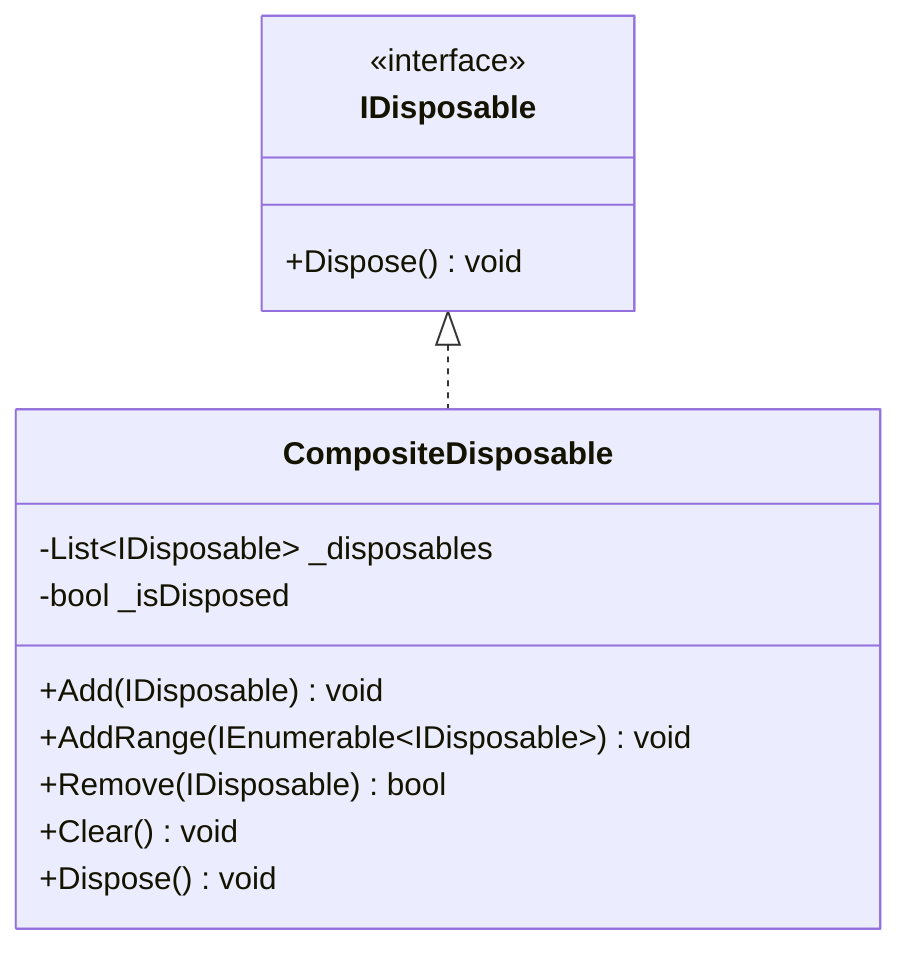
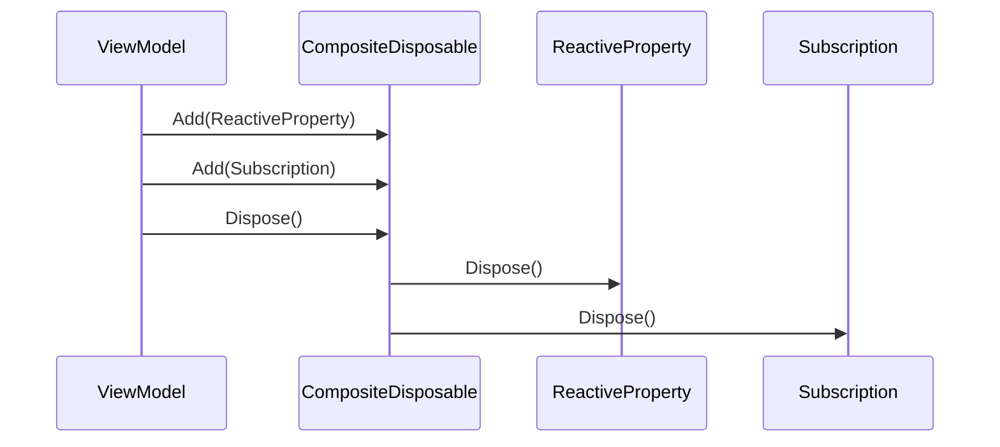

# CompositeDisposable 実装詳細

## 1. 概要

### 1.1 目的

本ドキュメントは、MVVM + リアクティブプログラミングにおける CompositeDisposable の実装詳細を定義し、以下の目的を達成することを目指します：

-   複数の IDisposable リソースの一元管理
-   メモリリークの防止
-   リソース解放の確実な実行

### 1.2 適用範囲

-   サブスクリプション管理
-   リソース解放
-   メモリ管理

## 2. クラス図



## 3. シーケンス図



## 4. 実装詳細

### 4.1 基本実装

```csharp
public class CompositeDisposable : IDisposable
{
    private readonly List<IDisposable> _disposables = new();
    private bool _isDisposed;
    private readonly object _lock = new();

    public void Add(IDisposable disposable)
    {
        if (disposable == null) throw new ArgumentNullException(nameof(disposable));

        lock (_lock)
        {
            if (_isDisposed)
            {
                disposable.Dispose();
                return;
            }

            _disposables.Add(disposable);
        }
    }

    // Add メソッドでは自身の追加を検出して無視するため特別なチェックは不要

    public void AddRange(IEnumerable<IDisposable> disposables)
    {
        if (disposables == null) throw new ArgumentNullException(nameof(disposables));

        foreach (var disposable in disposables)
        {
            Add(disposable);
        }
    }

    public bool Remove(IDisposable disposable)
    {
        if (disposable == null) throw new ArgumentNullException(nameof(disposable));

        lock (_lock)
        {
            return _disposables.Remove(disposable);
        }
    }

    public void Clear()
    {
        lock (_lock)
        {
            foreach (var disposable in _disposables)
            {
                disposable.Dispose();
            }
            _disposables.Clear();
        }
    }

    public void Dispose()
    {
        lock (_lock)
        {
            if (_isDisposed) return;

            foreach (var disposable in _disposables)
            {
                disposable.Dispose();
            }
            _disposables.Clear();
            _isDisposed = true;
        }
    }
}
```

### 4.2 使用例

```csharp
public class GameViewModel : IDisposable
{
    private readonly CompositeDisposable _disposables = new();
    public ReactiveProperty<int> Score { get; } = new(0);
    public ReactiveProperty<float> Time { get; } = new(0f);

    public GameViewModel()
    {
        // 複数のサブスクリプションを管理
        _disposables.Add(
            Score.Subscribe(OnScoreChanged)
        );
        _disposables.Add(
            Time.Subscribe(OnTimeChanged)
        );
    }

    private void OnScoreChanged(int score)
    {
        // スコア変更時の処理
    }

    private void OnTimeChanged(float time)
    {
        // 時間変更時の処理
    }

    public void Dispose()
    {
        _disposables.Dispose();
    }
}
```

## 5. パフォーマンス最適化

### 5.1 メモリ管理

-   スレッドセーフな実装
-   効率的なリソース解放
-   重複登録の防止

### 5.2 スレッドセーフティ

-   ロックの最適化
-   デッドロックの防止
-   並行アクセスの制御

## 6. テスト戦略

### 6.1 単体テスト

```csharp
[Test]
public void CompositeDisposable_AddAndDispose_DisposesAllResources()
{
    var disposable1 = new Mock<IDisposable>();
    var disposable2 = new Mock<IDisposable>();
    var composite = new CompositeDisposable();

    composite.Add(disposable1.Object);
    composite.Add(disposable2.Object);
    composite.Dispose();

    disposable1.Verify(d => d.Dispose(), Times.Once);
    disposable2.Verify(d => d.Dispose(), Times.Once);
}
```

### 6.2 スレッドセーフティテスト

```csharp
[Test]
public void CompositeDisposable_ConcurrentAccess_ThreadSafe()
{
    var composite = new CompositeDisposable();
    var tasks = new List<Task>();

    for (int i = 0; i < 1000; i++)
    {
        tasks.Add(Task.Run(() =>
        {
            var disposable = new Mock<IDisposable>();
            composite.Add(disposable.Object);
        }));
    }

    Task.WaitAll(tasks.ToArray());
    composite.Dispose();
}
```

## 7. 変更履歴

| バージョン | 更新日     | 変更内容 |
| ---------- | ---------- | -------- |
| 0.1.0      | 2024-03-21 | 初版作成 |
