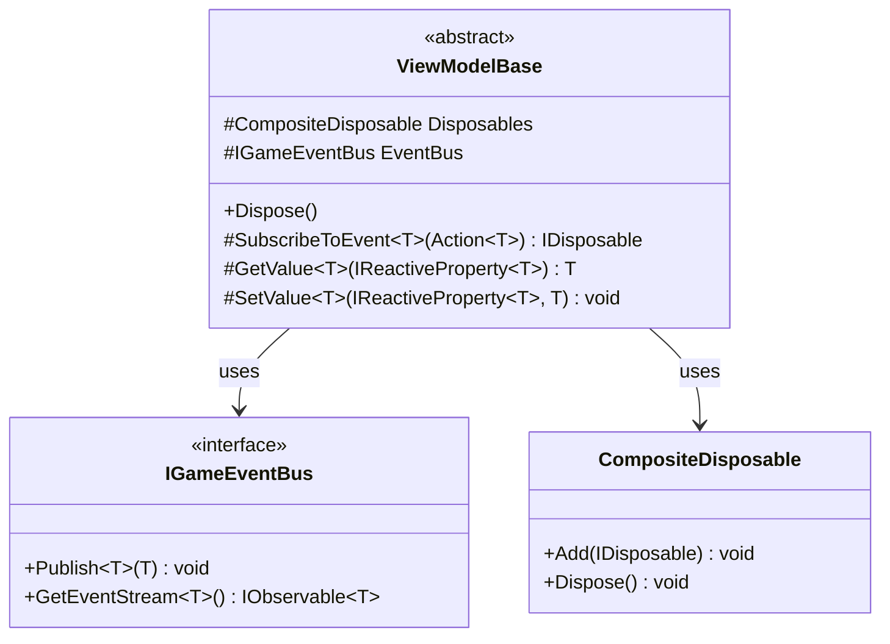
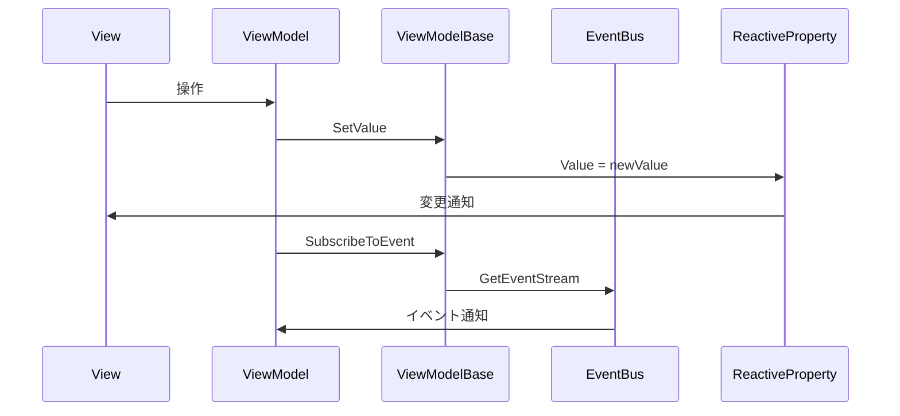

# ViewModelBase 実装詳細

## 1. 概要

### 1.1 目的

本ドキュメントは、MVVM + リアクティブプログラミングにおける ViewModelBase の実装詳細を定義し、以下の目的を達成することを目指します：

-   ViewModel の共通機能の実装パターンの確立
-   リソース管理の一元化
-   イベント処理の標準化
-   開発チーム間での実装の一貫性確保

### 1.2 適用範囲

-   ViewModel の基底クラス
-   リソース管理
-   イベント処理
-   プロパティ変更通知

## 2. クラス図



## 3. シーケンス図



## 4. 実装詳細

### 4.1 基本実装

```csharp
namespace Core.ViewModels
{
    /// <summary>
    /// ViewModelの基底クラス
    /// </summary>
    public abstract class ViewModelBase : IDisposable
    {
        /// <summary>
        /// リソース管理用のCompositeDisposable
        /// </summary>
        protected readonly CompositeDisposable Disposables = new();

        /// <summary>
        /// イベントバス
        /// </summary>
        protected readonly IGameEventBus EventBus;

        /// <summary>
        /// コンストラクタ
        /// </summary>
        protected ViewModelBase(IGameEventBus eventBus)
        {
            EventBus = eventBus ?? throw new ArgumentNullException(nameof(eventBus));
        }

        /// <summary>
        /// リソースの解放
        /// </summary>
        public virtual void Dispose()
        {
            Disposables.Dispose();
        }

        /// <summary>
        /// イベントの購読
        /// </summary>
        protected IDisposable SubscribeToEvent<T>(Action<T> onNext) where T : GameEvent
        {
            var subscription = EventBus.GetEventStream<T>().Subscribe(onNext);
            Disposables.Add(subscription);
            return subscription;
        }

        /// <summary>
        /// リアクティブプロパティの値を取得
        /// </summary>
        protected T GetValue<T>(IReactiveProperty<T> property)
        {
            return property.Value;
        }

        /// <summary>
        /// リアクティブプロパティの値を設定
        /// </summary>
        protected void SetValue<T>(IReactiveProperty<T> property, T value)
        {
            property.Value = value;
        }
    }
}
```

### 4.2 使用例

```csharp
public class PlayerViewModel : ViewModelBase
{
    public ReactiveProperty<float> Health { get; } = new(100f);
    public ReactiveProperty<string> HealthText { get; } = new();

    public PlayerViewModel(IGameEventBus eventBus) : base(eventBus)
    {
        // ヘルス変更の監視
        Disposables.Add(
            Health.Subscribe(health =>
                HealthText.Value = $"HP: {health:F0}")
        );

        // ダメージイベントの購読
        SubscribeToEvent<DamageEvent>(OnDamageReceived);
    }

    private void OnDamageReceived(DamageEvent evt)
    {
        Health.Value -= evt.Amount;
    }
}
```

## 5. パフォーマンス最適化

### 5.1 メモリ管理

-   CompositeDisposable によるリソース管理の一元化
-   イベント購読の自動解除
-   不要なサブスクリプションの防止

### 5.2 更新最適化

-   プロパティ変更通知の最適化
-   イベント処理の効率化
-   リソース解放の確実な実行

## 6. テスト戦略

### 6.1 単体テスト

```csharp
[Test]
public void ViewModelBase_SubscribeToEvent_AddsToDisposables()
{
    var eventBus = new GameEventBus();
    var viewModel = new TestViewModel(eventBus);
    var eventReceived = false;

    viewModel.SubscribeToEvent<TestEvent>(_ => eventReceived = true);
    eventBus.Publish(new TestEvent());

    Assert.IsTrue(eventReceived);
}

[Test]
public void ViewModelBase_Dispose_CleansUpResources()
{
    var eventBus = new GameEventBus();
    var viewModel = new TestViewModel(eventBus);
    var weakRef = new WeakReference(viewModel);

    viewModel.Dispose();
    viewModel = null;
    GC.Collect();

    Assert.IsFalse(weakRef.IsAlive);
}
```

### 6.2 メモリリークテスト

```csharp
[Test]
public void ViewModelBase_EventSubscription_DoesNotLeak()
{
    var eventBus = new GameEventBus();
    var viewModel = new TestViewModel(eventBus);
    var subscription = viewModel.SubscribeToEvent<TestEvent>(_ => { });

    viewModel.Dispose();
    subscription = null;
    GC.Collect();

    // メモリリークの検証
}
```

## 7. 変更履歴

| バージョン | 更新日     | 変更内容 |
| ---------- | ---------- | -------- |
| 0.1.0      | 2024-03-21 | 初版作成 |
| 0.2.0      | 2025-06-09 | 実装内容の更新 |
