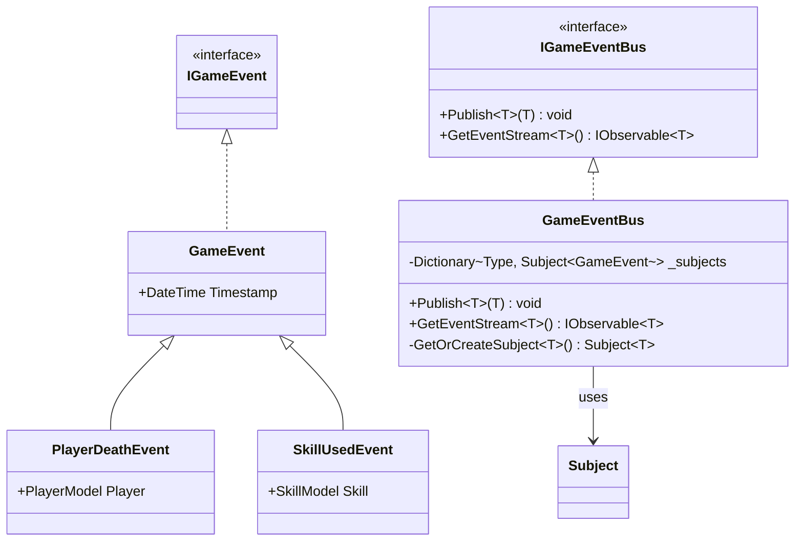
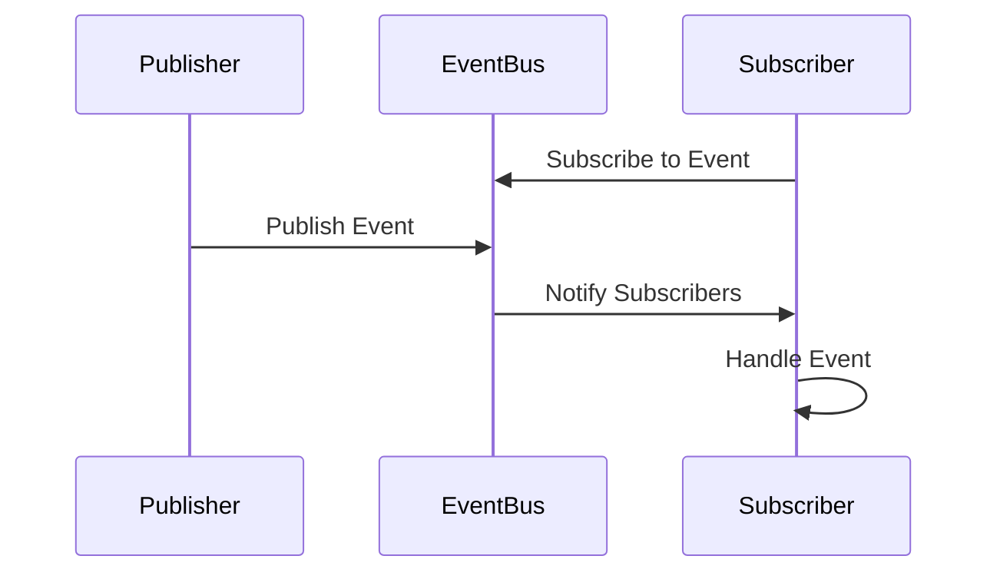

# イベントバス実装詳細

## 1. 概要

### 1.1 目的

本ドキュメントは、MVVM + リアクティブプログラミングにおけるイベントバスの実装詳細を定義し、以下の目的を達成することを目指します：

-   イベント駆動アーキテクチャの確立
-   型安全なイベント処理
-   開発チーム間での実装の一貫性確保

### 1.2 適用範囲

-   イベントの定義
-   イベントの購読
-   イベントの発行
-   イベントの処理

## 2. クラス図



## 3. シーケンス図



## 4. 実装詳細

### 4.1 基本実装

```csharp
public interface IGameEvent
{
    DateTime Timestamp { get; }
}

public abstract class GameEvent : IGameEvent
{
    public DateTime Timestamp { get; } = DateTime.UtcNow;
}

public interface IGameEventBus
{
    void Publish<T>(T evt) where T : GameEvent;
    IObservable<T> GetEventStream<T>() where T : GameEvent;
}

public class GameEventBus : IGameEventBus
{
    private readonly Dictionary<Type, Subject<GameEvent>> _subjects = new();

    public void Publish<T>(T evt) where T : GameEvent
    {
        var subject = GetOrCreateSubject<T>();
        subject.OnNext(evt);
    }

    public IObservable<T> GetEventStream<T>() where T : GameEvent
    {
        return GetOrCreateSubject<T>().OfType<T>();
    }

    private Subject<T> GetOrCreateSubject<T>() where T : GameEvent
    {
        var type = typeof(T);
        if (!_subjects.TryGetValue(type, out var subject))
        {
            subject = new Subject<GameEvent>();
            _subjects[type] = subject;
        }
        return subject as Subject<T>;
    }
}
```

### 4.2 イベントの定義

```csharp
public class PlayerDeathEvent : GameEvent
{
    public PlayerModel Player { get; }

    public PlayerDeathEvent(PlayerModel player)
    {
        Player = player;
    }
}

public class SkillUsedEvent : GameEvent
{
    public SkillModel Skill { get; }

    public SkillUsedEvent(SkillModel skill)
    {
        Skill = skill;
    }
}
```

## 5. パフォーマンス最適化

### 5.1 メモリ管理

-   不要なサブスクリプションの解除
-   イベントのフィルタリング
-   リソースの適切な解放

### 5.2 更新最適化

-   イベントのバッチ処理
-   更新頻度の制御
-   不要な通知の防止

## 6. テスト戦略

### 6.1 単体テスト

```csharp
[Test]
public void GameEventBus_Publish_NotifiesSubscribers()
{
    var eventBus = new GameEventBus();
    var evt = new PlayerDeathEvent(new PlayerModel());
    bool notified = false;

    using (eventBus.GetEventStream<PlayerDeathEvent>()
        .Subscribe(_ => notified = true))
    {
        eventBus.Publish(evt);
        Assert.IsTrue(notified);
    }
}
```

### 6.2 統合テスト

```csharp
[Test]
public void GameEventBus_PlayerDeath_TriggersGameOver()
{
    var eventBus = new GameEventBus();
    var player = new PlayerModel();
    bool gameOverTriggered = false;

    eventBus.GetEventStream<PlayerDeathEvent>()
        .Subscribe(_ => gameOverTriggered = true);

    player.TakeDamage(player.MaxHealth.Value);
    eventBus.Publish(new PlayerDeathEvent(player));

    Assert.IsTrue(gameOverTriggered);
}
```

## 7. 変更履歴

| バージョン | 更新日     | 変更内容 |
| ---------- | ---------- | -------- |
| 0.1.0      | 2024-03-21 | 初版作成 |
