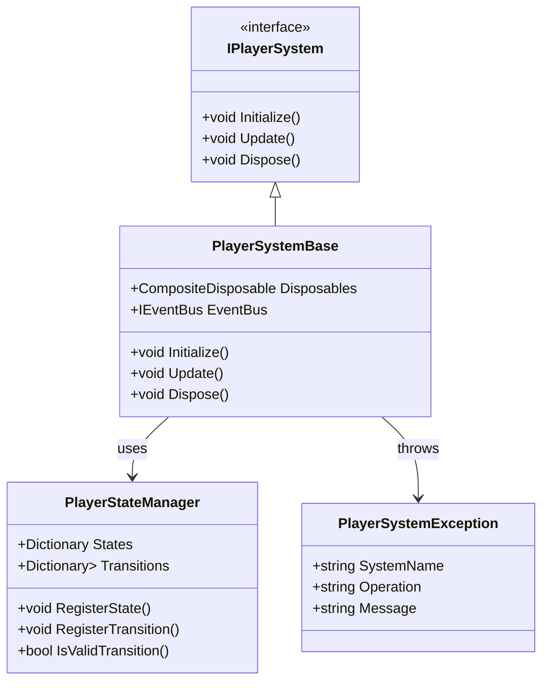
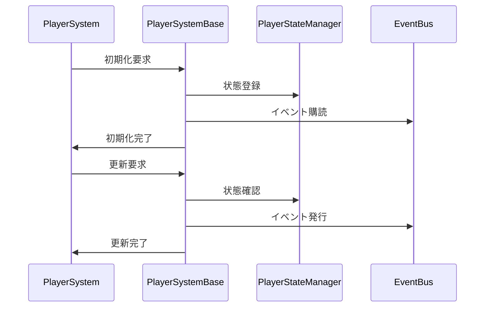

# プレイヤーシステム基底クラス実装詳細

## 目次

1. [概要](#1-概要)
2. [クラス図](#2-クラス図)
3. [シーケンス図](#3-シーケンス図)
4. [実装詳細](#4-実装詳細)
5. [パフォーマンス最適化](#5-パフォーマンス最適化)
6. [テスト戦略](#6-テスト戦略)
7. [変更履歴](#7-変更履歴)

## 1. 概要

### 1.1 目的

本ドキュメントは、プレイヤーシステムの基底クラスとインターフェースの実装詳細を定義し、以下の目的を達成することを目指します：

-   プレイヤーシステムの共通機能の実装
-   システム間の一貫性確保
-   エラーハンドリングの統一
-   開発チーム間での実装の一貫性確保

### 1.2 適用範囲

-   プレイヤーシステムの基底クラス
-   プレイヤーシステムの共通インターフェース
-   エラーハンドリング
-   状態管理

## 2. クラス図



## 3. シーケンス図



## 4. 実装詳細

### 4.1 インターフェース

```csharp
public interface IPlayerSystem
{
    void Initialize();
    void Update();
    void Dispose();
}
```

### 4.2 基底クラス

```csharp
public abstract class PlayerSystemBase : IPlayerSystem
{
    protected readonly CompositeDisposable Disposables;
    protected readonly IEventBus EventBus;
    protected readonly PlayerStateManager StateManager;

    protected PlayerSystemBase(IEventBus eventBus)
    {
        Disposables = new CompositeDisposable();
        EventBus = eventBus;
        StateManager = new PlayerStateManager();
    }

    public abstract void Initialize();
    public abstract void Update();

    public virtual void Dispose()
    {
        Disposables.Dispose();
    }

    protected void HandleError(string operation, Exception ex)
    {
        var error = new PlayerSystemException(GetType().Name, operation, ex.Message);
        EventBus.Publish(new ErrorEvent(error));
    }
}
```

### 4.3 例外クラス

```csharp
public class PlayerSystemException : Exception
{
    public string SystemName { get; }
    public string Operation { get; }

    public PlayerSystemException(string systemName, string operation, string message)
        : base(message)
    {
        SystemName = systemName;
        Operation = operation;
    }
}
```

### 4.4 状態管理

```csharp
public class PlayerStateManager
{
    private readonly Dictionary<string, IState> _states;
    private readonly Dictionary<string, List<StateTransition>> _transitions;

    public PlayerStateManager()
    {
        _states = new Dictionary<string, IState>();
        _transitions = new Dictionary<string, List<StateTransition>>();
    }

    public void RegisterState(string stateName, IState state)
    {
        if (_states.ContainsKey(stateName))
        {
            throw new ArgumentException($"State {stateName} is already registered");
        }
        _states[stateName] = state;
    }

    public void RegisterTransition(string fromState, string toState, Func<bool> condition)
    {
        if (!_states.ContainsKey(fromState) || !_states.ContainsKey(toState))
        {
            throw new ArgumentException("Invalid state transition");
        }

        if (!_transitions.ContainsKey(fromState))
        {
            _transitions[fromState] = new List<StateTransition>();
        }
        _transitions[fromState].Add(new StateTransition(toState, condition));
    }

    public bool IsValidTransition(string fromState, string toState)
    {
        if (!_transitions.ContainsKey(fromState))
        {
            return false;
        }

        return _transitions[fromState].Any(t => t.ToState == toState && t.Condition());
    }
}
```

## 5. パフォーマンス最適化

### 5.1 メモリ管理

-   状態データのキャッシュ
-   イベントの最適化
-   リソースの適切な解放

### 5.2 更新最適化

-   状態処理の優先順位付け
-   不要な更新の回避
-   バッチ処理の活用

## 6. テスト戦略

### 6.1 単体テスト

```csharp
[Test]
public void TestPlayerSystemBase()
{
    var eventBus = new EventBus();
    var system = new TestPlayerSystem(eventBus);

    // 初期化のテスト
    system.Initialize();
    Assert.That(system.IsInitialized, Is.True);
}
```

### 6.2 統合テスト

```csharp
[Test]
public void TestPlayerSystemStateManagement()
{
    var eventBus = new EventBus();
    var system = new TestPlayerSystem(eventBus);

    // 状態管理のテスト
    system.RegisterState("Test", new TestState());
    system.RegisterTransition("Test", "Next", () => true);
    Assert.That(system.IsValidTransition("Test", "Next"), Is.True);
}
```

## 7. 変更履歴

| バージョン | 更新日     | 変更内容 |
| ---------- | ---------- | -------- |
| 0.1.1      | 2025-06-13 | 参照リンクを修正 |
| 0.1.0      | 2024-03-24 | 初版作成 |
