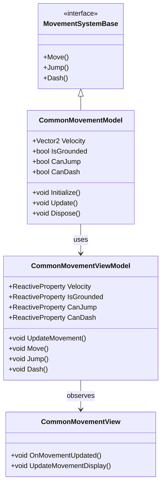
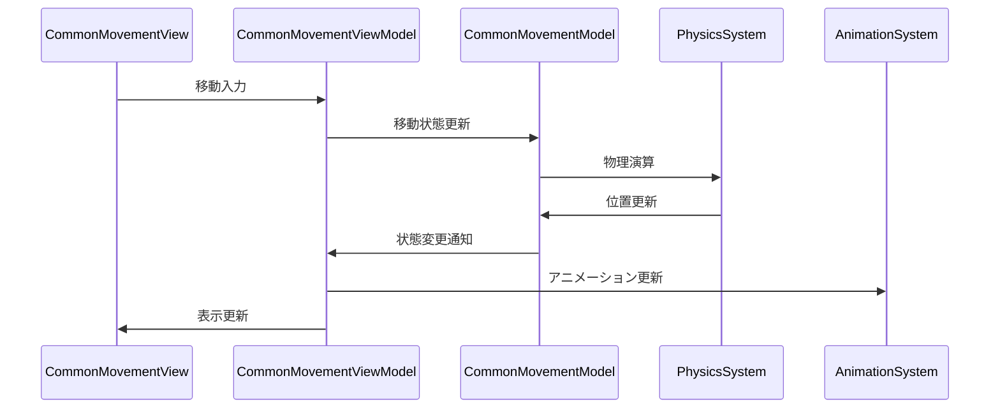

# 共通移動システム実装詳細

# 目次

1. [概要](#1-概要)
2. [クラス図](#2-クラス図)
3. [シーケンス図](#3-シーケンス図)
4. [実装詳細](#4-実装詳細)
5. [パフォーマンス最適化](#5-パフォーマンス最適化)
6. [テスト戦略](#6-テスト戦略)
7. [制限事項](#7-制限事項)
8. [使用方法](#8-使用方法)
9. [変更履歴](#9-変更履歴)

## 1. 概要

### 1.1 目的

本ドキュメントは、共通移動システムの実装詳細を定義し、以下の目的を達成することを目指します：

-   基本的な移動処理の実装
-   物理演算との連携
-   移動状態の管理
-   開発チーム間での実装の一貫性確保

### 1.2 適用範囲

-   基本的な移動処理
-   物理演算との連携
-   移動状態の管理
-   移動アニメーションの制御

## 2. クラス図



## 3. シーケンス図



## 4. 実装詳細

### 4.1 モデル層

```csharp
public class CommonMovementModel : MovementSystemBase, IDisposable
{
    private readonly CompositeDisposable _disposables;
    private Vector2 _velocity;
    private bool _isGrounded;
    private bool _canJump;
    private bool _canDash;

    public CommonMovementModel()
    {
        _disposables = new CompositeDisposable();
    }

    public void Initialize()
    {
        _velocity = Vector2.Zero;
        _isGrounded = false;
        _canJump = true;
        _canDash = true;
    }

    public void Update()
    {
        UpdateGroundedState();
        UpdateMovementState();
    }

    public void Move(Vector2 direction)
    {
        if (_isGrounded)
        {
            _velocity = direction * GetMovementSpeed();
        }
    }

    public void Jump()
    {
        if (_isGrounded && _canJump)
        {
            _velocity.Y = GetJumpForce();
            _canJump = false;
        }
    }

    public void Dash()
    {
        if (_canDash)
        {
            _velocity *= GetDashMultiplier();
            _canDash = false;
        }
    }

    public void Dispose()
    {
        _disposables.Dispose();
    }
}
```

### 4.2 ビューモデル層

```csharp
public class CommonMovementViewModel : ViewModelBase
{
    private readonly CommonMovementModel _model;
    private readonly ReactiveProperty<Vector2> _velocity;
    private readonly ReactiveProperty<bool> _isGrounded;
    private readonly ReactiveProperty<bool> _canJump;
    private readonly ReactiveProperty<bool> _canDash;

    public CommonMovementViewModel(CommonMovementModel model)
    {
        _model = model;
        _velocity = new ReactiveProperty<Vector2>();
        _isGrounded = new ReactiveProperty<bool>();
        _canJump = new ReactiveProperty<bool>();
        _canDash = new ReactiveProperty<bool>();

        // 移動状態の購読
        _velocity.Subscribe(OnVelocityChanged).AddTo(Disposables);
        _isGrounded.Subscribe(OnGroundedChanged).AddTo(Disposables);
    }

    public void UpdateMovement()
    {
        _model.Update();
        UpdateMovementState();
    }

    public void Move(Vector2 direction)
    {
        _model.Move(direction);
        _velocity.Value = _model.Velocity;
    }

    public void Jump()
    {
        _model.Jump();
        _velocity.Value = _model.Velocity;
        _canJump.Value = _model.CanJump;
    }

    public void Dash()
    {
        _model.Dash();
        _velocity.Value = _model.Velocity;
        _canDash.Value = _model.CanDash;
    }

    private void UpdateMovementState()
    {
        _velocity.Value = _model.Velocity;
        _isGrounded.Value = _model.IsGrounded;
        _canJump.Value = _model.CanJump;
        _canDash.Value = _model.CanDash;
    }

    private void OnVelocityChanged(Vector2 velocity)
    {
        EventBus.Publish(new MovementVelocityChangedEvent(velocity));
    }

    private void OnGroundedChanged(bool isGrounded)
    {
        EventBus.Publish(new MovementGroundedChangedEvent(isGrounded));
    }
}
```

### 4.3 ビュー層

```csharp
public class CommonMovementView : MonoBehaviour
{
    private CommonMovementViewModel _viewModel;

    private void Start()
    {
        var model = new CommonMovementModel();
        _viewModel = new CommonMovementViewModel(model);
        _viewModel.Initialize();
    }

    private void Update()
    {
        _viewModel.UpdateMovement();
    }

    private void OnDestroy()
    {
        _viewModel.Dispose();
    }
}
```

## 5. パフォーマンス最適化

### 5.1 メモリ管理

-   移動状態のキャッシュ
-   イベントの最適化
-   リソースの適切な解放

### 5.2 更新最適化

-   移動処理の優先順位付け
-   不要な更新の回避
-   バッチ処理の活用

## 6. テスト戦略

### 6.1 単体テスト

```csharp
[Test]
public void TestMovement()
{
    var model = new CommonMovementModel();
    var viewModel = new CommonMovementViewModel(model);

    // 移動のテスト
    viewModel.Move(new Vector2(1, 0));
    Assert.That(viewModel.Velocity.Value, Is.EqualTo(new Vector2(1, 0)));
}
```

### 6.2 統合テスト

```csharp
[Test]
public void TestMovementToAnimationIntegration()
{
    var movementSystem = new CommonMovementSystem();
    var animationSystem = new CommonAnimationSystem();

    // 移動からアニメーションへの連携テスト
    movementSystem.Move(new Vector2(1, 0));
    Assert.That(animationSystem.CurrentAnimation.Value, Is.EqualTo("Walk"));
}
```

## 7. 制限事項

-   物理演算の依存関係
-   パフォーマンスへの影響
-   メモリ使用量の制限

## 8. 使用方法

### 8.1 基本的な使用方法

```csharp
// 移動システムの初期化
var movementSystem = new CommonMovementSystem();
movementSystem.Initialize();

// 移動の実行
movementSystem.Move(new Vector2(1, 0));
```

### 8.2 注意事項

-   物理演算との連携が必要
-   適切な更新頻度の設定
-   リソースの解放の確認

## 9. 変更履歴

| バージョン | 更新日     | 変更内容                                                                                               |
| ---------- | ---------- | ------------------------------------------------------------------------------------------------------ |
| 0.2.0      | 2024-03-23 | パフォーマンス最適化の追加<br>- 物理演算の最適化<br>- 移動状態の管理改善<br>- アニメーション制御の強化 |
| 0.1.0      | 2024-03-22 | 初版作成<br>- 基本実装の定義<br>- 移動システムの実装<br>- 使用例の追加                                 |
