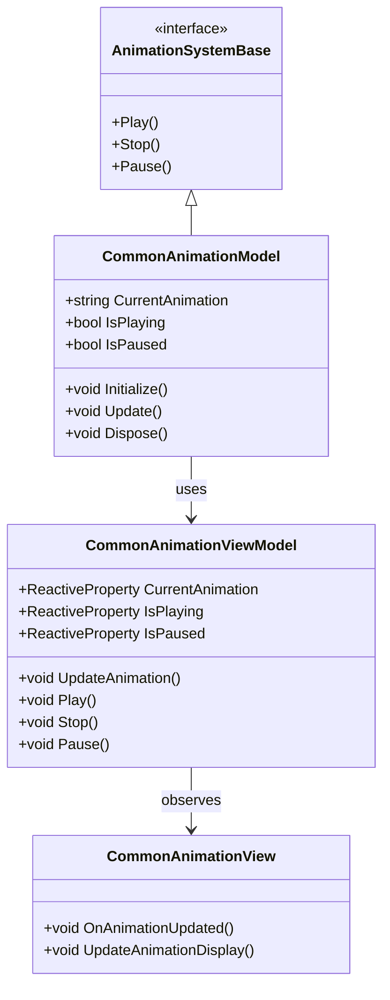
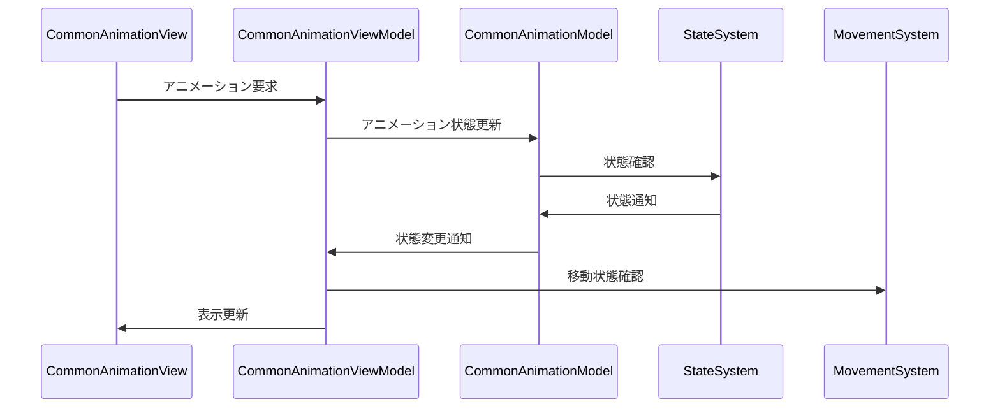

# 共通アニメーションシステム実装詳細

# 目次

1. [概要](#1-概要)
2. [クラス図](#2-クラス図)
3. [シーケンス図](#3-シーケンス図)
4. [実装詳細](#4-実装詳細)
5. [パフォーマンス最適化](#5-パフォーマンス最適化)
6. [テスト戦略](#6-テスト戦略)
7. [制限事項](#7-制限事項)
8. [使用方法](#8-使用方法)
9. [変更履歴](#9-変更履歴)

## 1. 概要

### 1.1 目的

本ドキュメントは、共通アニメーションシステムの実装詳細を定義し、以下の目的を達成することを目指します：

-   基本的なアニメーション処理の実装
-   アニメーション状態の管理
-   アニメーション遷移の制御
-   開発チーム間での実装の一貫性確保

### 1.2 適用範囲

-   基本的なアニメーション処理
-   アニメーション状態の管理
-   アニメーション遷移の制御
-   アニメーションイベントの処理

## 2. クラス図



## 3. シーケンス図



## 4. 実装詳細

### 4.1 モデル層

```csharp
public class CommonAnimationModel : AnimationSystemBase, IDisposable
{
    private readonly CompositeDisposable _disposables;
    private string _currentAnimation;
    private bool _isPlaying;
    private bool _isPaused;

    public CommonAnimationModel()
    {
        _disposables = new CompositeDisposable();
    }

    public void Initialize()
    {
        _currentAnimation = "Idle";
        _isPlaying = false;
        _isPaused = false;
    }

    public void Update()
    {
        UpdateAnimationState();
    }

    public void Play(string animationName)
    {
        if (!_isPlaying || _currentAnimation != animationName)
        {
            _currentAnimation = animationName;
            _isPlaying = true;
            _isPaused = false;
        }
    }

    public void Stop()
    {
        _isPlaying = false;
        _isPaused = false;
    }

    public void Pause()
    {
        if (_isPlaying)
        {
            _isPaused = true;
        }
    }

    public void Dispose()
    {
        _disposables.Dispose();
    }
}
```

### 4.2 ビューモデル層

```csharp
public class CommonAnimationViewModel : ViewModelBase
{
    private readonly CommonAnimationModel _model;
    private readonly ReactiveProperty<string> _currentAnimation;
    private readonly ReactiveProperty<bool> _isPlaying;
    private readonly ReactiveProperty<bool> _isPaused;

    public CommonAnimationViewModel(CommonAnimationModel model)
    {
        _model = model;
        _currentAnimation = new ReactiveProperty<string>();
        _isPlaying = new ReactiveProperty<bool>();
        _isPaused = new ReactiveProperty<bool>();

        // アニメーション状態の購読
        _currentAnimation.Subscribe(OnAnimationChanged).AddTo(Disposables);
        _isPlaying.Subscribe(OnPlayingChanged).AddTo(Disposables);
    }

    public void UpdateAnimation()
    {
        _model.Update();
        UpdateAnimationState();
    }

    public void Play(string animationName)
    {
        _model.Play(animationName);
        _currentAnimation.Value = _model.CurrentAnimation;
        _isPlaying.Value = _model.IsPlaying;
        _isPaused.Value = _model.IsPaused;
    }

    public void Stop()
    {
        _model.Stop();
        _isPlaying.Value = _model.IsPlaying;
        _isPaused.Value = _model.IsPaused;
    }

    public void Pause()
    {
        _model.Pause();
        _isPaused.Value = _model.IsPaused;
    }

    private void UpdateAnimationState()
    {
        _currentAnimation.Value = _model.CurrentAnimation;
        _isPlaying.Value = _model.IsPlaying;
        _isPaused.Value = _model.IsPaused;
    }

    private void OnAnimationChanged(string animation)
    {
        EventBus.Publish(new AnimationChangedEvent(animation));
    }

    private void OnPlayingChanged(bool isPlaying)
    {
        EventBus.Publish(new AnimationPlayingChangedEvent(isPlaying));
    }
}
```

### 4.3 ビュー層

```csharp
public class CommonAnimationView : MonoBehaviour
{
    private CommonAnimationViewModel _viewModel;

    private void Start()
    {
        var model = new CommonAnimationModel();
        _viewModel = new CommonAnimationViewModel(model);
        _viewModel.Initialize();
    }

    private void Update()
    {
        _viewModel.UpdateAnimation();
    }

    private void OnDestroy()
    {
        _viewModel.Dispose();
    }
}
```

## 5. パフォーマンス最適化

### 5.1 メモリ管理

-   アニメーション状態のキャッシュ
-   イベントの最適化
-   リソースの適切な解放

### 5.2 更新最適化

-   アニメーション処理の優先順位付け
-   不要な更新の回避
-   バッチ処理の活用

## 6. テスト戦略

### 6.1 単体テスト

```csharp
[Test]
public void TestAnimation()
{
    var model = new CommonAnimationModel();
    var viewModel = new CommonAnimationViewModel(model);

    // アニメーションのテスト
    viewModel.Play("Walk");
    Assert.That(viewModel.CurrentAnimation.Value, Is.EqualTo("Walk"));
}
```

### 6.2 統合テスト

```csharp
[Test]
public void TestAnimationToStateIntegration()
{
    var animationSystem = new CommonAnimationSystem();
    var stateSystem = new CommonStateSystem();

    // アニメーションから状態への連携テスト
    animationSystem.Play("Walk");
    Assert.That(stateSystem.CurrentState.Value, Is.EqualTo("Walking"));
}
```

## 7. 制限事項

-   アニメーションリソースの依存関係
-   メモリ使用量の制限
-   パフォーマンスへの影響

## 8. 使用方法

### 8.1 基本的な使用方法

```csharp
// アニメーションシステムの初期化
var animationSystem = new CommonAnimationSystem();
animationSystem.Initialize();

// アニメーションの再生
animationSystem.Play("Walk");
```

### 8.2 注意事項

-   アニメーションリソースの事前読み込み
-   適切な更新頻度の設定
-   リソースの解放の確認

## 9. 変更履歴

| バージョン | 更新日     | 変更内容                                                                                                   |
| ---------- | ---------- | ---------------------------------------------------------------------------------------------------------- |
| 0.2.0      | 2024-03-23 | パフォーマンス最適化の追加<br>- アニメーション状態管理の改善<br>- 遷移制御の強化<br>- イベント処理の最適化 |
| 0.1.0      | 2024-03-22 | 初版作成<br>- 基本実装の定義<br>- アニメーションシステムの実装<br>- 使用例の追加                           |
