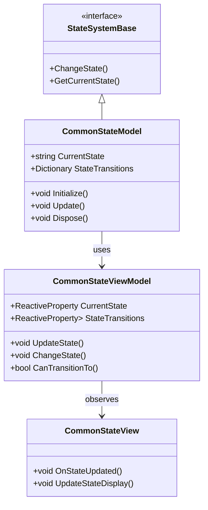
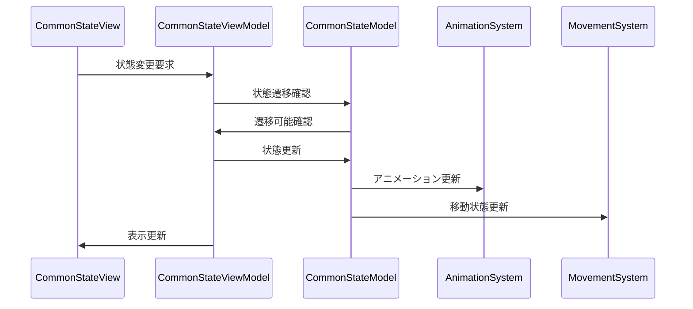

# 共通状態システム実装詳細

# 目次

1. [概要](#1-概要)
2. [クラス図](#2-クラス図)
3. [シーケンス図](#3-シーケンス図)
4. [実装詳細](#4-実装詳細)
5. [パフォーマンス最適化](#5-パフォーマンス最適化)
6. [テスト戦略](#6-テスト戦略)
7. [制限事項](#7-制限事項)
8. [使用方法](#8-使用方法)
9. [変更履歴](#9-変更履歴)

## 1. 概要

### 1.1 目的

本ドキュメントは、共通状態システムの実装詳細を定義し、以下の目的を達成することを目指します：

-   基本的な状態管理の実装
-   状態遷移の制御
-   状態イベントの処理
-   開発チーム間での実装の一貫性確保

### 1.2 適用範囲

-   基本的な状態管理
-   状態遷移の制御
-   状態イベントの処理
-   状態の永続化

## 2. クラス図



## 3. シーケンス図



## 4. 実装詳細

### 4.1 モデル層

```csharp
public class CommonStateModel : StateSystemBase, IDisposable
{
    private readonly CompositeDisposable _disposables;
    private string _currentState;
    private Dictionary<string, string> _stateTransitions;

    public CommonStateModel()
    {
        _disposables = new CompositeDisposable();
    }

    public void Initialize()
    {
        _currentState = "Idle";
        _stateTransitions = new Dictionary<string, string>
        {
            { "Idle", "Walk" },
            { "Walk", "Run" },
            { "Run", "Jump" },
            { "Jump", "Fall" },
            { "Fall", "Idle" }
        };
    }

    public void Update()
    {
        UpdateStateTransitions();
    }

    public void ChangeState(string newState)
    {
        if (CanTransitionTo(newState))
        {
            _currentState = newState;
        }
    }

    public bool CanTransitionTo(string newState)
    {
        return _stateTransitions.ContainsKey(_currentState) &&
               _stateTransitions[_currentState] == newState;
    }

    public void Dispose()
    {
        _disposables.Dispose();
    }
}
```

### 4.2 ビューモデル層

```csharp
public class CommonStateViewModel : ViewModelBase
{
    private readonly CommonStateModel _model;
    private readonly ReactiveProperty<string> _currentState;
    private readonly ReactiveProperty<Dictionary<string, string>> _stateTransitions;

    public CommonStateViewModel(CommonStateModel model)
    {
        _model = model;
        _currentState = new ReactiveProperty<string>();
        _stateTransitions = new ReactiveProperty<Dictionary<string, string>>();

        // 状態変更の購読
        _currentState.Subscribe(OnStateChanged).AddTo(Disposables);
    }

    public void UpdateState()
    {
        _model.Update();
        UpdateStateInfo();
    }

    public void ChangeState(string newState)
    {
        _model.ChangeState(newState);
        _currentState.Value = _model.CurrentState;
    }

    public bool CanTransitionTo(string newState)
    {
        return _model.CanTransitionTo(newState);
    }

    private void UpdateStateInfo()
    {
        _currentState.Value = _model.CurrentState;
        _stateTransitions.Value = _model.StateTransitions;
    }

    private void OnStateChanged(string state)
    {
        EventBus.Publish(new StateChangedEvent(state));
    }
}
```

### 4.3 ビュー層

```csharp
public class CommonStateView : MonoBehaviour
{
    private CommonStateViewModel _viewModel;

    private void Start()
    {
        var model = new CommonStateModel();
        _viewModel = new CommonStateViewModel(model);
        _viewModel.Initialize();
    }

    private void Update()
    {
        _viewModel.UpdateState();
    }

    private void OnDestroy()
    {
        _viewModel.Dispose();
    }
}
```

## 5. パフォーマンス最適化

### 5.1 メモリ管理

-   状態情報のキャッシュ
-   イベントの最適化
-   リソースの適切な解放

### 5.2 更新最適化

-   状態更新の優先順位付け
-   不要な更新の回避
-   バッチ処理の活用

## 6. テスト戦略

### 6.1 単体テスト

```csharp
[Test]
public void TestStateTransition()
{
    var model = new CommonStateModel();
    var viewModel = new CommonStateViewModel(model);

    // 状態遷移のテスト
    viewModel.ChangeState("Walk");
    Assert.That(viewModel.CurrentState.Value, Is.EqualTo("Walk"));
}
```

### 6.2 統合テスト

```csharp
[Test]
public void TestStateToAnimationIntegration()
{
    var stateSystem = new CommonStateSystem();
    var animationSystem = new CommonAnimationSystem();

    // 状態からアニメーションへの連携テスト
    stateSystem.ChangeState("Walk");
    Assert.That(animationSystem.CurrentAnimation.Value, Is.EqualTo("Walk"));
}
```

## 7. 制限事項

-   状態遷移の依存関係
-   メモリ使用量の制限
-   パフォーマンスへの影響

## 8. 使用方法

### 8.1 基本的な使用方法

```csharp
// 状態システムの初期化
var stateSystem = new CommonStateSystem();
stateSystem.Initialize();

// 状態の変更
stateSystem.ChangeState("Walk");
```

### 8.2 注意事項

-   状態遷移の定義が必要
-   適切な更新頻度の設定
-   リソースの解放の確認

## 9. 変更履歴

| バージョン | 更新日     | 変更内容                                                                                       |
| ---------- | ---------- | ---------------------------------------------------------------------------------------------- |
| 0.2.0      | 2024-03-23 | パフォーマンス最適化の追加<br>- 状態遷移の最適化<br>- イベント処理の改善<br>- メモリ管理の強化 |
| 0.1.0      | 2024-03-22 | 初版作成<br>- 基本実装の定義<br>- 状態システムの実装<br>- 使用例の追加                         |
