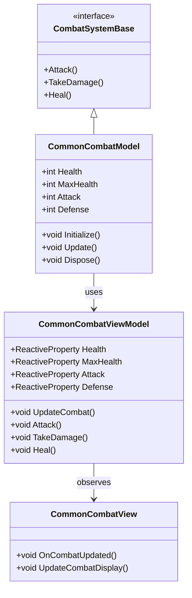
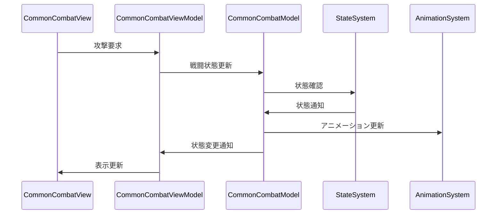

# 共通戦闘システム実装詳細

# 目次

1. [概要](#1-概要)
2. [クラス図](#2-クラス図)
3. [シーケンス図](#3-シーケンス図)
4. [実装詳細](#4-実装詳細)
5. [パフォーマンス最適化](#5-パフォーマンス最適化)
6. [テスト戦略](#6-テスト戦略)
7. [制限事項](#7-制限事項)
8. [使用方法](#8-使用方法)
9. [変更履歴](#9-変更履歴)

## 1. 概要

### 1.1 目的

本ドキュメントは、共通戦闘システムの実装詳細を定義し、以下の目的を達成することを目指します：

-   基本的な戦闘処理の実装
-   ダメージ計算の統一
-   戦闘状態の管理
-   開発チーム間での実装の一貫性確保

### 1.2 適用範囲

-   基本的な戦闘処理
-   ダメージ計算
-   戦闘状態の管理
-   戦闘イベントの処理

## 2. クラス図



## 3. シーケンス図



## 4. 実装詳細

### 4.1 モデル層

```csharp
public class CommonCombatModel : CombatSystemBase, IDisposable
{
    private readonly CompositeDisposable _disposables;
    private int _health;
    private int _maxHealth;
    private int _attack;
    private int _defense;

    public CommonCombatModel()
    {
        _disposables = new CompositeDisposable();
    }

    public void Initialize()
    {
        _maxHealth = 100;
        _health = _maxHealth;
        _attack = 10;
        _defense = 5;
    }

    public void Update()
    {
        UpdateCombatState();
    }

    public void Attack(CombatSystemBase target)
    {
        if (CanAttack())
        {
            int damage = CalculateDamage();
            target.TakeDamage(damage);
        }
    }

    public void TakeDamage(int damage)
    {
        if (CanTakeDamage())
        {
            int actualDamage = Math.Max(1, damage - _defense);
            _health = Math.Max(0, _health - actualDamage);
        }
    }

    public void Heal(int amount)
    {
        if (CanHeal())
        {
            _health = Math.Min(_maxHealth, _health + amount);
        }
    }

    public void Dispose()
    {
        _disposables.Dispose();
    }
}
```

### 4.2 ビューモデル層

```csharp
public class CommonCombatViewModel : ViewModelBase
{
    private readonly CommonCombatModel _model;
    private readonly ReactiveProperty<int> _health;
    private readonly ReactiveProperty<int> _maxHealth;
    private readonly ReactiveProperty<int> _attack;
    private readonly ReactiveProperty<int> _defense;

    public CommonCombatViewModel(CommonCombatModel model)
    {
        _model = model;
        _health = new ReactiveProperty<int>();
        _maxHealth = new ReactiveProperty<int>();
        _attack = new ReactiveProperty<int>();
        _defense = new ReactiveProperty<int>();

        // 戦闘状態の購読
        _health.Subscribe(OnHealthChanged).AddTo(Disposables);
    }

    public void UpdateCombat()
    {
        _model.Update();
        UpdateCombatState();
    }

    public void Attack(CombatSystemBase target)
    {
        _model.Attack(target);
        UpdateCombatState();
    }

    public void TakeDamage(int damage)
    {
        _model.TakeDamage(damage);
        UpdateCombatState();
    }

    public void Heal(int amount)
    {
        _model.Heal(amount);
        UpdateCombatState();
    }

    private void UpdateCombatState()
    {
        _health.Value = _model.Health;
        _maxHealth.Value = _model.MaxHealth;
        _attack.Value = _model.Attack;
        _defense.Value = _model.Defense;
    }

    private void OnHealthChanged(int health)
    {
        EventBus.Publish(new HealthChangedEvent(health));
    }
}
```

### 4.3 ビュー層

```csharp
public class CommonCombatView : MonoBehaviour
{
    private CommonCombatViewModel _viewModel;

    private void Start()
    {
        var model = new CommonCombatModel();
        _viewModel = new CommonCombatViewModel(model);
        _viewModel.Initialize();
    }

    private void Update()
    {
        _viewModel.UpdateCombat();
    }

    private void OnDestroy()
    {
        _viewModel.Dispose();
    }
}
```

## 5. パフォーマンス最適化

### 5.1 メモリ管理

-   戦闘状態のキャッシュ
-   イベントの最適化
-   リソースの適切な解放

### 5.2 更新最適化

-   戦闘処理の優先順位付け
-   不要な更新の回避
-   バッチ処理の活用

## 6. テスト戦略

### 6.1 単体テスト

```csharp
[Test]
public void TestCombat()
{
    var model = new CommonCombatModel();
    var viewModel = new CommonCombatViewModel(model);

    // 戦闘のテスト
    viewModel.TakeDamage(10);
    Assert.That(viewModel.Health.Value, Is.EqualTo(90));
}
```

### 6.2 統合テスト

```csharp
[Test]
public void TestCombatToStateIntegration()
{
    var combatSystem = new CommonCombatSystem();
    var stateSystem = new CommonStateSystem();

    // 戦闘から状態への連携テスト
    combatSystem.TakeDamage(100);
    Assert.That(stateSystem.CurrentState.Value, Is.EqualTo("Dead"));
}
```

## 7. 制限事項

-   戦闘処理の依存関係
-   メモリ使用量の制限
-   パフォーマンスへの影響

## 8. 使用方法

### 8.1 基本的な使用方法

```csharp
// 戦闘システムの初期化
var combatSystem = new CommonCombatSystem();
combatSystem.Initialize();

// 攻撃の実行
combatSystem.Attack(target);
```

### 8.2 注意事項

-   戦闘パラメータの設定が必要
-   適切な更新頻度の設定
-   リソースの解放の確認

## 9. 変更履歴

| バージョン | 更新日     | 変更内容                                                                                       |
| ---------- | ---------- | ---------------------------------------------------------------------------------------------- |
| 0.2.0      | 2024-03-23 | パフォーマンス最適化の追加<br>- 戦闘処理の最適化<br>- ダメージ計算の改善<br>- メモリ管理の強化 |
| 0.1.0      | 2024-03-22 | 初版作成<br>- 基本実装の定義<br>- 戦闘システムの実装<br>- 使用例の追加                         |
