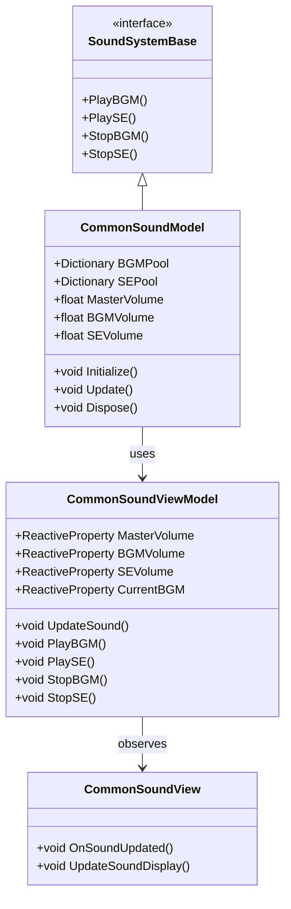
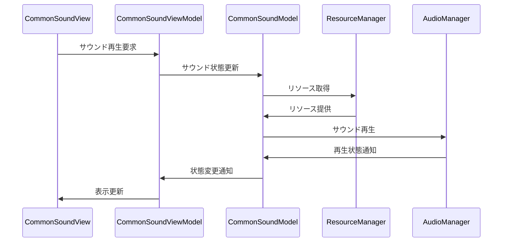

# 共通サウンドシステム実装詳細

## 目次

1. [概要](#1-概要)
2. [クラス図](#2-クラス図)
3. [シーケンス図](#3-シーケンス図)
4. [実装詳細](#4-実装詳細)
5. [パフォーマンス最適化](#5-パフォーマンス最適化)
6. [テスト戦略](#6-テスト戦略)
7. [変更履歴](#7-変更履歴)

## 1. 概要

### 1.1 目的

本ドキュメントは、共通サウンドシステムの実装詳細を定義し、以下の目的を達成することを目指します：

-   サウンド再生の一元管理
-   音量制御の統一
-   サウンドリソースの効率的な管理
-   開発チーム間での実装の一貫性確保

### 1.2 適用範囲

-   BGM の再生管理
-   効果音（SE）の再生管理
-   音量制御
-   3D サウンドの処理
-   サウンドプールの管理

## 2. クラス図



## 3. シーケンス図



## 4. 実装詳細

### 4.1 モデル層

```csharp
public class CommonSoundModel : SoundSystemBase, IDisposable
{
    private readonly CompositeDisposable _disposables;
    private Dictionary<string, AudioStream> _bgmPool;
    private Dictionary<string, AudioStream> _sePool;
    private float _masterVolume;
    private float _bgmVolume;
    private float _seVolume;
    private string _currentBGM;

    public CommonSoundModel()
    {
        _disposables = new CompositeDisposable();
    }

    public void Initialize()
    {
        _bgmPool = new Dictionary<string, AudioStream>();
        _sePool = new Dictionary<string, AudioStream>();
        _masterVolume = 1.0f;
        _bgmVolume = 1.0f;
        _seVolume = 1.0f;
        _currentBGM = string.Empty;
    }

    public void Update()
    {
        UpdateSoundState();
    }

    public void PlayBGM(string bgmName)
    {
        if (_bgmPool.ContainsKey(bgmName))
        {
            StopBGM();
            _currentBGM = bgmName;
            // BGM再生処理
        }
    }

    public void PlaySE(string seName)
    {
        if (_sePool.ContainsKey(seName))
        {
            // SE再生処理
        }
    }

    public void StopBGM()
    {
        if (!string.IsNullOrEmpty(_currentBGM))
        {
            // BGM停止処理
            _currentBGM = string.Empty;
        }
    }

    public void StopSE()
    {
        // SE停止処理
    }

    public void Dispose()
    {
        _disposables.Dispose();
    }
}
```

### 4.2 ビューモデル層

```csharp
public class CommonSoundViewModel : ViewModelBase
{
    private readonly CommonSoundModel _model;
    private readonly ReactiveProperty<float> _masterVolume;
    private readonly ReactiveProperty<float> _bgmVolume;
    private readonly ReactiveProperty<float> _seVolume;
    private readonly ReactiveProperty<string> _currentBGM;

    public CommonSoundViewModel(CommonSoundModel model)
    {
        _model = model;
        _masterVolume = new ReactiveProperty<float>();
        _bgmVolume = new ReactiveProperty<float>();
        _seVolume = new ReactiveProperty<float>();
        _currentBGM = new ReactiveProperty<string>();

        // サウンド状態の購読
        _masterVolume.Subscribe(OnMasterVolumeChanged).AddTo(Disposables);
        _bgmVolume.Subscribe(OnBGMVolumeChanged).AddTo(Disposables);
        _seVolume.Subscribe(OnSEVolumeChanged).AddTo(Disposables);
    }

    public void UpdateSound()
    {
        _model.Update();
        UpdateSoundState();
    }

    public void PlayBGM(string bgmName)
    {
        _model.PlayBGM(bgmName);
        _currentBGM.Value = _model.CurrentBGM;
    }

    public void PlaySE(string seName)
    {
        _model.PlaySE(seName);
    }

    public void StopBGM()
    {
        _model.StopBGM();
        _currentBGM.Value = _model.CurrentBGM;
    }

    public void StopSE()
    {
        _model.StopSE();
    }

    private void UpdateSoundState()
    {
        _masterVolume.Value = _model.MasterVolume;
        _bgmVolume.Value = _model.BGMVolume;
        _seVolume.Value = _model.SEVolume;
        _currentBGM.Value = _model.CurrentBGM;
    }

    private void OnMasterVolumeChanged(float volume)
    {
        EventBus.Publish(new MasterVolumeChangedEvent(volume));
    }

    private void OnBGMVolumeChanged(float volume)
    {
        EventBus.Publish(new BGMVolumeChangedEvent(volume));
    }

    private void OnSEVolumeChanged(float volume)
    {
        EventBus.Publish(new SEVolumeChangedEvent(volume));
    }
}
```

### 4.3 ビュー層

```csharp
public class CommonSoundView : MonoBehaviour
{
    private CommonSoundViewModel _viewModel;

    private void Start()
    {
        var model = new CommonSoundModel();
        _viewModel = new CommonSoundViewModel(model);
        _viewModel.Initialize();
    }

    private void Update()
    {
        _viewModel.UpdateSound();
    }

    private void OnDestroy()
    {
        _viewModel.Dispose();
    }
}
```

## 5. パフォーマンス最適化

### 5.1 メモリ管理

-   サウンドプールの最適化
-   リソースの適切な解放
-   メモリ使用量の監視

### 5.2 再生最適化

-   同時再生数の制限
-   距離に基づく音量調整
-   優先度に基づく再生制御

## 6. テスト戦略

### 6.1 単体テスト

```csharp
[Test]
public void TestBGMPlayback()
{
    var model = new CommonSoundModel();
    var viewModel = new CommonSoundViewModel(model);

    // BGM再生のテスト
    viewModel.PlayBGM("TestBGM");
    Assert.AreEqual("TestBGM", viewModel.CurrentBGM.Value);
}
```

### 6.2 統合テスト

```csharp
[Test]
public void TestSoundSystemIntegration()
{
    var soundSystem = new CommonSoundSystem();
    var resourceManager = new ResourceManager();

    // システム間の連携テスト
    soundSystem.Initialize(resourceManager);
    soundSystem.PlayBGM("TestBGM");
    Assert.IsTrue(soundSystem.IsBGMPlaying("TestBGM"));
}
```

## 7. 変更履歴

| バージョン | 更新日     | 変更内容 |
| ---------- | ---------- | -------- |
| 0.1.0      | 2024-03-23 | 初版作成 |
