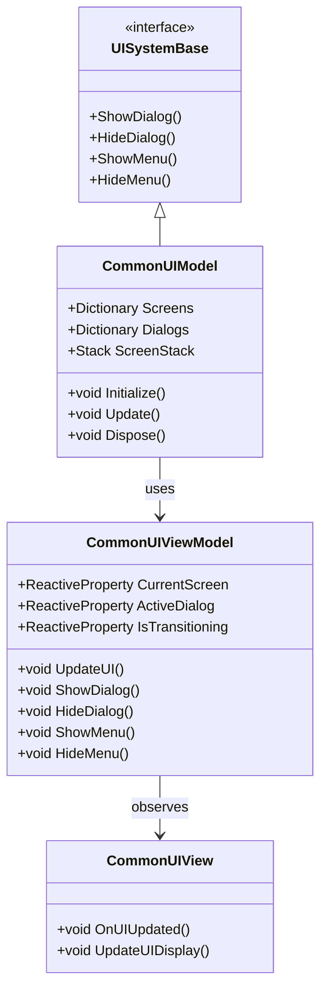
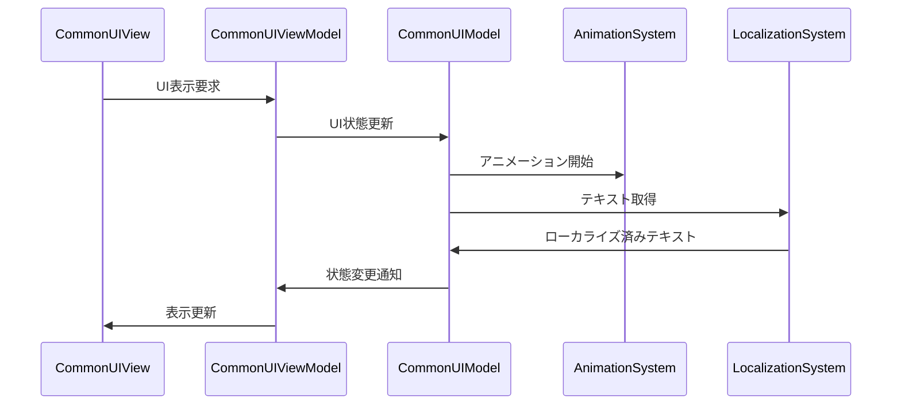

# 共通 UI システム実装詳細

## 目次

1. [概要](#1-概要)
2. [クラス図](#2-クラス図)
3. [シーケンス図](#3-シーケンス図)
4. [実装詳細](#4-実装詳細)
5. [パフォーマンス最適化](#5-パフォーマンス最適化)
6. [テスト戦略](#6-テスト戦略)
7. [変更履歴](#7-変更履歴)

## 1. 概要

### 1.1 目的

本ドキュメントは、共通 UI システムの実装詳細を定義し、以下の目的を達成することを目指します：

-   UI コンポーネントの一元管理
-   画面遷移の統一
-   ダイアログ管理の標準化
-   開発チーム間での実装の一貫性確保

### 1.2 適用範囲

-   共通 UI コンポーネント
-   ダイアログ管理
-   メニュー遷移
-   ローカライズ対応
-   アニメーション制御

## 2. クラス図



## 3. シーケンス図



## 4. 実装詳細

### 4.1 モデル層

```csharp
public class CommonUIModel : UISystemBase, IDisposable
{
    private readonly CompositeDisposable _disposables;
    private Dictionary<string, UIScreen> _screens;
    private Dictionary<string, UIDialog> _dialogs;
    private Stack<UIScreen> _screenStack;
    private UIScreen _currentScreen;
    private UIDialog _activeDialog;

    public CommonUIModel()
    {
        _disposables = new CompositeDisposable();
    }

    public void Initialize()
    {
        _screens = new Dictionary<string, UIScreen>();
        _dialogs = new Dictionary<string, UIDialog>();
        _screenStack = new Stack<UIScreen>();
        _currentScreen = null;
        _activeDialog = null;
    }

    public void Update()
    {
        UpdateUIState();
    }

    public void ShowDialog(string dialogName)
    {
        if (_dialogs.ContainsKey(dialogName))
        {
            _activeDialog = _dialogs[dialogName];
            // ダイアログ表示処理
        }
    }

    public void HideDialog()
    {
        if (_activeDialog != null)
        {
            // ダイアログ非表示処理
            _activeDialog = null;
        }
    }

    public void ShowMenu(string menuName)
    {
        if (_screens.ContainsKey(menuName))
        {
            var screen = _screens[menuName];
            _screenStack.Push(_currentScreen);
            _currentScreen = screen;
            // メニュー表示処理
        }
    }

    public void HideMenu()
    {
        if (_screenStack.Count > 0)
        {
            _currentScreen = _screenStack.Pop();
            // メニュー非表示処理
        }
    }

    public void Dispose()
    {
        _disposables.Dispose();
    }
}
```

### 4.2 ビューモデル層

```csharp
public class CommonUIViewModel : ViewModelBase
{
    private readonly CommonUIModel _model;
    private readonly ReactiveProperty<UIScreen> _currentScreen;
    private readonly ReactiveProperty<UIDialog> _activeDialog;
    private readonly ReactiveProperty<bool> _isTransitioning;

    public CommonUIViewModel(CommonUIModel model)
    {
        _model = model;
        _currentScreen = new ReactiveProperty<UIScreen>();
        _activeDialog = new ReactiveProperty<UIDialog>();
        _isTransitioning = new ReactiveProperty<bool>();

        // UI状態の購読
        _currentScreen.Subscribe(OnScreenChanged).AddTo(Disposables);
        _activeDialog.Subscribe(OnDialogChanged).AddTo(Disposables);
    }

    public void UpdateUI()
    {
        _model.Update();
        UpdateUIState();
    }

    public void ShowDialog(string dialogName)
    {
        _model.ShowDialog(dialogName);
        _activeDialog.Value = _model.ActiveDialog;
    }

    public void HideDialog()
    {
        _model.HideDialog();
        _activeDialog.Value = _model.ActiveDialog;
    }

    public void ShowMenu(string menuName)
    {
        _model.ShowMenu(menuName);
        _currentScreen.Value = _model.CurrentScreen;
    }

    public void HideMenu()
    {
        _model.HideMenu();
        _currentScreen.Value = _model.CurrentScreen;
    }

    private void UpdateUIState()
    {
        _currentScreen.Value = _model.CurrentScreen;
        _activeDialog.Value = _model.ActiveDialog;
    }

    private void OnScreenChanged(UIScreen screen)
    {
        EventBus.Publish(new ScreenChangedEvent(screen));
    }

    private void OnDialogChanged(UIDialog dialog)
    {
        EventBus.Publish(new DialogChangedEvent(dialog));
    }
}
```

### 4.3 ビュー層

```csharp
public class CommonUIView : MonoBehaviour
{
    private CommonUIViewModel _viewModel;

    private void Start()
    {
        var model = new CommonUIModel();
        _viewModel = new CommonUIViewModel(model);
        _viewModel.Initialize();
    }

    private void Update()
    {
        _viewModel.UpdateUI();
    }

    private void OnDestroy()
    {
        _viewModel.Dispose();
    }
}
```

## 5. パフォーマンス最適化

### 5.1 メモリ管理

-   UI コンポーネントのプール化
-   リソースの適切な解放
-   メモリ使用量の監視

### 5.2 描画最適化

-   不要な再描画の防止
-   バッチ処理の活用
-   レイヤー管理の最適化

## 6. テスト戦略

### 6.1 単体テスト

```csharp
[Test]
public void TestDialogShow()
{
    var model = new CommonUIModel();
    var viewModel = new CommonUIViewModel(model);

    // ダイアログ表示のテスト
    viewModel.ShowDialog("TestDialog");
    Assert.IsNotNull(viewModel.ActiveDialog.Value);
}
```

### 6.2 統合テスト

```csharp
[Test]
public void TestUISystemIntegration()
{
    var uiSystem = new CommonUISystem();
    var animationSystem = new AnimationSystem();

    // システム間の連携テスト
    uiSystem.Initialize(animationSystem);
    uiSystem.ShowDialog("TestDialog");
    Assert.IsTrue(uiSystem.IsDialogVisible("TestDialog"));
}
```

## 7. 変更履歴

| バージョン | 更新日     | 変更内容 |
| ---------- | ---------- | -------- |
| 0.1.0      | 2024-03-23 | 初版作成 |
