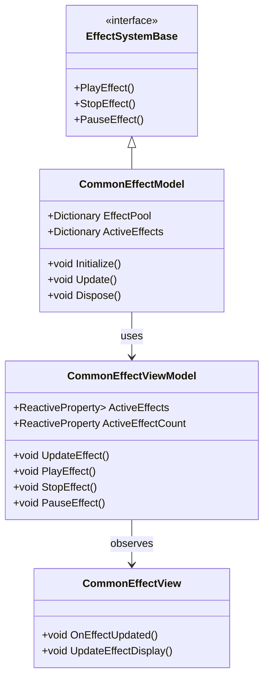
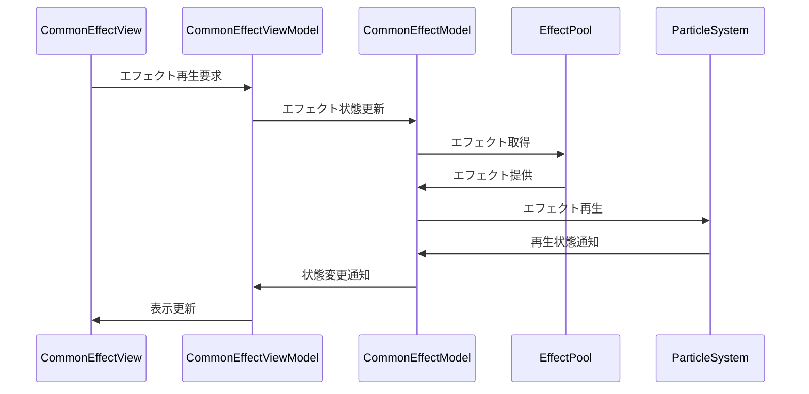

# 共通エフェクトシステム実装詳細

## 目次

1. [概要](#1-概要)
2. [クラス図](#2-クラス図)
3. [シーケンス図](#3-シーケンス図)
4. [実装詳細](#4-実装詳細)
5. [パフォーマンス最適化](#5-パフォーマンス最適化)
6. [テスト戦略](#6-テスト戦略)
7. [変更履歴](#7-変更履歴)

## 1. 概要

### 1.1 目的

本ドキュメントは、共通エフェクトシステムの実装詳細を定義し、以下の目的を達成することを目指します：

-   エフェクトの一元管理
-   パフォーマンスの最適化
-   エフェクトリソースの効率的な管理
-   開発チーム間での実装の一貫性確保

### 1.2 適用範囲

-   パーティクルエフェクト
-   ビジュアルエフェクト
-   エフェクトプール
-   エフェクトアニメーション
-   パフォーマンス最適化

## 2. クラス図



## 3. シーケンス図



## 4. 実装詳細

### 4.1 モデル層

```csharp
public class CommonEffectModel : EffectSystemBase, IDisposable
{
    private readonly CompositeDisposable _disposables;
    private Dictionary<string, EffectData> _effectPool;
    private Dictionary<string, ParticleSystem> _activeEffects;
    private int _maxActiveEffects;

    public CommonEffectModel()
    {
        _disposables = new CompositeDisposable();
    }

    public void Initialize()
    {
        _effectPool = new Dictionary<string, EffectData>();
        _activeEffects = new Dictionary<string, ParticleSystem>();
        _maxActiveEffects = 100;
    }

    public void Update()
    {
        UpdateEffectState();
        CleanupInactiveEffects();
    }

    public void PlayEffect(string effectName, Vector3 position)
    {
        if (_effectPool.ContainsKey(effectName) && _activeEffects.Count < _maxActiveEffects)
        {
            var effectData = _effectPool[effectName];
            var particleSystem = GetParticleSystem(effectData);
            particleSystem.transform.position = position;
            particleSystem.Play();
            _activeEffects[effectName] = particleSystem;
        }
    }

    public void StopEffect(string effectName)
    {
        if (_activeEffects.ContainsKey(effectName))
        {
            var particleSystem = _activeEffects[effectName];
            particleSystem.Stop();
            _activeEffects.Remove(effectName);
        }
    }

    public void PauseEffect(string effectName)
    {
        if (_activeEffects.ContainsKey(effectName))
        {
            var particleSystem = _activeEffects[effectName];
            particleSystem.Pause();
        }
    }

    private void UpdateEffectState()
    {
        foreach (var effect in _activeEffects.Values)
        {
            if (!effect.isPlaying)
            {
                effect.Stop();
            }
        }
    }

    private void CleanupInactiveEffects()
    {
        var inactiveEffects = _activeEffects
            .Where(kvp => !kvp.Value.isPlaying)
            .Select(kvp => kvp.Key)
            .ToList();

        foreach (var effectName in inactiveEffects)
        {
            _activeEffects.Remove(effectName);
        }
    }

    public void Dispose()
    {
        _disposables.Dispose();
    }
}
```

### 4.2 ビューモデル層

```csharp
public class CommonEffectViewModel : ViewModelBase
{
    private readonly CommonEffectModel _model;
    private readonly ReactiveProperty<Dictionary<string, ParticleSystem>> _activeEffects;
    private readonly ReactiveProperty<int> _activeEffectCount;

    public CommonEffectViewModel(CommonEffectModel model)
    {
        _model = model;
        _activeEffects = new ReactiveProperty<Dictionary<string, ParticleSystem>>();
        _activeEffectCount = new ReactiveProperty<int>();

        // エフェクト状態の購読
        _activeEffects.Subscribe(OnActiveEffectsChanged).AddTo(Disposables);
    }

    public void UpdateEffect()
    {
        _model.Update();
        UpdateEffectState();
    }

    public void PlayEffect(string effectName, Vector3 position)
    {
        _model.PlayEffect(effectName, position);
        UpdateEffectState();
    }

    public void StopEffect(string effectName)
    {
        _model.StopEffect(effectName);
        UpdateEffectState();
    }

    public void PauseEffect(string effectName)
    {
        _model.PauseEffect(effectName);
        UpdateEffectState();
    }

    private void UpdateEffectState()
    {
        _activeEffects.Value = _model.ActiveEffects;
        _activeEffectCount.Value = _model.ActiveEffects.Count;
    }

    private void OnActiveEffectsChanged(Dictionary<string, ParticleSystem> effects)
    {
        EventBus.Publish(new ActiveEffectsChangedEvent(effects));
    }
}
```

### 4.3 ビュー層

```csharp
public class CommonEffectView : MonoBehaviour
{
    private CommonEffectViewModel _viewModel;

    private void Start()
    {
        var model = new CommonEffectModel();
        _viewModel = new CommonEffectViewModel(model);
        _viewModel.Initialize();
    }

    private void Update()
    {
        _viewModel.UpdateEffect();
    }

    private void OnDestroy()
    {
        _viewModel.Dispose();
    }
}
```

## 5. パフォーマンス最適化

### 5.1 メモリ管理

-   エフェクトプールの最適化
-   リソースの適切な解放
-   メモリ使用量の監視

### 5.2 描画最適化

-   同時表示数の制限
-   距離に基づく表示制御
-   バッチ処理の活用

## 6. テスト戦略

### 6.1 単体テスト

```csharp
[Test]
public void TestEffectPlayback()
{
    var model = new CommonEffectModel();
    var viewModel = new CommonEffectViewModel(model);

    // エフェクト再生のテスト
    viewModel.PlayEffect("TestEffect", Vector3.zero);
    Assert.IsTrue(viewModel.ActiveEffects.Value.ContainsKey("TestEffect"));
}
```

### 6.2 統合テスト

```csharp
[Test]
public void TestEffectSystemIntegration()
{
    var effectSystem = new CommonEffectSystem();
    var resourceManager = new ResourceManager();

    // システム間の連携テスト
    effectSystem.Initialize(resourceManager);
    effectSystem.PlayEffect("TestEffect", Vector3.zero);
    Assert.IsTrue(effectSystem.IsEffectPlaying("TestEffect"));
}
```

## 7. 変更履歴

| バージョン | 更新日     | 変更内容 |
| ---------- | ---------- | -------- |
| 0.1.0      | 2024-03-23 | 初版作成 |
