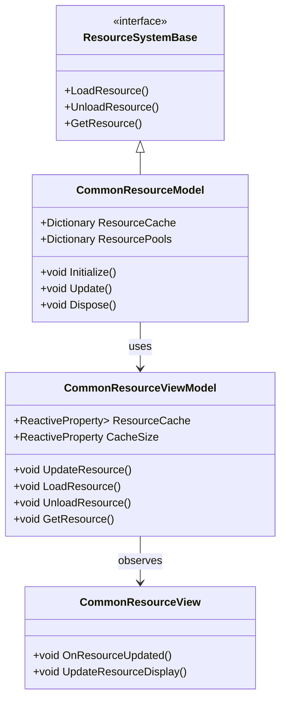
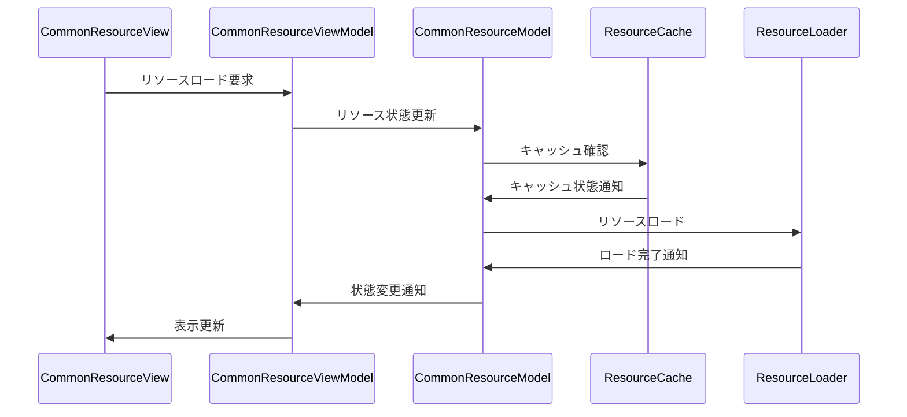

# 共通リソース管理システム実装詳細

## 目次

1. [概要](#1-概要)
2. [クラス図](#2-クラス図)
3. [シーケンス図](#3-シーケンス図)
4. [実装詳細](#4-実装詳細)
5. [パフォーマンス最適化](#5-パフォーマンス最適化)
6. [テスト戦略](#6-テスト戦略)
7. [変更履歴](#7-変更履歴)

## 1. 概要

### 1.1 目的

本ドキュメントは、共通リソース管理システムの実装詳細を定義し、以下の目的を達成することを目指します：

-   リソースの一元管理
-   メモリ使用量の最適化
-   非同期ロードの実装
-   開発チーム間での実装の一貫性確保

### 1.2 適用範囲

-   アセットのロード/アンロード
-   メモリ管理
-   リソースプール
-   非同期ロード
-   キャッシュ管理

## 2. クラス図



## 3. シーケンス図



## 4. 実装詳細

### 4.1 モデル層

```csharp
public class CommonResourceModel : ResourceSystemBase, IDisposable
{
    private readonly CompositeDisposable _disposables;
    private Dictionary<string, ResourceData> _resourceCache;
    private Dictionary<string, ResourcePool> _resourcePools;
    private int _maxCacheSize;
    private int _currentCacheSize;

    public CommonResourceModel()
    {
        _disposables = new CompositeDisposable();
    }

    public void Initialize()
    {
        _resourceCache = new Dictionary<string, ResourceData>();
        _resourcePools = new Dictionary<string, ResourcePool>();
        _maxCacheSize = 1024 * 1024 * 100; // 100MB
        _currentCacheSize = 0;
    }

    public void Update()
    {
        UpdateResourceState();
        CleanupUnusedResources();
    }

    public async Task<ResourceData> LoadResource(string resourcePath)
    {
        if (_resourceCache.ContainsKey(resourcePath))
        {
            return _resourceCache[resourcePath];
        }

        if (_currentCacheSize >= _maxCacheSize)
        {
            CleanupOldestResources();
        }

        var resourceData = await LoadResourceAsync(resourcePath);
        if (resourceData != null)
        {
            _resourceCache[resourcePath] = resourceData;
            _currentCacheSize += resourceData.Size;
        }

        return resourceData;
    }

    public void UnloadResource(string resourcePath)
    {
        if (_resourceCache.ContainsKey(resourcePath))
        {
            var resourceData = _resourceCache[resourcePath];
            _currentCacheSize -= resourceData.Size;
            _resourceCache.Remove(resourcePath);
            resourceData.Dispose();
        }
    }

    public ResourceData GetResource(string resourcePath)
    {
        return _resourceCache.ContainsKey(resourcePath) ? _resourceCache[resourcePath] : null;
    }

    private async Task<ResourceData> LoadResourceAsync(string resourcePath)
    {
        // 非同期ロード処理
        return await Task.Run(() => {
            // リソースロード処理
            return new ResourceData();
        });
    }

    private void UpdateResourceState()
    {
        foreach (var pool in _resourcePools.Values)
        {
            pool.Update();
        }
    }

    private void CleanupUnusedResources()
    {
        var unusedResources = _resourceCache
            .Where(kvp => !kvp.Value.IsInUse)
            .Select(kvp => kvp.Key)
            .ToList();

        foreach (var resourcePath in unusedResources)
        {
            UnloadResource(resourcePath);
        }
    }

    private void CleanupOldestResources()
    {
        var oldestResources = _resourceCache
            .OrderBy(kvp => kvp.Value.LastAccessTime)
            .Take(5)
            .Select(kvp => kvp.Key)
            .ToList();

        foreach (var resourcePath in oldestResources)
        {
            UnloadResource(resourcePath);
        }
    }

    public void Dispose()
    {
        _disposables.Dispose();
    }
}
```

### 4.2 ビューモデル層

```csharp
public class CommonResourceViewModel : ViewModelBase
{
    private readonly CommonResourceModel _model;
    private readonly ReactiveProperty<Dictionary<string, ResourceData>> _resourceCache;
    private readonly ReactiveProperty<int> _cacheSize;

    public CommonResourceViewModel(CommonResourceModel model)
    {
        _model = model;
        _resourceCache = new ReactiveProperty<Dictionary<string, ResourceData>>();
        _cacheSize = new ReactiveProperty<int>();

        // リソース状態の購読
        _resourceCache.Subscribe(OnResourceCacheChanged).AddTo(Disposables);
    }

    public void UpdateResource()
    {
        _model.Update();
        UpdateResourceState();
    }

    public async Task<ResourceData> LoadResource(string resourcePath)
    {
        var resource = await _model.LoadResource(resourcePath);
        UpdateResourceState();
        return resource;
    }

    public void UnloadResource(string resourcePath)
    {
        _model.UnloadResource(resourcePath);
        UpdateResourceState();
    }

    public ResourceData GetResource(string resourcePath)
    {
        return _model.GetResource(resourcePath);
    }

    private void UpdateResourceState()
    {
        _resourceCache.Value = _model.ResourceCache;
        _cacheSize.Value = _model.CurrentCacheSize;
    }

    private void OnResourceCacheChanged(Dictionary<string, ResourceData> cache)
    {
        EventBus.Publish(new ResourceCacheChangedEvent(cache));
    }
}
```

### 4.3 ビュー層

```csharp
public class CommonResourceView : MonoBehaviour
{
    private CommonResourceViewModel _viewModel;

    private void Start()
    {
        var model = new CommonResourceModel();
        _viewModel = new CommonResourceViewModel(model);
        _viewModel.Initialize();
    }

    private void Update()
    {
        _viewModel.UpdateResource();
    }

    private void OnDestroy()
    {
        _viewModel.Dispose();
    }
}
```

## 5. パフォーマンス最適化

### 5.1 メモリ管理

-   キャッシュサイズの最適化
-   リソースの適切な解放
-   メモリ使用量の監視

### 5.2 ロード最適化

-   非同期ロードの実装
-   プリロードの活用
-   バッチ処理の活用

## 6. テスト戦略

### 6.1 単体テスト

```csharp
[Test]
public async Task TestResourceLoading()
{
    var model = new CommonResourceModel();
    var viewModel = new CommonResourceViewModel(model);

    // リソースロードのテスト
    var resource = await viewModel.LoadResource("TestResource");
    Assert.IsNotNull(resource);
    Assert.IsTrue(viewModel.ResourceCache.Value.ContainsKey("TestResource"));
}
```

### 6.2 統合テスト

```csharp
[Test]
public async Task TestResourceSystemIntegration()
{
    var resourceSystem = new CommonResourceSystem();
    var fileSystem = new FileSystem();

    // システム間の連携テスト
    resourceSystem.Initialize(fileSystem);
    var resource = await resourceSystem.LoadResource("TestResource");
    Assert.IsTrue(resourceSystem.IsResourceLoaded("TestResource"));
}
```

## 7. 変更履歴

| バージョン | 更新日     | 変更内容 |
| ---------- | ---------- | -------- |
| 0.1.0      | 2024-03-23 | 初版作成 |
