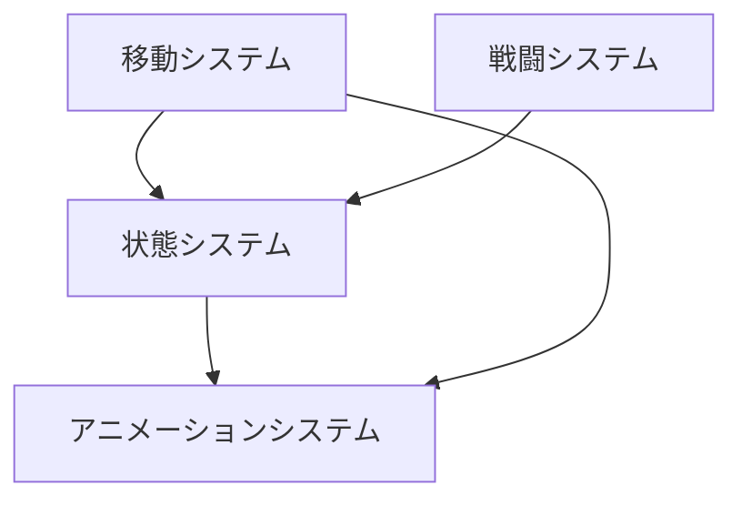
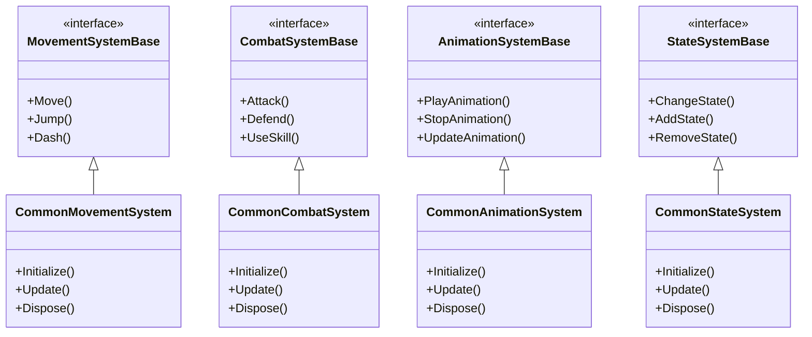
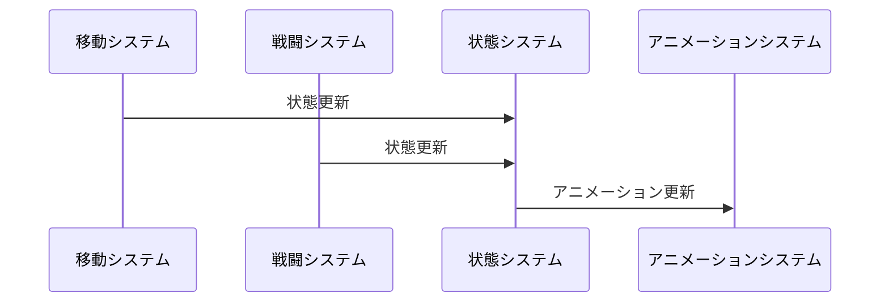

# 共通システム実装詳細

## 目次

1. [概要](#1-概要)
2. [システム構成](#2-システム構成)
3. [アーキテクチャ設計](#3-アーキテクチャ設計)
4. [設計原則](#4-設計原則)
5. [変更履歴](#5-変更履歴)

## 1. 概要

### 1.1 目的

本ドキュメントは、共通システムの実装詳細を定義し、以下の目的を達成することを目指します：

-   共通機能の一元管理
-   システム間の一貫性確保
-   コードの再利用性向上
-   開発チーム間での実装の一貫性確保

### 1.2 適用範囲

-   移動システム
-   アニメーションシステム
-   状態システム
-   戦闘システム

## 2. システム構成

### 2.1 サブシステム

共通システムは以下の 4 つの主要なサブシステムで構成されています：

1. **移動システム**

    - 基本的な移動処理
    - 物理演算との連携
    - 移動状態の管理

2. **アニメーションシステム**

    - 基本的なアニメーション処理
    - アニメーション状態の管理
    - エフェクトの表示

3. **状態システム**

    - 基本的な状態管理
    - バフ/デバフ管理
    - 状態効果の実装

4. **戦闘システム**
    - 基本的な戦闘処理
    - ダメージ計算
    - スキル効果の実装

### 2.2 システム間の連携

## 3. アーキテクチャ設計

### 3.1 全体クラス図

### 3.2 イベントフロー

## 4. 設計原則

### 4.1 共通の設計原則

1. **インターフェースの定義**

    - 各システムの基本インターフェースを定義
    - 共通機能の抽象化
    - 拡張性の確保

2. **MVVM + リアクティブプログラミング**

    - 各サブシステムは MVVM パターンに従う
    - 状態管理は ReactiveProperty を使用
    - イベント駆動の設計を採用

3. **責務の分離**

    - 各サブシステムは独立した責務を持つ
    - システム間の依存関係を最小限に
    - インターフェースを通じた疎結合

4. **拡張性の確保**
    - 新機能の追加が容易な設計
    - プラグインアーキテクチャの採用
    - 設定による動作のカスタマイズ

### 4.2 実装ガイドライン

1. **コード規約**

    - 命名規則の統一
    - コメントの適切な記述
    - エラー処理の標準化

2. **テスト戦略**

    - 単体テストの必須化
    - 統合テストの実施
    - パフォーマンステストの実施

3. **ドキュメント化**
    - 設計意図の明確な記述
    - API ドキュメントの整備
    - 変更履歴の管理

## 5. 変更履歴

| バージョン | 更新日     | 変更内容                         |
| ---------- | ---------- | -------------------------------- |
| 0.2.0      | 2024-03-23 | プレイヤーシステムとの連携を追加 |
| 0.1.0      | 2024-03-21 | 初版作成                         |
