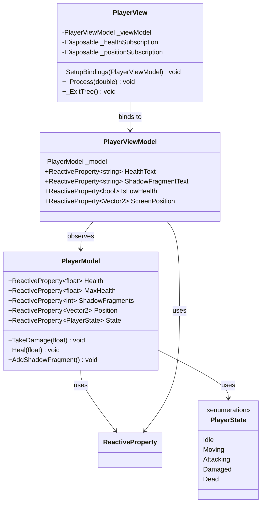
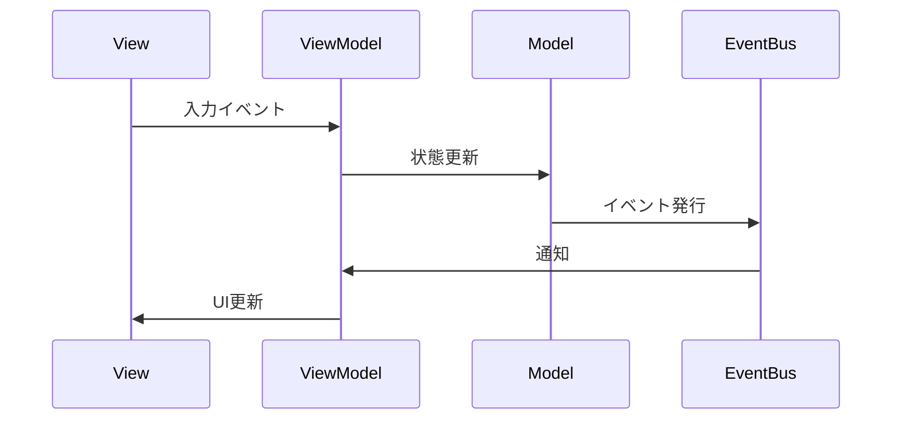

# プレイヤーシステム実装詳細

## 1. 概要

### 1.1 目的

本ドキュメントは、MVVM + リアクティブプログラミングにおけるプレイヤーシステムの実装詳細を定義し、以下の目的を達成することを目指します：

-   プレイヤー関連の機能の実装パターンの確立
-   状態管理と UI 表示の分離
-   開発チーム間での実装の一貫性確保

### 1.2 適用範囲

-   プレイヤーの状態管理
-   プレイヤーの UI 表示
-   プレイヤーの入力処理
-   プレイヤーのアニメーション制御

## 2. クラス図



## 3. シーケンス図



## 4. 実装詳細

### 4.1 モデル層

```csharp
public class PlayerModel
{
    public ReactiveProperty<float> Health { get; } = new(100f);
    public ReactiveProperty<float> MaxHealth { get; } = new(100f);
    public ReactiveProperty<int> ShadowFragments { get; } = new(0);
    public ReactiveProperty<Vector2> Position { get; } = new();
    public ReactiveProperty<PlayerState> State { get; } = new(PlayerState.Idle);

    public void TakeDamage(float damage)
    {
        Health.Value = Mathf.Max(0, Health.Value - damage);
        if (Health.Value <= 0)
        {
            State.Value = PlayerState.Dead;
            GameEventBus.Publish(new PlayerDeathEvent(this));
        }
        else
        {
            State.Value = PlayerState.Damaged;
        }
    }

    public void Heal(float amount)
    {
        Health.Value = Mathf.Min(MaxHealth.Value, Health.Value + amount);
    }

    public void AddShadowFragment()
    {
        ShadowFragments.Value++;
    }
}
```

### 4.2 ビューモデル層

```csharp
public class PlayerViewModel
{
    private readonly PlayerModel _model;
    public ReactiveProperty<string> HealthText { get; } = new();
    public ReactiveProperty<string> ShadowFragmentText { get; } = new();
    public ReactiveProperty<bool> IsLowHealth { get; } = new();
    public ReactiveProperty<Vector2> ScreenPosition { get; } = new();

    public PlayerViewModel(PlayerModel model)
    {
        _model = model;
        SetupSubscriptions();
    }

    private void SetupSubscriptions()
    {
        _model.Health.Subscribe(UpdateHealthDisplay);
        _model.ShadowFragments.Subscribe(UpdateShadowFragmentDisplay);
        _model.Position.Subscribe(UpdateScreenPosition);
    }

    private void UpdateHealthDisplay(float health)
    {
        HealthText.Value = $"HP: {health:F0}";
        IsLowHealth.Value = health < _model.MaxHealth.Value * 0.3f;
    }

    private void UpdateShadowFragmentDisplay(int fragments)
    {
        ShadowFragmentText.Value = $"影の欠片: {fragments}";
    }

    private void UpdateScreenPosition(Vector2 position)
    {
        ScreenPosition.Value = Camera2D.WorldToScreen(position);
    }
}
```

### 4.3 ビュー層

```csharp
public partial class PlayerView : Node2D
{
    private PlayerViewModel _viewModel;
    private IDisposable _healthSubscription;
    private IDisposable _positionSubscription;

    public void SetupBindings(PlayerViewModel viewModel)
    {
        _viewModel = viewModel;
        _healthSubscription = _viewModel.HealthText.Subscribe(text =>
            GetNode<Label>("HealthLabel").Text = text);

        _positionSubscription = _viewModel.ScreenPosition.Subscribe(position =>
            Position = position);
    }

    public override void _Process(double delta)
    {
        if (_viewModel.IsLowHealth.Value)
        {
            // 低体力時のエフェクト表示
            GetNode<AnimationPlayer>("LowHealthEffect").Play();
        }
    }

    public override void _ExitTree()
    {
        _healthSubscription?.Dispose();
        _positionSubscription?.Dispose();
    }
}
```

## 5. パフォーマンス最適化

### 5.1 メモリ管理

-   不要なサブスクリプションの解除
-   リソースの適切な解放
-   エフェクトのプーリング

### 5.2 更新最適化

-   位置更新の最適化
-   アニメーション更新の制御
-   不要な更新の防止

## 6. テスト戦略

### 6.1 単体テスト

```csharp
[Test]
public void PlayerModel_TakeDamage_ReducesHealth()
{
    var model = new PlayerModel();
    float initialHealth = model.Health.Value;
    float damage = 10f;

    model.TakeDamage(damage);

    Assert.AreEqual(initialHealth - damage, model.Health.Value);
}

[Test]
public void PlayerViewModel_HealthText_UpdatesWhenHealthChanges()
{
    var model = new PlayerModel();
    var viewModel = new PlayerViewModel(model);
    float newHealth = 80f;

    model.Health.Value = newHealth;

    Assert.AreEqual($"HP: {newHealth}", viewModel.HealthText.Value);
}
```

### 6.2 統合テスト

```csharp
[Test]
public void PlayerSystem_TakeDamage_UpdatesUI()
{
    var model = new PlayerModel();
    var viewModel = new PlayerViewModel(model);
    var view = new PlayerView();
    view.SetupBindings(viewModel);

    float damage = 10f;
    float initialHealth = model.Health.Value;

    model.TakeDamage(damage);

    Assert.AreEqual(initialHealth - damage, float.Parse(view.GetNode<Label>("HealthLabel").Text));
}
```

## 7. 変更履歴

| バージョン | 更新日     | 変更内容 |
| ---------- | ---------- | -------- |
| 0.1.0      | 2024-03-21 | 初版作成 |
