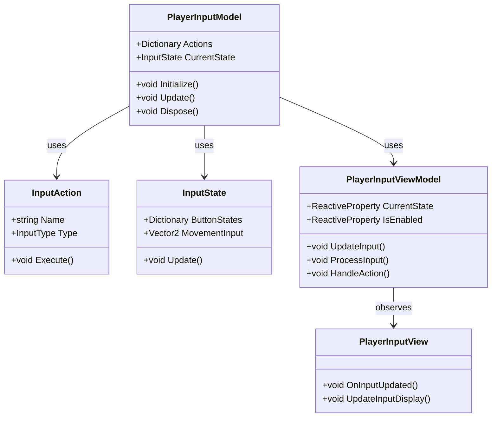
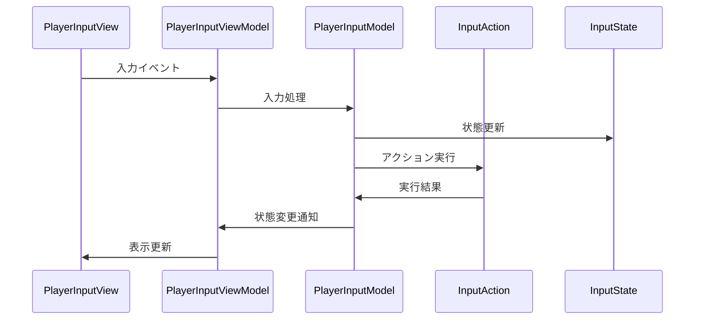

# プレイヤー入力システム実装詳細

## 目次

1. [概要](#1-概要)
2. [クラス図](#2-クラス図)
3. [シーケンス図](#3-シーケンス図)
4. [実装詳細](#4-実装詳細)
5. [パフォーマンス最適化](#5-パフォーマンス最適化)
6. [テスト戦略](#6-テスト戦略)
7. [変更履歴](#7-変更履歴)

## 1. 概要

### 1.1 目的

本ドキュメントは、プレイヤー入力システムの実装詳細を定義し、以下の目的を達成することを目指します：

-   プレイヤー固有の入力処理の実装
-   入力マッピングの管理
-   入力状態の管理
-   開発チーム間での実装の一貫性確保

### 1.2 適用範囲

-   プレイヤー固有の入力処理
-   プレイヤー固有の入力マッピング
-   プレイヤー固有の入力状態
-   プレイヤー固有の入力イベント

## 2. クラス図



## 3. シーケンス図



## 4. 実装詳細

### 4.1 モデル層

```csharp
public class PlayerInputModel : IDisposable
{
    private readonly CompositeDisposable _disposables;
    private Dictionary<string, InputAction> _actions;
    private InputState _currentState;
    private bool _isEnabled;

    public PlayerInputModel()
    {
        _disposables = new CompositeDisposable();
        _actions = new Dictionary<string, InputAction>();
        _currentState = new InputState();
    }

    public void Initialize()
    {
        LoadInputActions();
        _isEnabled = true;
    }

    public void Update()
    {
        if (_isEnabled)
        {
            _currentState.Update();
            ProcessInput();
        }
    }

    private void LoadInputActions()
    {
        _actions["Move"] = new InputAction("Move", InputType.Vector2);
        _actions["Jump"] = new InputAction("Jump", InputType.Button);
        _actions["Attack"] = new InputAction("Attack", InputType.Button);
        _actions["Dash"] = new InputAction("Dash", InputType.Button);
    }

    private void ProcessInput()
    {
        foreach (var action in _actions.Values)
        {
            if (IsActionTriggered(action))
            {
                action.Execute();
            }
        }
    }

    private bool IsActionTriggered(InputAction action)
    {
        switch (action.Type)
        {
            case InputType.Button:
                return _currentState.ButtonStates.ContainsKey(action.Name) &&
                       _currentState.ButtonStates[action.Name];
            case InputType.Vector2:
                return _currentState.MovementInput != Vector2.Zero;
            default:
                return false;
        }
    }

    public void Dispose()
    {
        _disposables.Dispose();
    }
}
```

### 4.2 ビューモデル層

```csharp
public class PlayerInputViewModel : ViewModelBase
{
    private readonly PlayerInputModel _model;
    private readonly ReactiveProperty<InputState> _currentState;
    private readonly ReactiveProperty<bool> _isEnabled;

    public PlayerInputViewModel(PlayerInputModel model)
    {
        _model = model;
        _currentState = new ReactiveProperty<InputState>();
        _isEnabled = new ReactiveProperty<bool>();

        // 入力状態の購読
        _currentState.Subscribe(OnInputStateChanged).AddTo(Disposables);
        _isEnabled.Subscribe(OnEnabledChanged).AddTo(Disposables);
    }

    public void UpdateInput()
    {
        _model.Update();
        UpdateInputState();
    }

    public void ProcessInput()
    {
        if (_isEnabled.Value)
        {
            _model.Update();
        }
    }

    private void UpdateInputState()
    {
        _currentState.Value = _model.CurrentState;
        _isEnabled.Value = _model.IsEnabled;
    }

    private void OnInputStateChanged(InputState state)
    {
        EventBus.Publish(new InputStateChangedEvent(state));
    }

    private void OnEnabledChanged(bool enabled)
    {
        EventBus.Publish(new InputEnabledChangedEvent(enabled));
    }
}
```

### 4.3 ビュー層

```csharp
public class PlayerInputView : MonoBehaviour
{
    private PlayerInputViewModel _viewModel;

    private void Start()
    {
        var model = new PlayerInputModel();
        _viewModel = new PlayerInputViewModel(model);
        _viewModel.Initialize();
    }

    private void Update()
    {
        _viewModel.UpdateInput();
    }

    private void OnDestroy()
    {
        _viewModel.Dispose();
    }
}
```

## 5. パフォーマンス最適化

### 5.1 メモリ管理

-   入力データのキャッシュ
-   イベントの最適化
-   リソースの適切な解放

### 5.2 更新最適化

-   入力処理の優先順位付け
-   不要な更新の回避
-   バッチ処理の活用

## 6. テスト戦略

### 6.1 単体テスト

```csharp
[Test]
public void TestPlayerInput()
{
    var model = new PlayerInputModel();
    var viewModel = new PlayerInputViewModel(model);

    // 入力のテスト
    viewModel.ProcessInput();
    Assert.That(viewModel.CurrentState.Value.MovementInput, Is.EqualTo(Vector2.Zero));
}
```

### 6.2 統合テスト

```csharp
[Test]
public void TestPlayerInputToMovementIntegration()
{
    var inputSystem = new PlayerInputSystem();
    var movementSystem = new PlayerMovementSystem();

    // 入力から移動への連携テスト
    inputSystem.ProcessInput();
    Assert.That(movementSystem.Velocity.Value, Is.EqualTo(Vector2.Zero));
}
```

## 7. 変更履歴

| バージョン | 更新日     | 変更内容                                                                     |
| ---------- | ---------- | ---------------------------------------------------------------------------- |
| 0.2.0      | 2024-03-23 | 共通システムとの連携を追加<br>- 入力処理の最適化<br>- イベントシステムの統合 |
| 0.1.0      | 2024-03-21 | 初版作成                                                                     |
