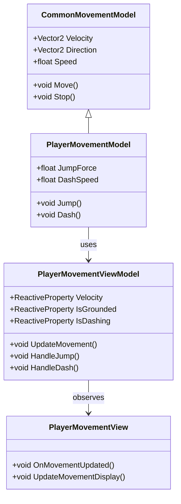
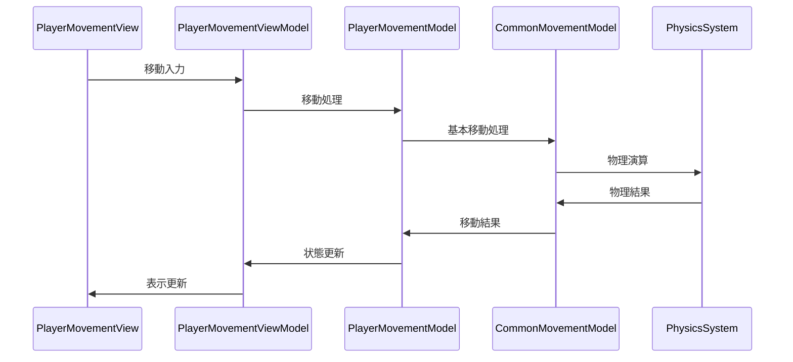

# プレイヤー移動システム実装詳細

## 目次

1. [概要](#1-概要)
2. [クラス図](#2-クラス図)
3. [シーケンス図](#3-シーケンス図)
4. [実装詳細](#4-実装詳細)
5. [パフォーマンス最適化](#5-パフォーマンス最適化)
6. [テスト戦略](#6-テスト戦略)
7. [変更履歴](#7-変更履歴)

## 1. 概要

### 1.1 目的

本ドキュメントは、プレイヤー移動システムの実装詳細を定義し、以下の目的を達成することを目指します：

-   プレイヤー固有の移動処理の実装
-   共通移動システムの拡張
-   移動状態の管理
-   開発チーム間での実装の一貫性確保

### 1.2 適用範囲

-   プレイヤー固有の移動処理
-   プレイヤー固有の移動パラメータ
-   プレイヤー固有の移動状態
-   プレイヤー固有の移動イベント

## 2. クラス図



## 3. シーケンス図



## 4. 実装詳細

### 4.1 モデル層

```csharp
public class PlayerMovementModel : CommonMovementModel
{
    private readonly CompositeDisposable _disposables;
    private float _jumpForce;
    private float _dashSpeed;
    private bool _isGrounded;
    private bool _isDashing;

    public PlayerMovementModel()
    {
        _disposables = new CompositeDisposable();
        _jumpForce = 10f;
        _dashSpeed = 20f;
    }

    public void Initialize()
    {
        // プレイヤー固有の移動パラメータの初期化
        Speed = 5f;
        _isGrounded = true;
        _isDashing = false;
    }

    public void Update()
    {
        if (_isDashing)
        {
            // ダッシュ中の処理
            Velocity = Direction * _dashSpeed;
        }
        else
        {
            // 通常移動の処理
            base.Move();
        }
    }

    public void Jump()
    {
        if (_isGrounded)
        {
            Velocity = new Vector2(Velocity.x, _jumpForce);
            _isGrounded = false;
        }
    }

    public void Dash()
    {
        if (!_isDashing)
        {
            _isDashing = true;
            // ダッシュ開始時の処理
        }
    }

    public void StopDash()
    {
        if (_isDashing)
        {
            _isDashing = false;
            // ダッシュ終了時の処理
        }
    }

    public void Dispose()
    {
        _disposables.Dispose();
    }
}
```

### 4.2 ビューモデル層

```csharp
public class PlayerMovementViewModel : ViewModelBase
{
    private readonly PlayerMovementModel _model;
    private readonly ReactiveProperty<Vector2> _velocity;
    private readonly ReactiveProperty<bool> _isGrounded;
    private readonly ReactiveProperty<bool> _isDashing;

    public PlayerMovementViewModel(PlayerMovementModel model)
    {
        _model = model;
        _velocity = new ReactiveProperty<Vector2>();
        _isGrounded = new ReactiveProperty<bool>();
        _isDashing = new ReactiveProperty<bool>();

        // 移動状態の購読
        _velocity.Subscribe(OnVelocityChanged).AddTo(Disposables);
        _isGrounded.Subscribe(OnGroundedChanged).AddTo(Disposables);
        _isDashing.Subscribe(OnDashingChanged).AddTo(Disposables);
    }

    public void UpdateMovement()
    {
        _model.Update();
        UpdateMovementState();
    }

    public void HandleJump()
    {
        _model.Jump();
    }

    public void HandleDash()
    {
        _model.Dash();
    }

    private void UpdateMovementState()
    {
        _velocity.Value = _model.Velocity;
        _isGrounded.Value = _model.IsGrounded;
        _isDashing.Value = _model.IsDashing;
    }

    private void OnVelocityChanged(Vector2 velocity)
    {
        EventBus.Publish(new MovementVelocityChangedEvent(velocity));
    }

    private void OnGroundedChanged(bool isGrounded)
    {
        EventBus.Publish(new MovementGroundedChangedEvent(isGrounded));
    }

    private void OnDashingChanged(bool isDashing)
    {
        EventBus.Publish(new MovementDashingChangedEvent(isDashing));
    }
}
```

### 4.3 ビュー層

```csharp
public class PlayerMovementView : MonoBehaviour
{
    private PlayerMovementViewModel _viewModel;

    private void Start()
    {
        var model = new PlayerMovementModel();
        _viewModel = new PlayerMovementViewModel(model);
        _viewModel.Initialize();
    }

    private void Update()
    {
        _viewModel.UpdateMovement();
    }

    private void OnDestroy()
    {
        _viewModel.Dispose();
    }
}
```

## 5. パフォーマンス最適化

### 5.1 メモリ管理

-   移動データのキャッシュ
-   イベントの最適化
-   リソースの適切な解放

### 5.2 更新最適化

-   移動処理の優先順位付け
-   不要な更新の回避
-   バッチ処理の活用

## 6. テスト戦略

### 6.1 単体テスト

```csharp
[Test]
public void TestPlayerMovement()
{
    var model = new PlayerMovementModel();
    var viewModel = new PlayerMovementViewModel(model);

    // 移動のテスト
    viewModel.UpdateMovement();
    Assert.That(viewModel.Velocity.Value, Is.EqualTo(Vector2.Zero));
}
```

### 6.2 統合テスト

```csharp
[Test]
public void TestPlayerMovementToAnimationIntegration()
{
    var movementSystem = new PlayerMovementSystem();
    var animationSystem = new PlayerAnimationSystem();

    // 移動からアニメーションへの連携テスト
    movementSystem.UpdateMovement();
    Assert.That(animationSystem.CurrentAnimation.Value, Is.EqualTo("Idle"));
}
```

## 7. 変更履歴

| バージョン | 更新日     | 変更内容                                                                     |
| ---------- | ---------- | ---------------------------------------------------------------------------- |
| 0.2.0      | 2024-03-23 | 共通システムとの連携を追加<br>- 移動処理の最適化<br>- 物理演算システムの統合 |
| 0.1.0      | 2024-03-21 | 初版作成                                                                     |
