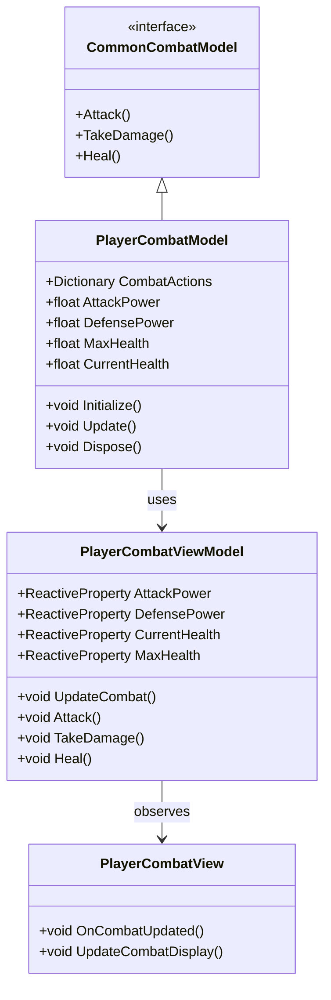
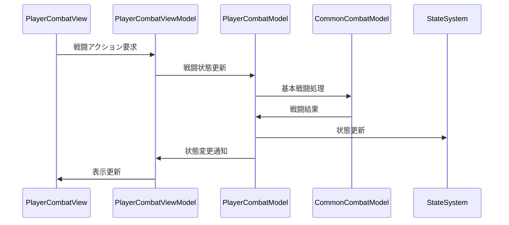

# プレイヤー戦闘システム実装詳細

## 目次

1. [概要](#1-概要)
2. [クラス図](#2-クラス図)
3. [シーケンス図](#3-シーケンス図)
4. [実装詳細](#4-実装詳細)
5. [パフォーマンス最適化](#5-パフォーマンス最適化)
6. [テスト戦略](#6-テスト戦略)
7. [変更履歴](#7-変更履歴)

## 1. 概要

### 1.1 目的

本ドキュメントは、プレイヤー戦闘システムの実装詳細を定義し、以下の目的を達成することを目指します：

-   プレイヤー固有の戦闘処理の実装
-   共通戦闘システムの拡張
-   プレイヤー固有の戦闘状態の管理
-   開発チーム間での実装の一貫性確保

### 1.2 適用範囲

-   プレイヤー固有の戦闘処理
-   プレイヤー固有の戦闘状態
-   プレイヤー固有の戦闘効果
-   プレイヤー固有の戦闘イベント

## 2. クラス図



## 3. シーケンス図



## 4. 実装詳細

### 4.1 モデル層

```csharp
public class PlayerCombatModel : CommonCombatModel, IDisposable
{
    private readonly CompositeDisposable _disposables;
    private Dictionary<string, CombatData> _combatActions;
    private float _attackPower;
    private float _defensePower;
    private float _maxHealth;
    private float _currentHealth;

    public PlayerCombatModel()
    {
        _disposables = new CompositeDisposable();
        _combatActions = new Dictionary<string, CombatData>();
    }

    public void Initialize()
    {
        LoadCombatActions();
        _attackPower = 10.0f;
        _defensePower = 5.0f;
        _maxHealth = 100.0f;
        _currentHealth = _maxHealth;
    }

    public void Update()
    {
        UpdateCombatState();
    }

    public override void Attack(string actionName)
    {
        if (_combatActions.ContainsKey(actionName))
        {
            var action = _combatActions[actionName];
            var damage = _attackPower * action.DamageMultiplier;
            action.OnExecute(damage);
        }
    }

    public override void TakeDamage(float damage)
    {
        var actualDamage = Math.Max(0, damage - _defensePower);
        _currentHealth = Math.Max(0, _currentHealth - actualDamage);
    }

    public override void Heal(float amount)
    {
        _currentHealth = Math.Min(_maxHealth, _currentHealth + amount);
    }

    private void LoadCombatActions()
    {
        _combatActions["BasicAttack"] = new CombatData("BasicAttack", 1.0f, OnBasicAttack);
        _combatActions["StrongAttack"] = new CombatData("StrongAttack", 2.0f, OnStrongAttack);
        _combatActions["SpecialAttack"] = new CombatData("SpecialAttack", 3.0f, OnSpecialAttack);
    }

    private void OnBasicAttack(float damage)
    {
        // 基本攻撃の処理
    }

    private void OnStrongAttack(float damage)
    {
        // 強攻撃の処理
    }

    private void OnSpecialAttack(float damage)
    {
        // 特殊攻撃の処理
    }

    public void Dispose()
    {
        _disposables.Dispose();
    }
}
```

### 4.2 ビューモデル層

```csharp
public class PlayerCombatViewModel : ViewModelBase
{
    private readonly PlayerCombatModel _model;
    private readonly ReactiveProperty<float> _attackPower;
    private readonly ReactiveProperty<float> _defensePower;
    private readonly ReactiveProperty<float> _currentHealth;
    private readonly ReactiveProperty<float> _maxHealth;

    public PlayerCombatViewModel(PlayerCombatModel model)
    {
        _model = model;
        _attackPower = new ReactiveProperty<float>();
        _defensePower = new ReactiveProperty<float>();
        _currentHealth = new ReactiveProperty<float>();
        _maxHealth = new ReactiveProperty<float>();

        // 戦闘状態の購読
        _currentHealth.Subscribe(OnHealthChanged).AddTo(Disposables);
        _attackPower.Subscribe(OnAttackPowerChanged).AddTo(Disposables);
    }

    public void UpdateCombat()
    {
        _model.Update();
        UpdateCombatState();
    }

    public void Attack(string actionName)
    {
        _model.Attack(actionName);
        UpdateCombatState();
    }

    public void TakeDamage(float damage)
    {
        _model.TakeDamage(damage);
        UpdateCombatState();
    }

    public void Heal(float amount)
    {
        _model.Heal(amount);
        UpdateCombatState();
    }

    private void UpdateCombatState()
    {
        _attackPower.Value = _model.AttackPower;
        _defensePower.Value = _model.DefensePower;
        _currentHealth.Value = _model.CurrentHealth;
        _maxHealth.Value = _model.MaxHealth;
    }

    private void OnHealthChanged(float health)
    {
        EventBus.Publish(new HealthChangedEvent(health));
    }

    private void OnAttackPowerChanged(float power)
    {
        EventBus.Publish(new AttackPowerChangedEvent(power));
    }
}
```

### 4.3 ビュー層

```csharp
public class PlayerCombatView : MonoBehaviour
{
    private PlayerCombatViewModel _viewModel;

    private void Start()
    {
        var model = new PlayerCombatModel();
        _viewModel = new PlayerCombatViewModel(model);
        _viewModel.Initialize();
    }

    private void Update()
    {
        _viewModel.UpdateCombat();
    }

    private void OnDestroy()
    {
        _viewModel.Dispose();
    }
}
```

## 5. パフォーマンス最適化

### 5.1 メモリ管理

-   戦闘データのキャッシュ
-   イベントの最適化
-   リソースの適切な解放

### 5.2 更新最適化

-   戦闘処理の優先順位付け
-   不要な更新の回避
-   バッチ処理の活用

## 6. テスト戦略

### 6.1 単体テスト

```csharp
[Test]
public void TestPlayerCombat()
{
    var model = new PlayerCombatModel();
    var viewModel = new PlayerCombatViewModel(model);

    // 戦闘のテスト
    viewModel.Attack("BasicAttack");
    Assert.That(viewModel.AttackPower.Value, Is.EqualTo(10.0f));
}
```

### 6.2 統合テスト

```csharp
[Test]
public void TestPlayerCombatToStateIntegration()
{
    var combatSystem = new PlayerCombatSystem();
    var stateSystem = new PlayerStateSystem();

    // 戦闘から状態への連携テスト
    combatSystem.TakeDamage(50.0f);
    Assert.That(stateSystem.CurrentState.Value, Is.EqualTo("Damaged"));
}
```

## 7. 変更履歴

| バージョン | 更新日     | 変更内容                                                                         |
| ---------- | ---------- | -------------------------------------------------------------------------------- |
| 0.2.0      | 2024-03-23 | 共通システムとの連携を追加<br>- 戦闘処理の最適化<br>- ダメージ計算システムの統合 |
| 0.1.0      | 2024-03-21 | 初版作成                                                                         |
