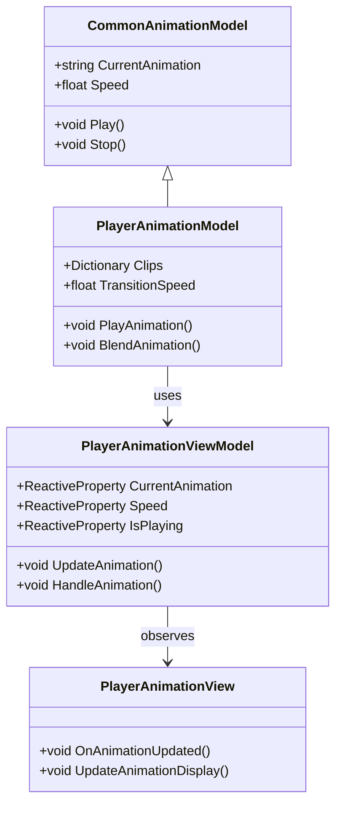
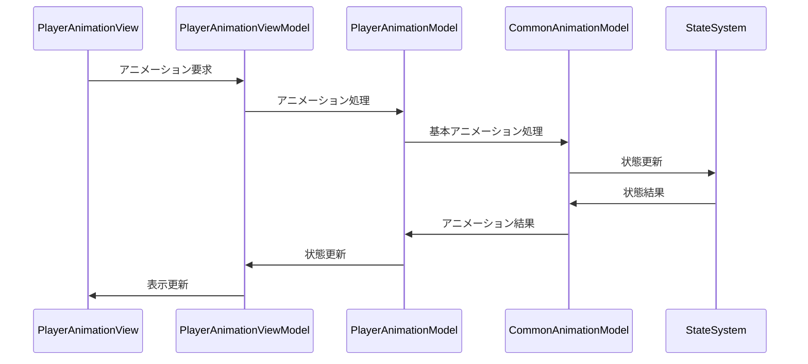

# プレイヤーアニメーションシステム実装詳細

## 目次

1. [概要](#1-概要)
2. [クラス図](#2-クラス図)
3. [シーケンス図](#3-シーケンス図)
4. [実装詳細](#4-実装詳細)
5. [パフォーマンス最適化](#5-パフォーマンス最適化)
6. [テスト戦略](#6-テスト戦略)
7. [変更履歴](#7-変更履歴)

## 1. 概要

### 1.1 目的

本ドキュメントは、プレイヤーアニメーションシステムの実装詳細を定義し、以下の目的を達成することを目指します：

-   プレイヤー固有のアニメーション処理の実装
-   共通アニメーションシステムの拡張
-   アニメーション状態の管理
-   開発チーム間での実装の一貫性確保

### 1.2 適用範囲

-   プレイヤー固有のアニメーション処理
-   プレイヤー固有のアニメーションパラメータ
-   プレイヤー固有のアニメーション状態
-   プレイヤー固有のアニメーションイベント

## 2. クラス図



## 3. シーケンス図



## 4. 実装詳細

### 4.1 モデル層

```csharp
public class PlayerAnimationModel : CommonAnimationModel
{
    private readonly CompositeDisposable _disposables;
    private Dictionary<string, AnimationClip> _clips;
    private float _transitionSpeed;
    private bool _isPlaying;

    public PlayerAnimationModel()
    {
        _disposables = new CompositeDisposable();
        _clips = new Dictionary<string, AnimationClip>();
        _transitionSpeed = 0.25f;
    }

    public void Initialize()
    {
        // プレイヤー固有のアニメーションパラメータの初期化
        LoadAnimationClips();
        CurrentAnimation = "Idle";
        Speed = 1.0f;
        _isPlaying = true;
    }

    private void LoadAnimationClips()
    {
        _clips["Idle"] = Resources.Load<AnimationClip>("Animations/Player/Idle");
        _clips["Walk"] = Resources.Load<AnimationClip>("Animations/Player/Walk");
        _clips["Run"] = Resources.Load<AnimationClip>("Animations/Player/Run");
        _clips["Jump"] = Resources.Load<AnimationClip>("Animations/Player/Jump");
        _clips["Attack"] = Resources.Load<AnimationClip>("Animations/Player/Attack");
    }

    public void Update()
    {
        if (_isPlaying)
        {
            // アニメーション更新処理
            UpdateAnimation();
        }
    }

    public void PlayAnimation(string animationName)
    {
        if (_clips.ContainsKey(animationName))
        {
            CurrentAnimation = animationName;
            Play();
        }
    }

    public void BlendAnimation(string fromAnimation, string toAnimation, float blendTime)
    {
        if (_clips.ContainsKey(fromAnimation) && _clips.ContainsKey(toAnimation))
        {
            // アニメーションブレンド処理
            StartCoroutine(BlendAnimationCoroutine(fromAnimation, toAnimation, blendTime));
        }
    }

    private IEnumerator BlendAnimationCoroutine(string fromAnimation, string toAnimation, float blendTime)
    {
        float elapsedTime = 0f;
        while (elapsedTime < blendTime)
        {
            float blend = elapsedTime / blendTime;
            // ブレンド処理
            elapsedTime += Time.deltaTime;
            yield return null;
        }
        CurrentAnimation = toAnimation;
    }

    public void Dispose()
    {
        _disposables.Dispose();
    }
}
```

### 4.2 ビューモデル層

```csharp
public class PlayerAnimationViewModel : ViewModelBase
{
    private readonly PlayerAnimationModel _model;
    private readonly ReactiveProperty<string> _currentAnimation;
    private readonly ReactiveProperty<float> _speed;
    private readonly ReactiveProperty<bool> _isPlaying;

    public PlayerAnimationViewModel(PlayerAnimationModel model)
    {
        _model = model;
        _currentAnimation = new ReactiveProperty<string>();
        _speed = new ReactiveProperty<float>();
        _isPlaying = new ReactiveProperty<bool>();

        // アニメーション状態の購読
        _currentAnimation.Subscribe(OnAnimationChanged).AddTo(Disposables);
        _speed.Subscribe(OnSpeedChanged).AddTo(Disposables);
        _isPlaying.Subscribe(OnPlayingChanged).AddTo(Disposables);
    }

    public void UpdateAnimation()
    {
        _model.Update();
        UpdateAnimationState();
    }

    public void HandleAnimation(string animationName)
    {
        _model.PlayAnimation(animationName);
    }

    private void UpdateAnimationState()
    {
        _currentAnimation.Value = _model.CurrentAnimation;
        _speed.Value = _model.Speed;
        _isPlaying.Value = _model.IsPlaying;
    }

    private void OnAnimationChanged(string animation)
    {
        EventBus.Publish(new AnimationChangedEvent(animation));
    }

    private void OnSpeedChanged(float speed)
    {
        EventBus.Publish(new AnimationSpeedChangedEvent(speed));
    }

    private void OnPlayingChanged(bool isPlaying)
    {
        EventBus.Publish(new AnimationPlayingChangedEvent(isPlaying));
    }
}
```

### 4.3 ビュー層

```csharp
public class PlayerAnimationView : MonoBehaviour
{
    private PlayerAnimationViewModel _viewModel;

    private void Start()
    {
        var model = new PlayerAnimationModel();
        _viewModel = new PlayerAnimationViewModel(model);
        _viewModel.Initialize();
    }

    private void Update()
    {
        _viewModel.UpdateAnimation();
    }

    private void OnDestroy()
    {
        _viewModel.Dispose();
    }
}
```

## 5. パフォーマンス最適化

### 5.1 メモリ管理

-   アニメーションデータのキャッシュ
-   イベントの最適化
-   リソースの適切な解放

### 5.2 更新最適化

-   アニメーション処理の優先順位付け
-   不要な更新の回避
-   バッチ処理の活用

## 6. テスト戦略

### 6.1 単体テスト

```csharp
[Test]
public void TestPlayerAnimation()
{
    var model = new PlayerAnimationModel();
    var viewModel = new PlayerAnimationViewModel(model);

    // アニメーションのテスト
    viewModel.UpdateAnimation();
    Assert.That(viewModel.CurrentAnimation.Value, Is.EqualTo("Idle"));
}
```

### 6.2 統合テスト

```csharp
[Test]
public void TestPlayerAnimationToStateIntegration()
{
    var animationSystem = new PlayerAnimationSystem();
    var stateSystem = new PlayerStateSystem();

    // アニメーションから状態への連携テスト
    animationSystem.UpdateAnimation();
    Assert.That(stateSystem.CurrentState.Value, Is.EqualTo("Idle"));
}
```

## 7. 変更履歴

| バージョン | 更新日     | 変更内容                                                                               |
| ---------- | ---------- | -------------------------------------------------------------------------------------- |
| 0.2.0      | 2024-03-23 | 共通システムとの連携を追加<br>- アニメーション処理の最適化<br>- ブレンドシステムの統合 |
| 0.1.0      | 2024-03-21 | 初版作成                                                                               |
