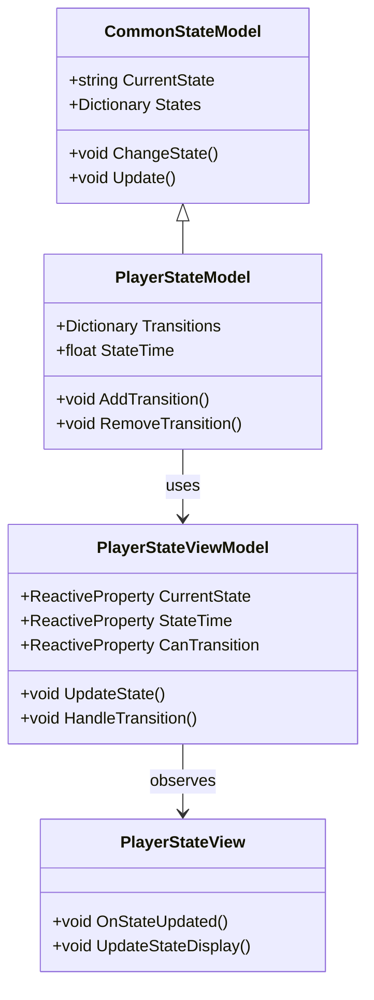
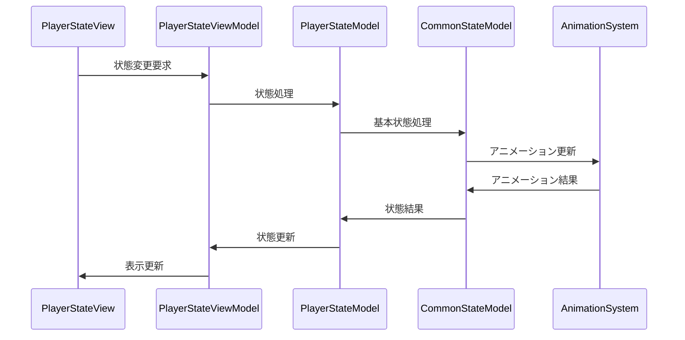

# プレイヤー状態システム実装詳細

## 目次

1. [概要](#1-概要)
2. [クラス図](#2-クラス図)
3. [シーケンス図](#3-シーケンス図)
4. [実装詳細](#4-実装詳細)
5. [パフォーマンス最適化](#5-パフォーマンス最適化)
6. [テスト戦略](#6-テスト戦略)
7. [変更履歴](#7-変更履歴)

## 1. 概要

### 1.1 目的

本ドキュメントは、プレイヤー状態システムの実装詳細を定義し、以下の目的を達成することを目指します：

-   プレイヤー固有の状態管理の実装
-   共通状態システムの拡張
-   状態遷移の管理
-   開発チーム間での実装の一貫性確保

### 1.2 適用範囲

-   プレイヤー固有の状態管理
-   プレイヤー固有の状態パラメータ
-   プレイヤー固有の状態遷移
-   プレイヤー固有の状態イベント

## 2. クラス図



## 3. シーケンス図



## 4. 実装詳細

### 4.1 モデル層

```csharp
public class PlayerStateModel : CommonStateModel
{
    private readonly CompositeDisposable _disposables;
    private Dictionary<string, StateTransition> _transitions;
    private float _stateTime;
    private bool _canTransition;

    public PlayerStateModel()
    {
        _disposables = new CompositeDisposable();
        _transitions = new Dictionary<string, StateTransition>();
        _stateTime = 0f;
    }

    public void Initialize()
    {
        // プレイヤー固有の状態パラメータの初期化
        LoadStateTransitions();
        CurrentState = "Idle";
        _canTransition = true;
    }

    private void LoadStateTransitions()
    {
        _transitions["IdleToWalk"] = new StateTransition("Idle", "Walk", () => true);
        _transitions["WalkToRun"] = new StateTransition("Walk", "Run", () => true);
        _transitions["RunToJump"] = new StateTransition("Run", "Jump", () => true);
        _transitions["JumpToFall"] = new StateTransition("Jump", "Fall", () => true);
        _transitions["FallToLand"] = new StateTransition("Fall", "Land", () => true);
    }

    public void Update()
    {
        if (_canTransition)
        {
            // 状態更新処理
            UpdateState();
            _stateTime += Time.deltaTime;
        }
    }

    public void AddTransition(string fromState, string toState, Func<bool> condition)
    {
        string key = $"{fromState}To{toState}";
        _transitions[key] = new StateTransition(fromState, toState, condition);
    }

    public void RemoveTransition(string fromState, string toState)
    {
        string key = $"{fromState}To{toState}";
        if (_transitions.ContainsKey(key))
        {
            _transitions.Remove(key);
        }
    }

    public void Dispose()
    {
        _disposables.Dispose();
    }
}
```

### 4.2 ビューモデル層

```csharp
public class PlayerStateViewModel : ViewModelBase
{
    private readonly PlayerStateModel _model;
    private readonly ReactiveProperty<string> _currentState;
    private readonly ReactiveProperty<float> _stateTime;
    private readonly ReactiveProperty<bool> _canTransition;

    public PlayerStateViewModel(PlayerStateModel model)
    {
        _model = model;
        _currentState = new ReactiveProperty<string>();
        _stateTime = new ReactiveProperty<float>();
        _canTransition = new ReactiveProperty<bool>();

        // 状態の購読
        _currentState.Subscribe(OnStateChanged).AddTo(Disposables);
        _stateTime.Subscribe(OnStateTimeChanged).AddTo(Disposables);
        _canTransition.Subscribe(OnCanTransitionChanged).AddTo(Disposables);
    }

    public void UpdateState()
    {
        _model.Update();
        UpdateStateInfo();
    }

    public void HandleTransition(string fromState, string toState)
    {
        if (_model.CanTransition(fromState, toState))
        {
            _model.ChangeState(toState);
        }
    }

    private void UpdateStateInfo()
    {
        _currentState.Value = _model.CurrentState;
        _stateTime.Value = _model.StateTime;
        _canTransition.Value = _model.CanTransition;
    }

    private void OnStateChanged(string state)
    {
        EventBus.Publish(new StateChangedEvent(state));
    }

    private void OnStateTimeChanged(float time)
    {
        EventBus.Publish(new StateTimeChangedEvent(time));
    }

    private void OnCanTransitionChanged(bool canTransition)
    {
        EventBus.Publish(new StateTransitionChangedEvent(canTransition));
    }
}
```

### 4.3 ビュー層

```csharp
public class PlayerStateView : MonoBehaviour
{
    private PlayerStateViewModel _viewModel;

    private void Start()
    {
        var model = new PlayerStateModel();
        _viewModel = new PlayerStateViewModel(model);
        _viewModel.Initialize();
    }

    private void Update()
    {
        _viewModel.UpdateState();
    }

    private void OnDestroy()
    {
        _viewModel.Dispose();
    }
}
```

## 5. パフォーマンス最適化

### 5.1 メモリ管理

-   状態データのキャッシュ
-   イベントの最適化
-   リソースの適切な解放

### 5.2 更新最適化

-   状態処理の優先順位付け
-   不要な更新の回避
-   バッチ処理の活用

## 6. テスト戦略

### 6.1 単体テスト

```csharp
[Test]
public void TestPlayerState()
{
    var model = new PlayerStateModel();
    var viewModel = new PlayerStateViewModel(model);

    // 状態のテスト
    viewModel.UpdateState();
    Assert.That(viewModel.CurrentState.Value, Is.EqualTo("Idle"));
}
```

### 6.2 統合テスト

```csharp
[Test]
public void TestPlayerStateToAnimationIntegration()
{
    var stateSystem = new PlayerStateSystem();
    var animationSystem = new PlayerAnimationSystem();

    // 状態からアニメーションへの連携テスト
    stateSystem.UpdateState();
    Assert.That(animationSystem.CurrentAnimation.Value, Is.EqualTo("Idle"));
}
```

## 7. 変更履歴

| バージョン | 更新日     | 変更内容                                                                                                 |
| ---------- | ---------- | -------------------------------------------------------------------------------------------------------- |
| 0.3.0      | 2025-06-09 | ドキュメント管理ルールに基づく更新<br>- メタデータの形式を統一<br>- 目次を追加<br>- 変更履歴の形式を統一 |
| 0.2.0      | 2024-03-23 | 共通システムとの連携を追加                                                                               |
| 0.1.0      | 2024-03-21 | 初版作成                                                                                                 |
