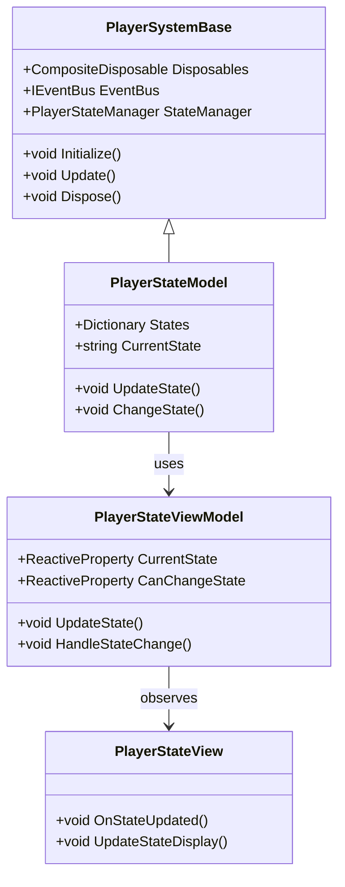
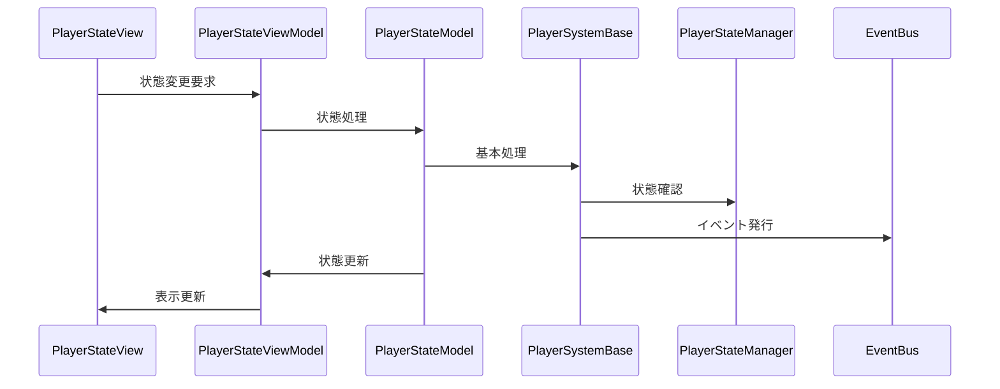

# プレイヤー状態システム実装詳細

## 目次

1. [概要](#1-概要)
2. [クラス図](#2-クラス図)
3. [シーケンス図](#3-シーケンス図)
4. [実装詳細](#4-実装詳細)
5. [パフォーマンス最適化](#5-パフォーマンス最適化)
6. [テスト戦略](#6-テスト戦略)
7. [変更履歴](#7-変更履歴)

## 1. 概要

### 1.1 目的

本ドキュメントは、プレイヤー状態システムの実装詳細を定義し、以下の目的を達成することを目指します：

-   プレイヤー固有の状態管理の実装
-   共通状態システムの拡張
-   状態遷移の管理
-   開発チーム間での実装の一貫性確保

### 1.2 適用範囲

-   プレイヤー固有の状態管理
-   プレイヤー固有の状態遷移
-   プレイヤー固有の状態イベント
-   プレイヤー固有の状態パラメータ

## 2. クラス図



## 3. シーケンス図



## 4. 実装詳細

### 4.1 モデル層

```csharp
public class PlayerStateModel : PlayerSystemBase
{
    private readonly Dictionary<string, State> _states;
    private string _currentState;
    private bool _canChangeState;

    public PlayerStateModel(IEventBus eventBus) : base(eventBus)
    {
        _states = new Dictionary<string, State>();
        _currentState = "Idle";
        _canChangeState = true;
    }

    public override void Initialize()
    {
        try
        {
            // プレイヤー固有の状態の初期化
            InitializeStates();
            RegisterStateTransitions();

            // 状態の登録
            StateManager.RegisterState("Player", new PlayerState());
            StateManager.RegisterTransition("Player", "Idle", () => _currentState == "Idle");
            StateManager.RegisterTransition("Player", "Moving", () => _currentState == "Moving");
            StateManager.RegisterTransition("Player", "Attacking", () => _currentState == "Attacking");
        }
        catch (Exception ex)
        {
            HandleError("Initialize", ex);
        }
    }

    private void InitializeStates()
    {
        try
        {
            _states["Idle"] = new IdleState();
            _states["Moving"] = new MovingState();
            _states["Attacking"] = new AttackingState();
            _states["Jumping"] = new JumpingState();
            _states["Falling"] = new FallingState();
        }
        catch (Exception ex)
        {
            HandleError("InitializeStates", ex);
        }
    }

    private void RegisterStateTransitions()
    {
        try
        {
            // 状態遷移の登録
            _states["Idle"].AddTransition("Moving", () => IsMoving());
            _states["Idle"].AddTransition("Attacking", () => IsAttacking());
            _states["Moving"].AddTransition("Idle", () => !IsMoving());
            _states["Moving"].AddTransition("Jumping", () => IsJumping());
            _states["Attacking"].AddTransition("Idle", () => !IsAttacking());
        }
        catch (Exception ex)
        {
            HandleError("RegisterStateTransitions", ex);
        }
    }

    public override void Update()
    {
        try
        {
            if (_canChangeState)
            {
                UpdateState();
            }
        }
        catch (Exception ex)
        {
            HandleError("Update", ex);
        }
    }

    public void ChangeState(string newState)
    {
        try
        {
            if (!_states.ContainsKey(newState))
            {
                throw new ArgumentException($"Invalid state: {newState}");
            }

            if (!_canChangeState)
            {
                throw new InvalidOperationException("Cannot change state at this time");
            }

            var currentState = _states[_currentState];
            if (currentState.CanTransitionTo(newState))
            {
                _currentState = newState;
                EventBus.Publish(new StateChangedEvent(_currentState));
            }
        }
        catch (Exception ex)
        {
            HandleError("ChangeState", ex);
        }
    }

    private void UpdateState()
    {
        var currentState = _states[_currentState];
        var nextState = currentState.GetNextState();
        if (nextState != null)
        {
            ChangeState(nextState);
        }
    }

    private bool IsMoving() => Input.GetAxis("Horizontal") != 0 || Input.GetAxis("Vertical") != 0;
    private bool IsAttacking() => Input.GetButtonDown("Fire1");
    private bool IsJumping() => Input.GetButtonDown("Jump");
}
```

### 4.2 ビューモデル層

```csharp
public class PlayerStateViewModel : ViewModelBase
{
    private readonly PlayerStateModel _model;
    private readonly ReactiveProperty<string> _currentState;
    private readonly ReactiveProperty<bool> _canChangeState;

    public PlayerStateViewModel(PlayerStateModel model)
    {
        _model = model;
        _currentState = new ReactiveProperty<string>();
        _canChangeState = new ReactiveProperty<bool>();

        // 状態変更の購読
        _currentState.Subscribe(OnStateChanged).AddTo(Disposables);
        _canChangeState.Subscribe(OnCanChangeStateChanged).AddTo(Disposables);
    }

    public void UpdateState()
    {
        _model.Update();
        UpdateStateDisplay();
    }

    public void HandleStateChange(string newState)
    {
        _model.ChangeState(newState);
    }

    private void UpdateStateDisplay()
    {
        _currentState.Value = _model.CurrentState;
        _canChangeState.Value = _model.CanChangeState;
    }

    private void OnStateChanged(string state)
    {
        EventBus.Publish(new StateChangedEvent(state));
    }

    private void OnCanChangeStateChanged(bool canChange)
    {
        EventBus.Publish(new CanChangeStateChangedEvent(canChange));
    }
}
```

### 4.3 ビュー層

```csharp
public class PlayerStateView : MonoBehaviour
{
    private PlayerStateViewModel _viewModel;

    private void Start()
    {
        var eventBus = new EventBus();
        var model = new PlayerStateModel(eventBus);
        _viewModel = new PlayerStateViewModel(model);
        _viewModel.Initialize();
    }

    private void Update()
    {
        _viewModel.UpdateState();
    }

    private void OnDestroy()
    {
        _viewModel.Dispose();
    }
}
```

## 5. パフォーマンス最適化

### 5.1 メモリ管理

-   状態オブジェクトのキャッシュ
-   イベントの最適化
-   リソースの適切な解放

### 5.2 更新最適化

-   状態更新の優先順位付け
-   不要な更新の回避
-   バッチ処理の活用

## 6. テスト戦略

### 6.1 単体テスト

```csharp
[Test]
public void TestPlayerState()
{
    var eventBus = new EventBus();
    var model = new PlayerStateModel(eventBus);
    var viewModel = new PlayerStateViewModel(model);

    // 状態のテスト
    viewModel.UpdateState();
    Assert.That(viewModel.CurrentState.Value, Is.EqualTo("Idle"));
}
```

### 6.2 統合テスト

```csharp
[Test]
public void TestPlayerStateToAnimationIntegration()
{
    var eventBus = new EventBus();
    var stateSystem = new PlayerStateModel(eventBus);
    var animationSystem = new PlayerAnimationModel(eventBus);

    // 状態からアニメーションへの連携テスト
    stateSystem.ChangeState("Moving");
    Assert.That(animationSystem.CurrentAnimation, Is.EqualTo("Walk"));
}
```

## 7. 変更履歴

| バージョン | 更新日     | 変更内容                                                                                   |
| ---------- | ---------- | ------------------------------------------------------------------------------------------ |
| 0.3.0      | 2024-03-24 | 基底クラスの導入<br>- エラーハンドリングの統一<br>- 状態管理の統合<br>- イベント処理の改善 |
| 0.2.0      | 2024-03-23 | 共通システムとの連携を追加<br>- 状態遷移の最適化<br>- イベントシステムの統合               |
| 0.1.0      | 2024-03-21 | 初版作成                                                                                   |
