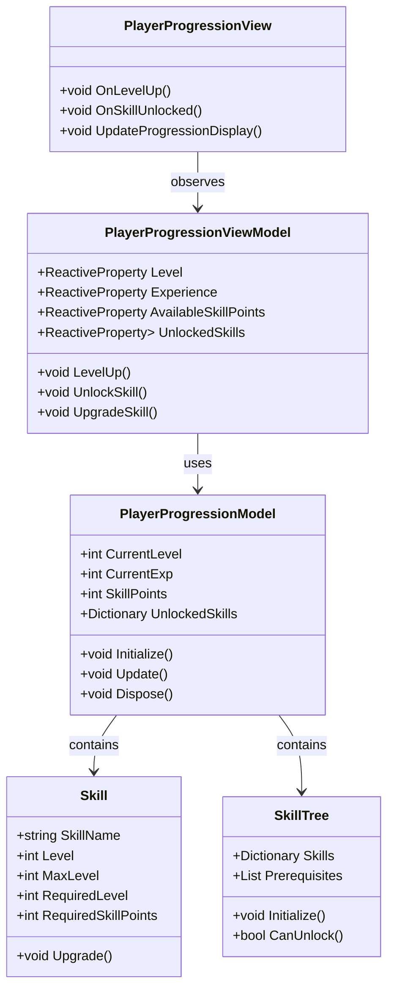
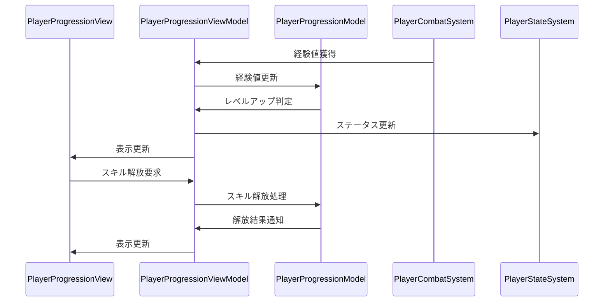

# プレイヤー進行システム実装詳細

## 目次

1. [概要](#1-概要)
2. [クラス図](#2-クラス図)
3. [シーケンス図](#3-シーケンス図)
4. [実装詳細](#4-実装詳細)
5. [パフォーマンス最適化](#5-パフォーマンス最適化)
6. [テスト戦略](#6-テスト戦略)
7. [変更履歴](#7-変更履歴)

## 1. 概要

### 1.1 目的

本ドキュメントは、プレイヤー進行システムの実装詳細を定義し、以下の目的を達成することを目指します：

-   プレイヤー固有の進行管理の実装
-   レベルアップシステムの実装
-   スキル解放と強化の管理
-   開発チーム間での実装の一貫性確保

### 1.2 適用範囲

-   経験値とレベルの管理
-   スキルポイントの管理
-   スキルツリーの実装
-   進行状態の保存と読み込み

## 2. クラス図



## 3. シーケンス図



## 4. 実装詳細

### 4.1 モデル層

```csharp
public class PlayerProgressionModel : IDisposable
{
    private readonly Dictionary<string, Skill> _unlockedSkills;
    private readonly SkillTree _skillTree;
    private readonly CompositeDisposable _disposables;

    public int CurrentLevel { get; private set; }
    public int CurrentExp { get; private set; }
    public int SkillPoints { get; private set; }

    public PlayerProgressionModel()
    {
        _unlockedSkills = new Dictionary<string, Skill>();
        _skillTree = new SkillTree();
        _disposables = new CompositeDisposable();
    }

    public void Initialize()
    {
        CurrentLevel = 1;
        CurrentExp = 0;
        SkillPoints = 0;
        _skillTree.Initialize();
    }

    public void AddExperience(int exp)
    {
        CurrentExp += exp;
        CheckLevelUp();
    }

    private void CheckLevelUp()
    {
        var expNeeded = CalculateExpNeeded(CurrentLevel);
        if (CurrentExp >= expNeeded)
        {
            LevelUp();
        }
    }

    private void LevelUp()
    {
        CurrentLevel++;
        SkillPoints += CalculateSkillPoints(CurrentLevel);
        CurrentExp -= CalculateExpNeeded(CurrentLevel - 1);
    }

    public bool UnlockSkill(string skillName)
    {
        if (!_skillTree.CanUnlock(skillName, CurrentLevel, SkillPoints))
        {
            return false;
        }

        var skill = _skillTree.GetSkill(skillName);
        _unlockedSkills[skillName] = skill;
        SkillPoints -= skill.RequiredSkillPoints;
        return true;
    }

    public void Dispose()
    {
        _disposables.Dispose();
    }
}
```

### 4.2 ビューモデル層

```csharp
public class PlayerProgressionViewModel : ViewModelBase
{
    private readonly PlayerProgressionModel _model;
    private readonly ReactiveProperty<int> _level;
    private readonly ReactiveProperty<int> _experience;
    private readonly ReactiveProperty<int> _availableSkillPoints;
    private readonly ReactiveProperty<List<Skill>> _unlockedSkills;

    public PlayerProgressionViewModel(PlayerProgressionModel model)
    {
        _model = model;
        _level = new ReactiveProperty<int>();
        _experience = new ReactiveProperty<int>();
        _availableSkillPoints = new ReactiveProperty<int>();
        _unlockedSkills = new ReactiveProperty<List<Skill>>();

        // 進行状態の購読
        _level.Subscribe(OnLevelChanged).AddTo(Disposables);
        _experience.Subscribe(OnExperienceChanged).AddTo(Disposables);
        _availableSkillPoints.Subscribe(OnSkillPointsChanged).AddTo(Disposables);
    }

    public void AddExperience(int exp)
    {
        _model.AddExperience(exp);
        UpdateProgressionState();
    }

    public bool UnlockSkill(string skillName)
    {
        var result = _model.UnlockSkill(skillName);
        if (result)
        {
            UpdateProgressionState();
            EventBus.Publish(new SkillUnlockedEvent(skillName));
        }
        return result;
    }

    private void UpdateProgressionState()
    {
        _level.Value = _model.CurrentLevel;
        _experience.Value = _model.CurrentExp;
        _availableSkillPoints.Value = _model.SkillPoints;
        _unlockedSkills.Value = _model.UnlockedSkills.Values.ToList();
    }

    private void OnLevelChanged(int level)
    {
        EventBus.Publish(new LevelUpEvent(level));
    }

    private void OnExperienceChanged(int exp)
    {
        EventBus.Publish(new ExperienceChangedEvent(exp));
    }

    private void OnSkillPointsChanged(int points)
    {
        EventBus.Publish(new SkillPointsChangedEvent(points));
    }
}
```

### 4.3 ビュー層

```csharp
public class PlayerProgressionView : MonoBehaviour
{
    private PlayerProgressionViewModel _viewModel;

    private void Start()
    {
        var model = new PlayerProgressionModel();
        _viewModel = new PlayerProgressionViewModel(model);
        _viewModel.Initialize();
    }

    private void OnDestroy()
    {
        _viewModel.Dispose();
    }

    public void OnExperienceGained(int exp)
    {
        _viewModel.AddExperience(exp);
    }

    public void OnSkillUnlockRequested(string skillName)
    {
        _viewModel.UnlockSkill(skillName);
    }
}
```

## 5. パフォーマンス最適化

### 5.1 メモリ管理

-   スキルデータのキャッシュ
-   イベントの最適化
-   リソースの適切な解放

### 5.2 更新最適化

-   進行状態の更新頻度制御
-   不要な更新の回避
-   バッチ処理の活用

## 6. テスト戦略

### 6.1 単体テスト

```csharp
[Test]
public void TestLevelUp()
{
    var model = new PlayerProgressionModel();
    var viewModel = new PlayerProgressionViewModel(model);

    // レベルアップのテスト
    viewModel.AddExperience(1000);
    Assert.That(viewModel.Level.Value, Is.EqualTo(2));
}
```

### 6.2 統合テスト

```csharp
[Test]
public void TestCombatToProgressionIntegration()
{
    var combatSystem = new PlayerCombatSystem();
    var progressionSystem = new PlayerProgressionSystem();

    // 戦闘から進行への連携テスト
    combatSystem.OnEnemyDefeated(100);
    Assert.That(progressionSystem.CurrentExp, Is.EqualTo(100));
}
```

## 7. 変更履歴

| バージョン | 更新日     | 変更内容                                                                                                 |
| ---------- | ---------- | -------------------------------------------------------------------------------------------------------- |
| 0.3.0      | 2025-06-09 | ドキュメント管理ルールに基づく更新<br>- メタデータの形式を統一<br>- 目次を追加<br>- 変更履歴の形式を統一 |
| 0.2.0      | 2024-03-23 | 共通システムとの連携を追加                                                                               |
| 0.1.0      | 2024-03-21 | 初版作成                                                                                                 |
