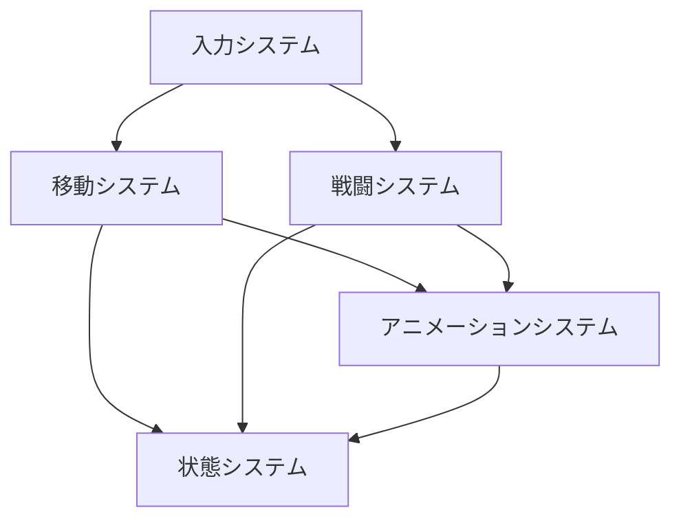
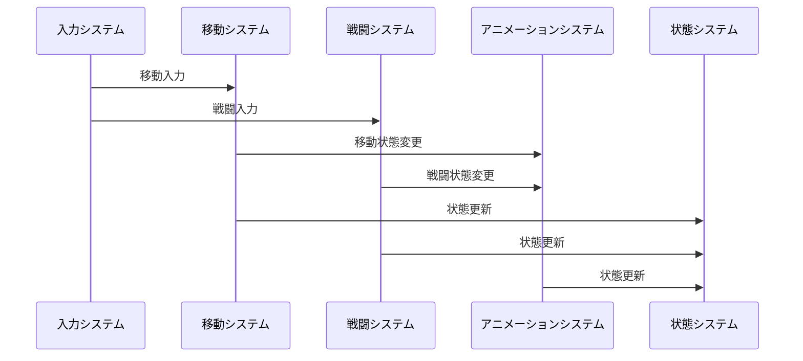

# プレイヤーシステム実装詳細

## 目次

1. [概要](#1-概要)
2. [システム構成](#2-システム構成)
3. [実装詳細](#3-実装詳細)
4. [実装ガイドライン](#4-実装ガイドライン)
5. [テスト戦略](#5-テスト戦略)
6. [変更履歴](#6-変更履歴)

## 1. 概要

### 1.1 目的

本ドキュメントは、プレイヤーシステムの実装詳細を定義し、以下の目的を達成することを目指します：

-   プレイヤー固有の機能実装
-   共通システムの拡張
-   プレイヤー固有の状態管理
-   開発チーム間での実装の一貫性確保

### 1.2 適用範囲

-   プレイヤー固有の機能
-   プレイヤー固有の状態
-   プレイヤー固有のイベント
-   プレイヤー固有の設定

## 2. システム構成

### 2.1 サブシステム

プレイヤーシステムは以下のサブシステムで構成されます：

1. 入力システム

    - プレイヤー固有の入力処理
    - 入力マッピングの管理
    - 入力状態の管理

2. 移動システム

    - プレイヤー固有の移動処理
    - 共通移動システムの拡張
    - 移動状態の管理

3. 戦闘システム

    - プレイヤー固有の戦闘処理
    - 共通戦闘システムの拡張
    - 戦闘状態の管理

4. アニメーションシステム

    - プレイヤー固有のアニメーション処理
    - 共通アニメーションシステムの拡張
    - アニメーション状態の管理

5. 状態システム
    - プレイヤー固有の状態管理
    - 共通状態システムの拡張
    - 状態遷移の管理

### 2.2 システム間の連携

## 3. 実装詳細

### 3.1 共通システムとの連携

各サブシステムは対応する共通システムを拡張して実装します：

1. 移動システム

    - `CommonMovementModel`を継承
    - プレイヤー固有の移動パラメータを追加
    - プレイヤー固有の移動処理を実装

2. 戦闘システム

    - `CommonCombatModel`を継承
    - プレイヤー固有の戦闘パラメータを追加
    - プレイヤー固有の戦闘処理を実装

3. アニメーションシステム

    - `CommonAnimationModel`を継承
    - プレイヤー固有のアニメーションパラメータを追加
    - プレイヤー固有のアニメーション処理を実装

4. 状態システム
    - `CommonStateModel`を継承
    - プレイヤー固有の状態パラメータを追加
    - プレイヤー固有の状態処理を実装

### 3.2 イベントフロー

## 4. 実装ガイドライン

### 4.1 命名規則

-   クラス名: `Player[機能]Model/ViewModel/View`
-   メソッド名: キャメルケース
-   プロパティ名: パスカルケース
-   イベント名: `[機能]Event`

### 4.2 コーディング規約

-   MVVM パターンの厳格な適用
-   リアクティブプログラミングの活用
-   イベント駆動アーキテクチャの採用
-   依存性注入の活用

### 4.3 エラー処理

-   例外の適切な処理
-   エラーログの記録
-   リカバリー処理の実装
-   デバッグ情報の提供

## 5. テスト戦略

### 5.1 単体テスト

-   各サブシステムの機能テスト
-   共通システムとの連携テスト
-   エラー処理のテスト
-   パフォーマンステスト

### 5.2 統合テスト

-   サブシステム間の連携テスト
-   共通システムとの統合テスト
-   エンドツーエンドテスト
-   負荷テスト

## 6. 変更履歴

| バージョン | 更新日     | 変更内容                                                                                                 |
| ---------- | ---------- | -------------------------------------------------------------------------------------------------------- |
| 0.3.0      | 2025-06-09 | ドキュメント管理ルールに基づく更新 - メタデータの形式を統一 - 目次を追加 - 変更履歴の形式を統一 |
| 0.2.0      | 2024-03-23 | 共通システムとの連携を追加                                                                               |
| 0.1.0      | 2024-03-21 | 初版作成                                                                                                 |
