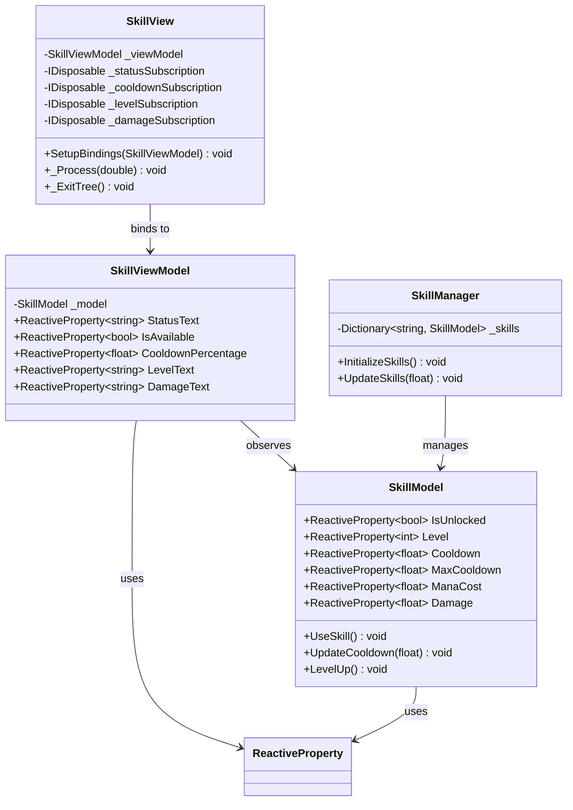
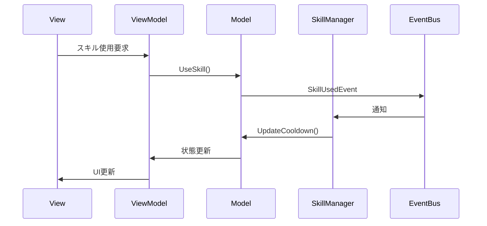

# スキルシステム実装詳細

## 目次

1. [概要](#1-%E6%A6%82%E8%A6%81)
2. [クラス図](#2-%E3%82%AF%E3%83%A9%E3%82%B9%E5%9B%B3)
3. [シーケンス図](#3-%E3%82%B7%E3%83%BC%E3%82%B1%E3%83%B3%E3%82%B9%E5%9B%B3)
4. [実装詳細](#4-%E5%AE%9F%E8%A3%85%E8%A9%B3%E7%B4%B0)
5. [パフォーマンス最適化](#5-%E3%83%91%E3%83%95%E3%82%A9%E3%83%BC%E3%83%9E%E3%83%B3%E3%82%B9%E6%9C%80%E9%81%A9%E5%8C%96)
6. [テスト戦略](#6-%E3%83%86%E3%82%B9%E3%83%88%E6%88%A6%E7%95%A5)
7. [変更履歴](#7-%E5%A4%89%E6%9B%B4%E5%B1%A5%E6%AD%B4)

## 1. 概要

### 1.1 目的

本ドキュメントは、MVVM + リアクティブプログラミングにおけるスキルシステムの実装詳細を定義し、以下の目的を達成することを目指します：

-   スキル関連の機能の実装パターンの確立
-   スキルの状態管理と UI 表示の分離
-   開発チーム間での実装の一貫性確保

### 1.2 適用範囲

-   スキルの状態管理
-   スキルの UI 表示
-   スキルの使用処理
-   クールダウン管理

## 2. クラス図



## 3. シーケンス図



## 4. 実装詳細

### 4.1 モデル層

```csharp
public class SkillModel
{
    public ReactiveProperty<bool> IsUnlocked { get; } = new(false);
    public ReactiveProperty<int> Level { get; } = new(0);
    public ReactiveProperty<float> Cooldown { get; } = new(0f);
    public ReactiveProperty<float> MaxCooldown { get; } = new(5f);
    public ReactiveProperty<float> ManaCost { get; } = new(10f);
    public ReactiveProperty<float> Damage { get; } = new(20f);

    public void UseSkill()
    {
        if (IsUnlocked.Value && Cooldown.Value <= 0)
        {
            Cooldown.Value = MaxCooldown.Value;
            GameEventBus.Publish(new SkillUsedEvent(this));
        }
    }

    public void UpdateCooldown(float delta)
    {
        if (Cooldown.Value > 0)
        {
            Cooldown.Value = Mathf.Max(0, Cooldown.Value - delta);
        }
    }

    public void LevelUp()
    {
        Level.Value++;
        Damage.Value *= 1.2f;
        ManaCost.Value *= 1.1f;
        GameEventBus.Publish(new SkillLevelUpEvent(this));
    }
}
```

### 4.2 ビューモデル層

```csharp
public class SkillViewModel
{
    private readonly SkillModel _model;
    public ReactiveProperty<string> StatusText { get; } = new();
    public ReactiveProperty<bool> IsAvailable { get; } = new();
    public ReactiveProperty<float> CooldownPercentage { get; } = new();
    public ReactiveProperty<string> LevelText { get; } = new();
    public ReactiveProperty<string> DamageText { get; } = new();

    public SkillViewModel(SkillModel model)
    {
        _model = model;
        SetupSubscriptions();
    }

    private void SetupSubscriptions()
    {
        _model.IsUnlocked.Subscribe(UpdateStatus);
        _model.Cooldown.Subscribe(UpdateCooldown);
        _model.Level.Subscribe(UpdateLevelDisplay);
        _model.Damage.Subscribe(UpdateDamageDisplay);
    }

    private void UpdateStatus(bool isUnlocked)
    {
        StatusText.Value = isUnlocked ? "使用可能" : "未解放";
        IsAvailable.Value = isUnlocked && _model.Cooldown.Value <= 0;
    }

    private void UpdateCooldown(float cooldown)
    {
        CooldownPercentage.Value = 1 - (cooldown / _model.MaxCooldown.Value);
        IsAvailable.Value = _model.IsUnlocked.Value && cooldown <= 0;
    }

    private void UpdateLevelDisplay(int level)
    {
        LevelText.Value = $"Lv.{level}";
    }

    private void UpdateDamageDisplay(float damage)
    {
        DamageText.Value = $"ダメージ: {damage:F0}";
    }
}
```

### 4.3 ビュー層

```csharp
public partial class SkillView : Control
{
    private SkillViewModel _viewModel;
    private IDisposable _statusSubscription;
    private IDisposable _cooldownSubscription;
    private IDisposable _levelSubscription;
    private IDisposable _damageSubscription;

    public void SetupBindings(SkillViewModel viewModel)
    {
        _viewModel = viewModel;
        _statusSubscription = _viewModel.StatusText.Subscribe(text =>
            GetNode<Label>("StatusLabel").Text = text);

        _cooldownSubscription = _viewModel.CooldownPercentage.Subscribe(percentage =>
            GetNode<ProgressBar>("CooldownBar").Value = percentage);

        _levelSubscription = _viewModel.LevelText.Subscribe(text =>
            GetNode<Label>("LevelLabel").Text = text);

        _damageSubscription = _viewModel.DamageText.Subscribe(text =>
            GetNode<Label>("DamageLabel").Text = text);
    }

    public override void _Process(double delta)
    {
        if (_viewModel.IsAvailable.Value && Input.IsActionJustPressed("use_skill"))
        {
            UseSkill();
        }
    }

    private void UseSkill()
    {
        // スキル使用時のエフェクト再生
        GetNode<AnimationPlayer>("EffectPlayer").Play("SkillEffect");
    }

    public override void _ExitTree()
    {
        _statusSubscription?.Dispose();
        _cooldownSubscription?.Dispose();
        _levelSubscription?.Dispose();
        _damageSubscription?.Dispose();
    }
}
```

## 5. パフォーマンス最適化

### 5.1 メモリ管理

-   不要なサブスクリプションの解除
-   リソースの適切な解放
-   エフェクトのプーリング

### 5.2 更新最適化

-   クールダウン更新の最適化
-   エフェクト更新の制御
-   不要な更新の防止

## 6. テスト戦略

### 6.1 単体テスト

```csharp
[Test]
public void SkillModel_UseSkill_SetsCooldown()
{
    var model = new SkillModel { IsUnlocked = { Value = true } };
    float initialCooldown = model.Cooldown.Value;

    model.UseSkill();

    Assert.AreEqual(model.MaxCooldown.Value, model.Cooldown.Value);
}

[Test]
public void SkillViewModel_LevelUp_UpdatesDamage()
{
    var model = new SkillModel();
    var viewModel = new SkillViewModel(model);
    float initialDamage = model.Damage.Value;

    model.LevelUp();

    Assert.AreEqual(initialDamage * 1.2f, model.Damage.Value);
}
```

### 6.2 統合テスト

```csharp
[Test]
public void SkillSystem_UseSkill_TriggersEffect()
{
    var model = new SkillModel { IsUnlocked = { Value = true } };
    var viewModel = new SkillViewModel(model);
    var view = new SkillView();
    bool effectTriggered = false;

    view.SetupBindings(viewModel);
    view.OnSkillEffect += () => effectTriggered = true;

    model.UseSkill();

    Assert.IsTrue(effectTriggered);
}
```

## 7. 変更履歴

| バージョン | 更新日     | 変更内容                                                                                                     |
| ---------- | ---------- | ------------------------------------------------------------------------------------------------------------ |
| 0.2.1      | 2025-06-13 | 目次追加とメタデータ更新 |
| 0.2.0      | 2025-06-01 | ドキュメント管理ルールに準拠した更新<br>- メタデータの更新<br>- バージョン管理の改善<br>- 変更履歴の形式統一 |
| 0.1.0      | 2024-03-21 | 初版作成                                                                                                     |
