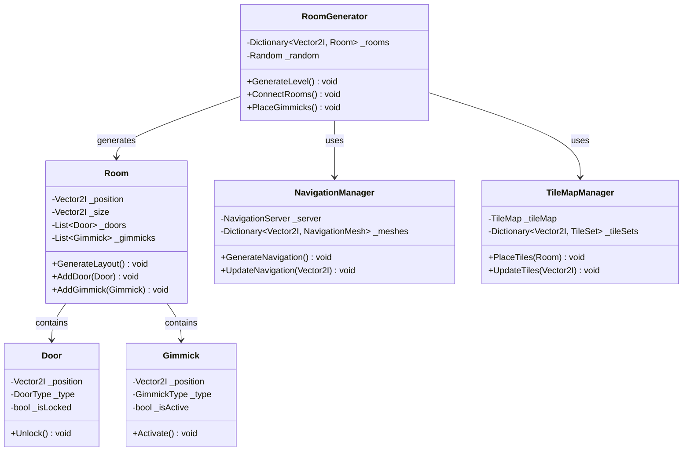
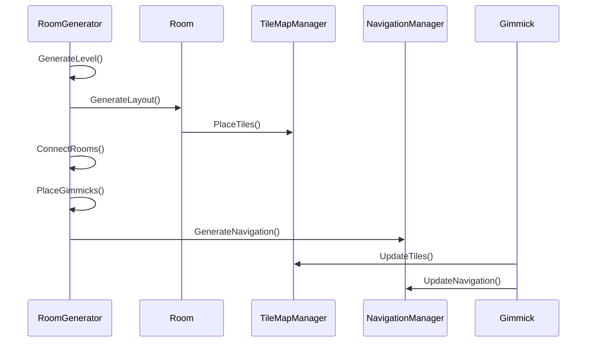

# レベル生成システム実装詳細

## 目次

1. [概要](#1-%E6%A6%82%E8%A6%81)
2. [クラス図](#2-%E3%82%AF%E3%83%A9%E3%82%B9%E5%9B%B3)
3. [シーケンス図](#3-%E3%82%B7%E3%83%BC%E3%82%B1%E3%83%B3%E3%82%B9%E5%9B%B3)
4. [実装詳細](#4-%E5%AE%9F%E8%A3%85%E8%A9%B3%E7%B4%B0)
5. [パフォーマンス最適化](#5-%E3%83%91%E3%83%95%E3%82%A9%E3%83%BC%E3%83%9E%E3%83%B3%E3%82%B9%E6%9C%80%E9%81%A9%E5%8C%96)
6. [テスト戦略](#6-%E3%83%86%E3%82%B9%E3%83%88%E6%88%A6%E7%95%A5)
7. [変更履歴](#7-%E5%A4%89%E6%9B%B4%E5%B1%A5%E6%AD%B4)

## 1. 概要

### 1.1 目的

本ドキュメントは、MVVM + リアクティブプログラミングにおけるレベル生成システムの実装詳細を定義し、以下の目的を達成することを目指します：

-   16×16 タイル部屋のランダム生成
-   8 つの部屋の接続ロジック
-   隠し通路と鍵扉のギミック実装
-   ナビゲーションメッシュの自動生成

### 1.2 適用範囲

-   部屋生成
-   通路生成
-   ギミック配置
-   ナビゲーション管理

## 2. クラス図



## 3. シーケンス図



## 4. 実装詳細

### 4.1 部屋生成

```csharp
public class RoomGenerator
{
    private readonly Dictionary<Vector2I, Room> _rooms = new();
    private readonly Random _random = new();
    private const int ROOM_SIZE = 16;
    private const int ROOM_COUNT = 8;

    public void GenerateLevel()
    {
        // 部屋の生成
        for (int i = 0; i < ROOM_COUNT; i++)
        {
            var position = GenerateRoomPosition();
            var room = new Room(position, new Vector2I(ROOM_SIZE, ROOM_SIZE));
            _rooms[position] = room;
            room.GenerateLayout();
        }

        // 部屋の接続
        ConnectRooms();

        // ギミックの配置
        PlaceGimmicks();

        // ナビゲーションメッシュの生成
        NavigationManager.GenerateNavigation();
    }

    private Vector2I GenerateRoomPosition()
    {
        // 部屋の位置を生成（重複を避ける）
        Vector2I position;
        do
        {
            position = new Vector2I(
                _random.Next(-3, 4) * ROOM_SIZE,
                _random.Next(-3, 4) * ROOM_SIZE
            );
        } while (_rooms.ContainsKey(position));

        return position;
    }
}
```

### 4.2 部屋クラス

```csharp
public class Room
{
    private readonly Vector2I _position;
    private readonly Vector2I _size;
    private readonly List<Door> _doors = new();
    private readonly List<Gimmick> _gimmicks = new();

    public Room(Vector2I position, Vector2I size)
    {
        _position = position;
        _size = size;
    }

    public void GenerateLayout()
    {
        // 部屋の基本レイアウトを生成
        GenerateWalls();
        GenerateFloor();
        GenerateObstacles();
    }

    public void AddDoor(Door door)
    {
        _doors.Add(door);
    }

    public void AddGimmick(Gimmick gimmick)
    {
        _gimmicks.Add(gimmick);
    }
}
```

### 4.3 ナビゲーション管理

```csharp
public class NavigationManager
{
    private readonly NavigationServer _server;
    private readonly Dictionary<Vector2I, NavigationMesh> _meshes = new();

    public void GenerateNavigation()
    {
        foreach (var room in _rooms.Values)
        {
            var mesh = new NavigationMesh();
            mesh.GenerateFromTileMap(room.TileMap);
            _meshes[room.Position] = mesh;
        }
    }

    public void UpdateNavigation(Vector2I roomPosition)
    {
        if (_meshes.TryGetValue(roomPosition, out var mesh))
        {
            mesh.Update();
        }
    }
}
```

### 4.4 タイルマップ管理

```csharp
public class TileMapManager
{
    private readonly TileMap _tileMap;
    private readonly Dictionary<Vector2I, TileSet> _tileSets = new();

    public void PlaceTiles(Room room)
    {
        var position = room.Position;
        var tiles = room.GenerateTiles();

        foreach (var tile in tiles)
        {
            _tileMap.SetCell(
                position + tile.Position,
                tile.TileSet,
                tile.SourceId,
                tile.AtlasCoords
            );
        }
    }

    public void UpdateTiles(Vector2I position)
    {
        // タイルの更新（ギミックの状態変更時など）
        var room = GetRoomAtPosition(position);
        if (room != null)
        {
            PlaceTiles(room);
        }
    }
}
```

## 5. パフォーマンス最適化

### 5.1 メモリ管理

-   部屋の遅延生成
-   不要な部屋のアンロード
-   タイルセットのキャッシュ

### 5.2 更新最適化

-   ナビゲーションメッシュの部分更新
-   タイルの差分更新
-   視界外の部屋の更新スキップ

## 6. テスト戦略

### 6.1 単体テスト

```csharp
[Test]
public void RoomGenerator_GenerateLevel_CreatesCorrectNumberOfRooms()
{
    var generator = new RoomGenerator();
    generator.GenerateLevel();

    Assert.AreEqual(8, generator.RoomCount);
}

[Test]
public void Room_GenerateLayout_CreatesValidLayout()
{
    var room = new Room(Vector2I.Zero, new Vector2I(16, 16));
    room.GenerateLayout();

    Assert.IsTrue(room.HasValidLayout());
}
```

### 6.2 統合テスト

```csharp
[Test]
public void LevelGeneration_WithGimmicks_PlacesCorrectly()
{
    var generator = new RoomGenerator();
    generator.GenerateLevel();

    var gimmickCount = generator.GetGimmickCount();
    Assert.AreEqual(2, gimmickCount); // 隠し通路と鍵扉
}
```

## 7. 変更履歴

| バージョン | 更新日     | 変更内容                                                                                                     |
| ---------- | ---------- | ------------------------------------------------------------------------------------------------------------ |
| 0.2.1      | 2025-06-13 | 目次追加とメタデータ更新 |
| 0.2.0      | 2025-06-01 | ドキュメント管理ルールに準拠した更新<br>- メタデータの更新<br>- バージョン管理の改善<br>- 変更履歴の形式統一 |
| 0.1.0      | 2024-03-21 | 初版作成                                                                                                     |
