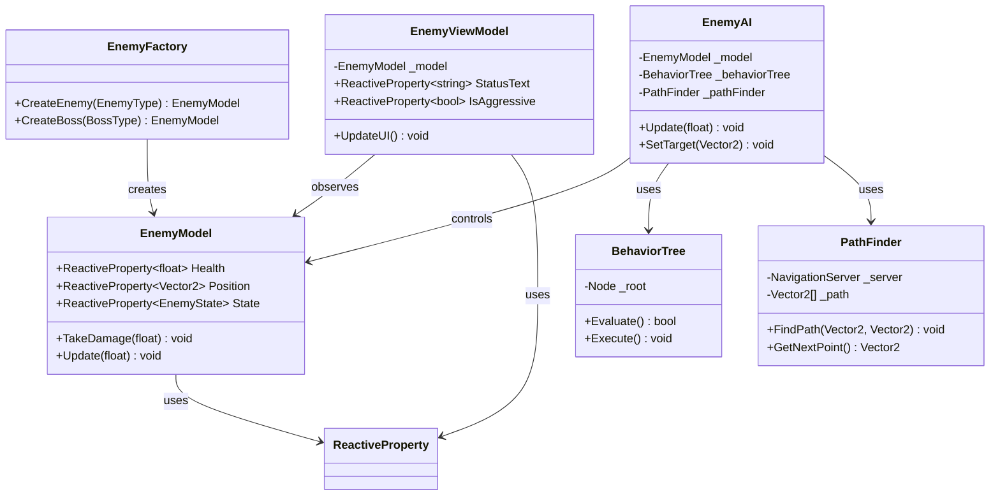
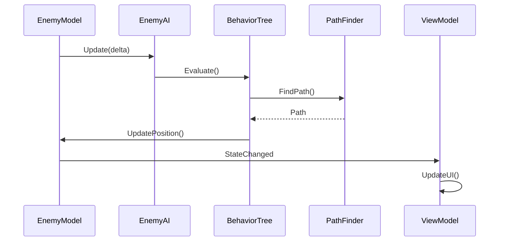

# 敵 AI システム実装詳細

## 目次

1. [概要](#1-%E6%A6%82%E8%A6%81)
2. [クラス図](#2-%E3%82%AF%E3%83%A9%E3%82%B9%E5%9B%B3)
3. [シーケンス図](#3-%E3%82%B7%E3%83%BC%E3%82%B1%E3%83%B3%E3%82%B9%E5%9B%B3)
4. [実装詳細](#4-%E5%AE%9F%E8%A3%85%E8%A9%B3%E7%B4%B0)
5. [パフォーマンス最適化](#5-%E3%83%91%E3%83%95%E3%82%A9%E3%83%BC%E3%83%9E%E3%83%B3%E3%82%B9%E6%9C%80%E9%81%A9%E5%8C%96)
6. [テスト戦略](#6-%E3%83%86%E3%82%B9%E3%83%88%E6%88%A6%E7%95%A5)
7. [変更履歴](#7-%E5%A4%89%E6%9B%B4%E5%B1%A5%E6%AD%B4)

## 1. 概要

### 1.1 目的

本ドキュメントは、MVVM + リアクティブプログラミングにおける敵 AI システムの実装詳細を定義し、以下の目的を達成することを目指します：

-   4 タイプの敵（近接、遠隔、突進、召喚）の実装
-   ミニボスとボスの特殊行動パターン
-   パスファインディングとナビゲーション
-   状態管理と行動制御

### 1.2 適用範囲

-   敵の状態管理
-   行動パターン
-   パスファインディング
-   戦闘 AI

## 2. クラス図



## 3. シーケンス図



## 4. 実装詳細

### 4.1 敵モデル

```csharp
public class EnemyModel
{
    public ReactiveProperty<float> Health { get; } = new(100f);
    public ReactiveProperty<Vector2> Position { get; } = new();
    public ReactiveProperty<EnemyState> State { get; } = new(EnemyState.Idle);

    private readonly EnemyType _type;
    private readonly float _attackRange;
    private readonly float _moveSpeed;

    public EnemyModel(EnemyType type)
    {
        _type = type;
        _attackRange = GetAttackRange(type);
        _moveSpeed = GetMoveSpeed(type);
    }

    public void TakeDamage(float damage)
    {
        Health.Value = Mathf.Max(0, Health.Value - damage);
        if (Health.Value <= 0)
        {
            State.Value = EnemyState.Dead;
            GameEventBus.Publish(new EnemyDeathEvent(this));
        }
    }

    public void Update(float delta)
    {
        if (State.Value == EnemyState.Dead) return;

        // 状態に応じた更新処理
        switch (State.Value)
        {
            case EnemyState.Idle:
                UpdateIdle(delta);
                break;
            case EnemyState.Chase:
                UpdateChase(delta);
                break;
            case EnemyState.Attack:
                UpdateAttack(delta);
                break;
        }
    }
}
```

### 4.2 行動パターン

```csharp
public class BehaviorTree
{
    private readonly Node _root;
    private readonly EnemyModel _model;
    private readonly PathFinder _pathFinder;

    public BehaviorTree(EnemyModel model, PathFinder pathFinder)
    {
        _model = model;
        _pathFinder = pathFinder;
        _root = CreateBehaviorTree();
    }

    private Node CreateBehaviorTree()
    {
        // 敵タイプに応じた行動パターンを定義
        return new Sequence(
            new IsPlayerInRange(_model),
            new Selector(
                new Sequence(
                    new IsInAttackRange(_model),
                    new AttackAction(_model)
                ),
                new Sequence(
                    new ChaseAction(_model, _pathFinder)
                )
            )
        );
    }

    public void Update(float delta)
    {
        _root.Evaluate();
    }
}
```

### 4.3 パスファインディング

```csharp
public class PathFinder
{
    private readonly NavigationServer _server;
    private Vector2[] _currentPath;
    private int _currentPathIndex;

    public PathFinder()
    {
        _server = NavigationServer.GetSingleton();
    }

    public void FindPath(Vector2 start, Vector2 end)
    {
        _currentPath = _server.GetSimplePath(start, end);
        _currentPathIndex = 0;
    }

    public Vector2? GetNextPoint()
    {
        if (_currentPath == null || _currentPathIndex >= _currentPath.Length)
            return null;

        return _currentPath[_currentPathIndex++];
    }
}
```

### 4.4 敵ファクトリー

```csharp
public class EnemyFactory
{
    public EnemyModel CreateEnemy(EnemyType type)
    {
        return type switch
        {
            EnemyType.Melee => new MeleeEnemyModel(),
            EnemyType.Ranged => new RangedEnemyModel(),
            EnemyType.Charger => new ChargerEnemyModel(),
            EnemyType.Summoner => new SummonerEnemyModel(),
            _ => throw new ArgumentException($"Unknown enemy type: {type}")
        };
    }

    public EnemyModel CreateBoss(BossType type)
    {
        return type switch
        {
            BossType.MiniBoss => new MiniBossModel(),
            BossType.FinalBoss => new FinalBossModel(),
            _ => throw new ArgumentException($"Unknown boss type: {type}")
        };
    }
}
```

## 5. パフォーマンス最適化

### 5.1 メモリ管理

-   敵のオブジェクトプーリング
-   パスのキャッシュ
-   不要な敵のアンロード

### 5.2 更新最適化

-   視界外の敵の更新スキップ
-   パスファインディングの最適化
-   行動パターンの簡略化

## 6. テスト戦略

### 6.1 単体テスト

```csharp
[Test]
public void EnemyModel_TakeDamage_ReducesHealth()
{
    var enemy = new EnemyModel(EnemyType.Melee);
    float initialHealth = enemy.Health.Value;

    enemy.TakeDamage(20f);

    Assert.AreEqual(initialHealth - 20f, enemy.Health.Value);
}

[Test]
public void BehaviorTree_Evaluate_ChangesState()
{
    var enemy = new EnemyModel(EnemyType.Melee);
    var pathFinder = new PathFinder();
    var behaviorTree = new BehaviorTree(enemy, pathFinder);

    behaviorTree.Update(0.1f);

    Assert.AreNotEqual(EnemyState.Idle, enemy.State.Value);
}
```

### 6.2 統合テスト

```csharp
[Test]
public void EnemyAI_WithPlayerInRange_ChasesPlayer()
{
    var enemy = new EnemyModel(EnemyType.Melee);
    var player = new PlayerModel();
    var ai = new EnemyAI(enemy);

    player.Position.Value = new Vector2(5f, 5f);
    ai.Update(0.1f);

    Assert.AreEqual(EnemyState.Chase, enemy.State.Value);
}
```

## 7. 変更履歴

| バージョン | 更新日     | 変更内容                                                                                                     |
| ---------- | ---------- | ------------------------------------------------------------------------------------------------------------ |
| 0.2.1      | 2025-06-13 | 目次追加とメタデータ更新 |
| 0.2.0      | 2025-06-01 | ドキュメント管理ルールに準拠した更新<br>- メタデータの更新<br>- バージョン管理の改善<br>- 変更履歴の形式統一 |
| 0.1.0      | 2024-03-21 | 初版作成                                                                                                     |
