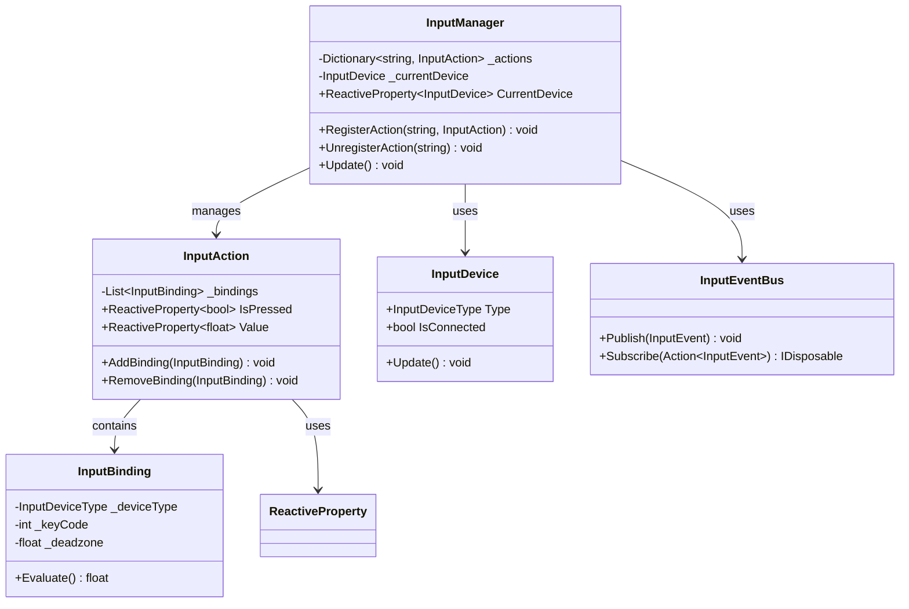
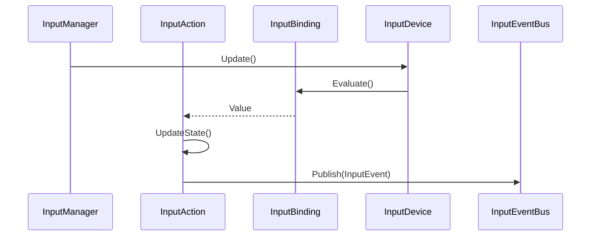

# 入力システム実装詳細

## 1. 概要

### 1.1 目的

本ドキュメントは、MVVM + リアクティブプログラミングにおける入力システムの実装詳細を定義し、以下の目的を達成することを目指します：

-   キーボード、マウス、ゲームパッドの入力統合
-   入力マッピングの動的変更
-   デバイス切り替えの自動検出
-   入力状態のリアクティブな管理

### 1.2 適用範囲

-   入力デバイス管理
-   入力マッピング
-   入力状態管理
-   入力イベント処理

## 2. クラス図



## 3. シーケンス図



## 4. 実装詳細

### 4.1 入力マネージャー

```csharp
public class InputManager
{
    private readonly Dictionary<string, InputAction> _actions = new();
    private readonly InputEventBus _eventBus;
    public ReactiveProperty<InputDevice> CurrentDevice { get; } = new();

    public InputManager(InputEventBus eventBus)
    {
        _eventBus = eventBus;
        InitializeDevices();
    }

    private void InitializeDevices()
    {
        // デバイスの初期化と接続監視
        InputDeviceManager.OnDeviceConnected += device =>
        {
            if (CurrentDevice.Value == null)
                CurrentDevice.Value = device;
        };

        InputDeviceManager.OnDeviceDisconnected += device =>
        {
            if (CurrentDevice.Value == device)
                CurrentDevice.Value = InputDeviceManager.GetFirstConnectedDevice();
        };
    }

    public void RegisterAction(string actionName, InputAction action)
    {
        _actions[actionName] = action;
        action.OnStateChanged += state =>
            _eventBus.Publish(new InputEvent(actionName, state));
    }

    public void Update()
    {
        foreach (var action in _actions.Values)
        {
            action.Update();
        }
    }
}
```

### 4.2 入力アクション

```csharp
public class InputAction
{
    private readonly List<InputBinding> _bindings = new();
    public ReactiveProperty<bool> IsPressed { get; } = new();
    public ReactiveProperty<float> Value { get; } = new();

    public event Action<InputState> OnStateChanged;

    public void AddBinding(InputBinding binding)
    {
        _bindings.Add(binding);
    }

    public void Update()
    {
        float maxValue = 0f;
        foreach (var binding in _bindings)
        {
            float value = binding.Evaluate();
            maxValue = Mathf.Max(maxValue, value);
        }

        Value.Value = maxValue;
        IsPressed.Value = maxValue > 0f;

        OnStateChanged?.Invoke(new InputState(IsPressed.Value, Value.Value));
    }
}
```

### 4.3 入力バインディング

```csharp
public class InputBinding
{
    private readonly InputDeviceType _deviceType;
    private readonly int _keyCode;
    private readonly float _deadzone;

    public InputBinding(InputDeviceType deviceType, int keyCode, float deadzone = 0.1f)
    {
        _deviceType = deviceType;
        _keyCode = keyCode;
        _deadzone = deadzone;
    }

    public float Evaluate()
    {
        return _deviceType switch
        {
            InputDeviceType.Keyboard => Input.GetKey((KeyCode)_keyCode) ? 1f : 0f,
            InputDeviceType.Mouse => Input.GetMouseButton(_keyCode) ? 1f : 0f,
            InputDeviceType.Gamepad => Mathf.Abs(Input.GetAxis($"Gamepad{_keyCode}")) > _deadzone ? 1f : 0f,
            _ => 0f
        };
    }
}
```

### 4.4 入力イベント

```csharp
public class InputEvent
{
    public string ActionName { get; }
    public InputState State { get; }

    public InputEvent(string actionName, InputState state)
    {
        ActionName = actionName;
        State = state;
    }
}

public struct InputState
{
    public bool IsPressed { get; }
    public float Value { get; }

    public InputState(bool isPressed, float value)
    {
        IsPressed = isPressed;
        Value = value;
    }
}
```

## 5. パフォーマンス最適化

### 5.1 メモリ管理

-   入力バインディングのプーリング
-   イベントの最適化
-   不要なデバイスのアンロード

### 5.2 更新最適化

-   入力状態のキャッシュ
-   デバイス切り替えの最適化
-   イベント発行の最適化

## 6. テスト戦略

### 6.1 単体テスト

```csharp
[Test]
public void InputAction_WithBinding_UpdatesState()
{
    var action = new InputAction();
    var binding = new InputBinding(InputDeviceType.Keyboard, (int)KeyCode.Space);
    action.AddBinding(binding);

    // キー入力をシミュレート
    SimulateKeyPress(KeyCode.Space);
    action.Update();

    Assert.IsTrue(action.IsPressed.Value);
    Assert.AreEqual(1f, action.Value.Value);
}

[Test]
public void InputManager_OnDeviceDisconnected_SwitchesDevice()
{
    var manager = new InputManager(new InputEventBus());
    var keyboard = new KeyboardDevice();
    var gamepad = new GamepadDevice();

    manager.CurrentDevice.Value = keyboard;
    SimulateDeviceDisconnect(keyboard);

    Assert.AreEqual(gamepad, manager.CurrentDevice.Value);
}
```

### 6.2 統合テスト

```csharp
[Test]
public void InputSystem_WithMultipleDevices_HandlesInput()
{
    var manager = new InputManager(new InputEventBus());
    var action = new InputAction();
    action.AddBinding(new InputBinding(InputDeviceType.Keyboard, (int)KeyCode.Space));
    action.AddBinding(new InputBinding(InputDeviceType.Gamepad, 0));

    manager.RegisterAction("Jump", action);
    SimulateGamepadButtonPress(0);

    Assert.IsTrue(action.IsPressed.Value);
}
```

## 7. 変更履歴

| バージョン | 更新日     | 変更内容 |
| ---------- | ---------- | -------- |
| 0.1.0      | 2024-03-21 | 初版作成 |
