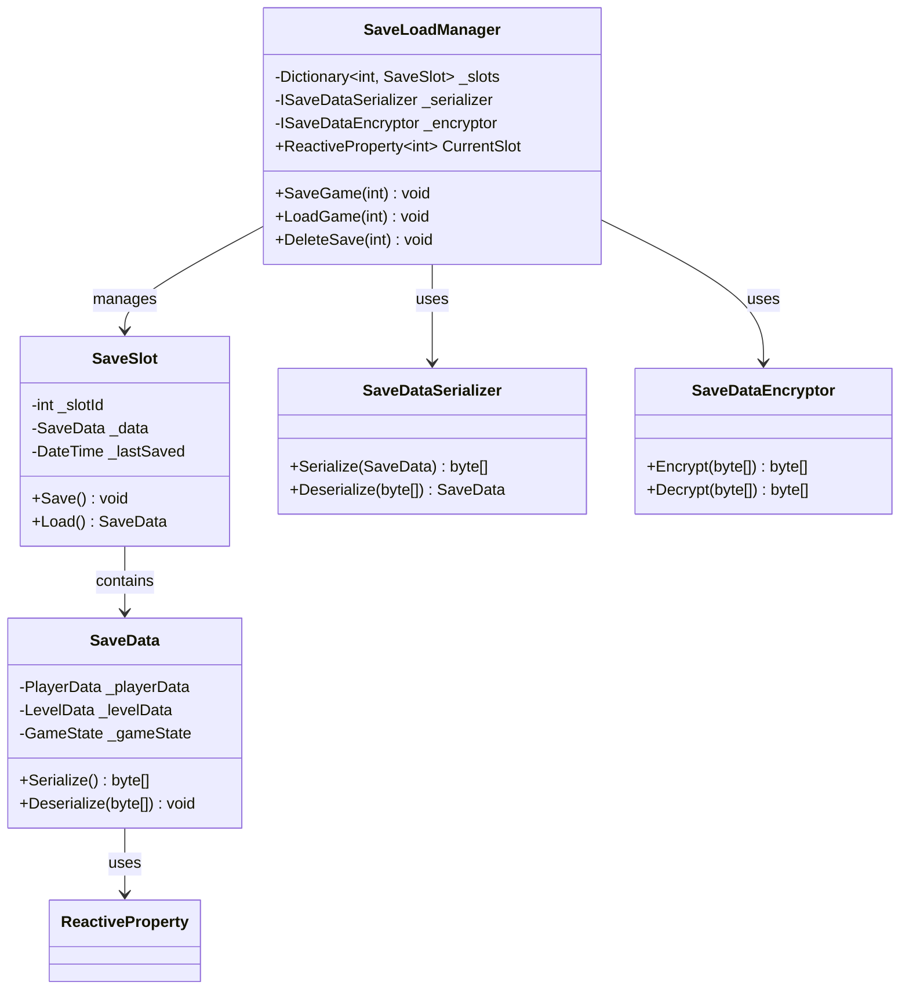
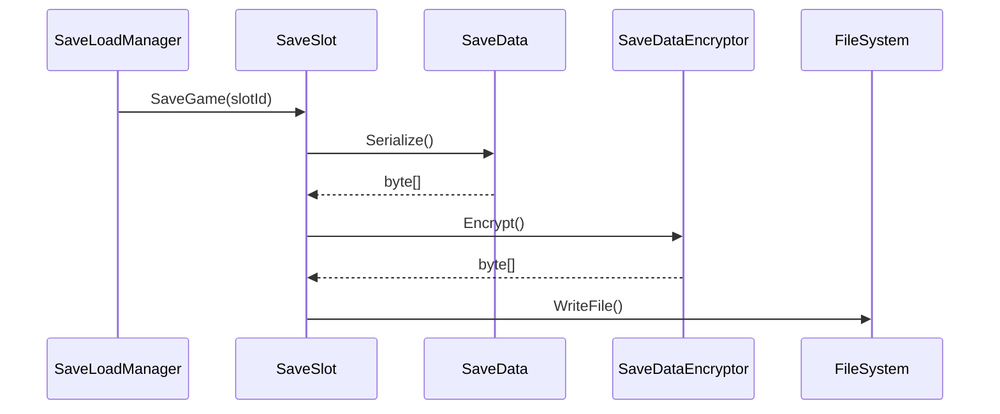

# セーブ/ロードシステム実装詳細

## 1. 概要

### 1.1 目的

本ドキュメントは、MVVM + リアクティブプログラミングにおけるセーブ/ロードシステムの実装詳細を定義し、以下の目的を達成することを目指します：

-   ゲーム状態の永続化
-   クイックリスタート機能
-   セーブデータの暗号化
-   セーブスロット管理

### 1.2 適用範囲

-   ゲーム状態の保存
-   セーブデータの読み込み
-   データの暗号化/復号化
-   セーブスロット管理

## 2. クラス図



## 3. シーケンス図



## 4. 実装詳細

### 4.1 セーブ/ロードマネージャー

```csharp
public class SaveLoadManager
{
    private readonly Dictionary<int, SaveSlot> _slots = new();
    private readonly ISaveDataSerializer _serializer;
    private readonly ISaveDataEncryptor _encryptor;
    public ReactiveProperty<int> CurrentSlot { get; } = new();

    public SaveLoadManager(ISaveDataSerializer serializer, ISaveDataEncryptor encryptor)
    {
        _serializer = serializer;
        _encryptor = encryptor;
        InitializeSlots();
    }

    private void InitializeSlots()
    {
        for (int i = 0; i < 3; i++)
        {
            _slots[i] = new SaveSlot(i, _serializer, _encryptor);
        }
    }

    public async Task SaveGame(int slotId)
    {
        if (!_slots.ContainsKey(slotId))
            throw new ArgumentException($"Invalid slot ID: {slotId}");

        var saveData = new SaveData
        {
            PlayerData = GameStateManager.Instance.PlayerData,
            LevelData = GameStateManager.Instance.LevelData,
            GameState = GameStateManager.Instance.CurrentState
        };

        await _slots[slotId].Save(saveData);
        CurrentSlot.Value = slotId;
    }

    public async Task LoadGame(int slotId)
    {
        if (!_slots.ContainsKey(slotId))
            throw new ArgumentException($"Invalid slot ID: {slotId}");

        var saveData = await _slots[slotId].Load();
        GameStateManager.Instance.RestoreState(saveData);
        CurrentSlot.Value = slotId;
    }
}
```

### 4.2 セーブスロット

```csharp
public class SaveSlot
{
    private readonly int _slotId;
    private readonly ISaveDataSerializer _serializer;
    private readonly ISaveDataEncryptor _encryptor;
    private readonly string _savePath;

    public SaveSlot(int slotId, ISaveDataSerializer serializer, ISaveDataEncryptor encryptor)
    {
        _slotId = slotId;
        _serializer = serializer;
        _encryptor = encryptor;
        _savePath = Path.Combine(Application.persistentDataPath, $"save_{slotId}.dat");
    }

    public async Task Save(SaveData data)
    {
        var serialized = _serializer.Serialize(data);
        var encrypted = _encryptor.Encrypt(serialized);
        await File.WriteAllBytesAsync(_savePath, encrypted);
    }

    public async Task<SaveData> Load()
    {
        if (!File.Exists(_savePath))
            throw new FileNotFoundException($"Save file not found: {_savePath}");

        var encrypted = await File.ReadAllBytesAsync(_savePath);
        var decrypted = _encryptor.Decrypt(encrypted);
        return _serializer.Deserialize(decrypted);
    }
}
```

### 4.3 セーブデータ

```csharp
public class SaveData
{
    public PlayerData PlayerData { get; set; }
    public LevelData LevelData { get; set; }
    public GameState GameState { get; set; }
}

public class PlayerData
{
    public ReactiveProperty<float> Health { get; } = new();
    public ReactiveProperty<int> ShadowFragments { get; } = new();
    public ReactiveProperty<Vector2> Position { get; } = new();
    public List<SkillData> Skills { get; } = new();
}

public class LevelData
{
    public int CurrentRoom { get; set; }
    public List<RoomData> Rooms { get; } = new();
    public List<EnemyData> Enemies { get; } = new();
}
```

### 4.4 データ暗号化

```csharp
public class SaveDataEncryptor : ISaveDataEncryptor
{
    private readonly byte[] _key;
    private readonly byte[] _iv;

    public SaveDataEncryptor()
    {
        _key = GenerateKey();
        _iv = GenerateIV();
    }

    public byte[] Encrypt(byte[] data)
    {
        using var aes = Aes.Create();
        aes.Key = _key;
        aes.IV = _iv;

        using var encryptor = aes.CreateEncryptor();
        return encryptor.TransformFinalBlock(data, 0, data.Length);
    }

    public byte[] Decrypt(byte[] data)
    {
        using var aes = Aes.Create();
        aes.Key = _key;
        aes.IV = _iv;

        using var decryptor = aes.CreateDecryptor();
        return decryptor.TransformFinalBlock(data, 0, data.Length);
    }
}
```

## 5. パフォーマンス最適化

### 5.1 メモリ管理

-   セーブデータの圧縮
-   不要なデータの除外
-   メモリキャッシュの最適化

### 5.2 更新最適化

-   非同期セーブ/ロード
-   インクリメンタルセーブ
-   バックグラウンドセーブ

## 6. テスト戦略

### 6.1 単体テスト

```csharp
[Test]
public async Task SaveLoadManager_SaveAndLoad_PreservesData()
{
    var manager = new SaveLoadManager(new SaveDataSerializer(), new SaveDataEncryptor());
    var originalData = new SaveData
    {
        PlayerData = new PlayerData { Health = { Value = 100f } }
    };

    await manager.SaveGame(0);
    await manager.LoadGame(0);

    Assert.AreEqual(originalData.PlayerData.Health.Value,
        GameStateManager.Instance.PlayerData.Health.Value);
}

[Test]
public void SaveDataEncryptor_EncryptAndDecrypt_PreservesData()
{
    var encryptor = new SaveDataEncryptor();
    var originalData = new byte[] { 1, 2, 3, 4, 5 };

    var encrypted = encryptor.Encrypt(originalData);
    var decrypted = encryptor.Decrypt(encrypted);

    CollectionAssert.AreEqual(originalData, decrypted);
}
```

### 6.2 統合テスト

```csharp
[Test]
public async Task SaveSystem_WithGameState_SavesAndLoadsCorrectly()
{
    var manager = new SaveLoadManager(new SaveDataSerializer(), new SaveDataEncryptor());
    var gameState = new GameState
    {
        PlayerHealth = 100f,
        CurrentLevel = 1,
        ShadowFragments = 5
    };

    GameStateManager.Instance.SetState(gameState);
    await manager.SaveGame(0);
    GameStateManager.Instance.ResetState();
    await manager.LoadGame(0);

    Assert.AreEqual(gameState.PlayerHealth,
        GameStateManager.Instance.CurrentState.PlayerHealth);
}
```

## 7. 変更履歴

| バージョン | 更新日     | 変更内容                                                                                                     |
| ---------- | ---------- | ------------------------------------------------------------------------------------------------------------ |
| 0.2.0      | 2025-06-01 | ドキュメント管理ルールに準拠した更新<br>- メタデータの更新<br>- バージョン管理の改善<br>- 変更履歴の形式統一 |
| 0.1.0      | 2024-03-21 | 初版作成                                                                                                     |
