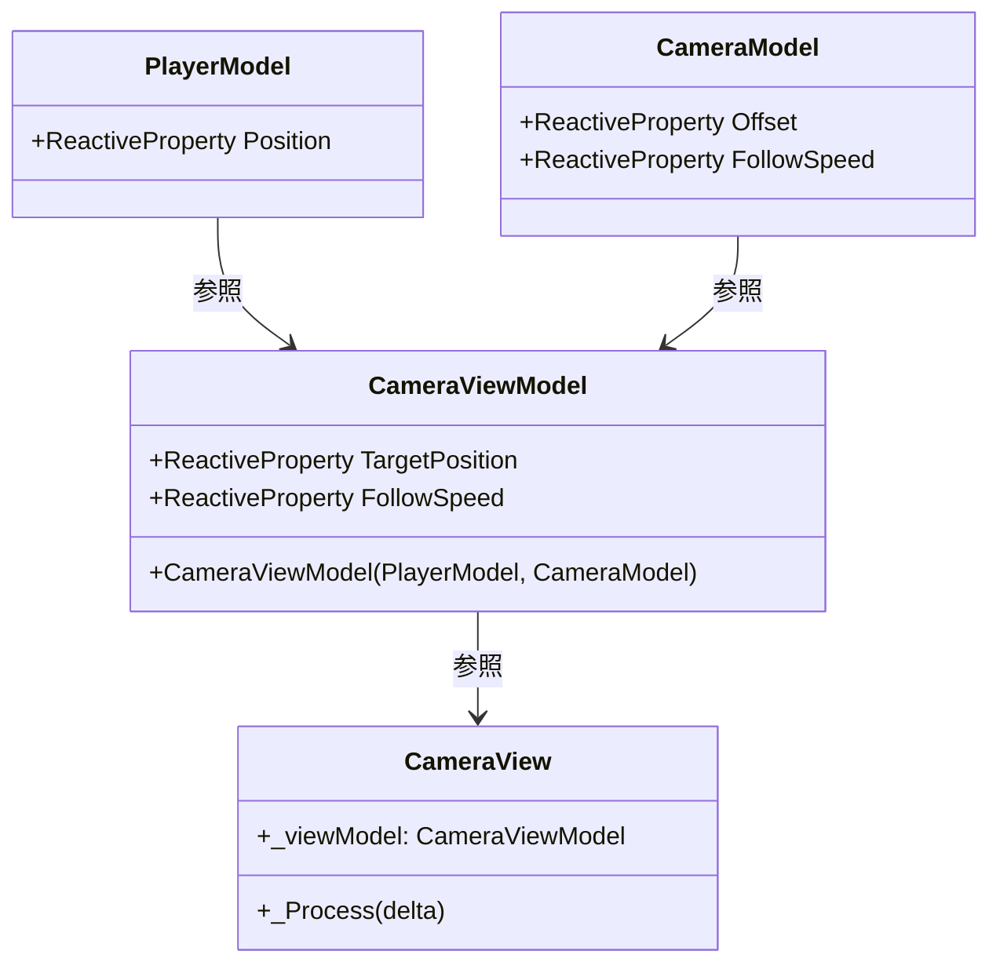

# 目次

1. [概要](#概要)
2. [詳細](#詳細)
3. [使用方法](#使用方法)
4. [制限事項](#制限事項)
5. [変更履歴](#変更履歴)

---

# 概要

本ドキュメントは、2.5Dアクションゲームにおける「プレイヤー追従型Camera3Dシステム」の実装方針・詳細設計を示します。
MVVM＋リアクティブプログラミングアーキテクチャに準拠し、保守性・拡張性・テスト容易性を重視します。

---

# 詳細

## アーキテクチャ方針

- **MVVM＋リアクティブプログラミング**を採用
  - Cameraの状態・パラメータはViewModelで管理
  - プレイヤー座標などModelの状態変化をViewModelが購読し、View（Camera3Dノード）に反映
- **一方向データフロー**を基本とし、View→ViewModel→Modelの流れを徹底

## クラス図（Mermaid記法）



## クラス構成（サンプルコード）

```csharp
// PlayerModel.cs
public class PlayerModel
{
    public ReactiveProperty<Vector3> Position { get; } = new(Vector3.Zero);
}

// CameraModel.cs
public class CameraModel
{
    public ReactiveProperty<Vector3> Offset { get; } = new(new Vector3(0, 10, -10));
    public ReactiveProperty<float> FollowSpeed { get; } = new(5.0f);
}

// CameraViewModel.cs
public class CameraViewModel
{
    public ReactiveProperty<Vector3> TargetPosition { get; } = new();
    public ReactiveProperty<float> FollowSpeed { get; }

    public CameraViewModel(PlayerModel player, CameraModel camera)
    {
        FollowSpeed = camera.FollowSpeed;
        player.Position.Subscribe(pos => TargetPosition.Value = pos + camera.Offset.Value);
    }
}

// CameraView.cs
public partial class CameraView : Camera3D
{
    private CameraViewModel _viewModel;

    public override void _Process(double delta)
    {
        // LerpでスムーズにTargetPositionへ移動
        GlobalTransform = new Transform3D(
            Basis.Identity,
            GlobalTransform.origin.Lerp(_viewModel.TargetPosition.Value, (float)delta * _viewModel.FollowSpeed.Value)
        );
        LookAt(_viewModel.TargetPosition.Value - _viewModel.Offset.Value, Vector3.Up);
    }
}
```

## 運用ルール・ベストプラクティス

- **購読解除（Dispose）**を忘れずに実装し、メモリリークを防止する
- **パフォーマンス最適化**のため、カメラ更新頻度や不要な更新を抑制する
- **テスト容易性**を意識し、ViewModelのロジックは独立してテスト可能にする
- **パラメータ調整**はExport変数やInspectorで柔軟に行う
- **シーン構成・依存関係**はMVVM原則に従い、View→ViewModel→Modelの一方向依存を守る
- **拡張時はViewModel/Modelの責務分離を厳守**し、Viewにロジックを持たせない

## 今後の拡張例

- カメラのズーム機能やシェイク演出の追加
- 壁抜け防止やカメラ制限エリアの実装
- 複数ターゲット対応（例：協力プレイ時のカメラワーク）
- カメラのFOVやクリッピング距離の動的調整

---

# 使用方法

1. PlayerModel, CameraModel, CameraViewModel, CameraView を所定のディレクトリに配置
2. MainシーンにCamera3Dノードを追加し、CameraViewスクリプトをアタッチ
3. CameraViewModelにPlayerModel, CameraModelをバインド
4. OffsetやFollowSpeedはInspectorまたはExport変数で調整
5. テストプレイで挙動を確認し、必要に応じてパラメータを微調整

---

# 制限事項

- 本設計はGodot + C# + MVVMリアクティブアーキテクチャを前提としています
- 他エンジンや異なるアーキテクチャでは適用できない場合があります
- Camera3Dの特殊な演出（シェイク・ズーム等）は別途実装が必要です
- プレイヤー以外の複数ターゲット追従は拡張が必要です

---

# 変更履歴

| バージョン | 更新日     | 変更内容                                                                 |
| ---------- | ---------- | ------------------------------------------------------------------------ |
| 0.1.2      | 2025-06-13 | プレイヤーシステムへのリンクを修正 |
| 0.1.1      | 2024-06-07 | ドキュメント管理ルールに準拠しメタデータ・目次・セクション等を整理         |
| 0.1.0      | 2024-06-07 | 初版作成                                                                 |

