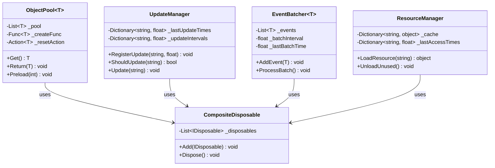
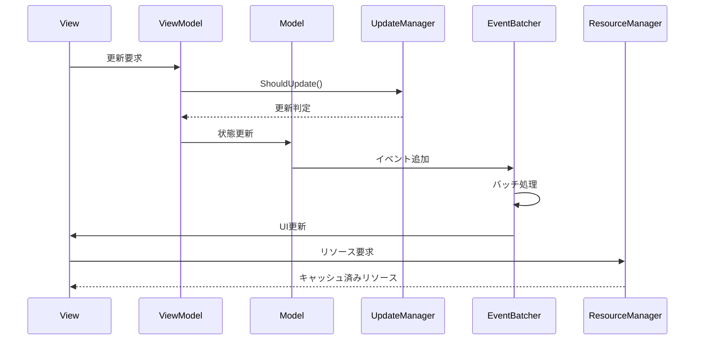

# パフォーマンス最適化詳細

## 1. 概要

### 1.1 目的

本ドキュメントは、MVVM + リアクティブプログラミングにおけるパフォーマンス最適化の実装詳細を定義し、以下の目的を達成することを目指します：

-   メモリ使用量の最適化
-   更新処理の効率化
-   不要な処理の削減
-   開発チーム間での最適化手法の統一

### 1.2 適用範囲

-   メモリ管理
-   更新処理の最適化
-   イベント処理の最適化
-   リソース管理

## 2. クラス図



## 3. シーケンス図



## 4. 実装詳細

### 4.1 メモリ管理

#### 4.1.1 サブスクリプション管理

```csharp
public class OptimizedViewModel : IDisposable
{
    private readonly CompositeDisposable _disposables = new();
    private readonly ReactiveProperty<int> _value = new();

    public OptimizedViewModel()
    {
        // サブスクリプションをCompositeDisposableで管理
        _disposables.Add(
            _value.Subscribe(OnValueChanged)
        );
    }

    private void OnValueChanged(int value)
    {
        // 値の変更処理
    }

    public void Dispose()
    {
        _disposables.Dispose();
    }
}
```

#### 4.1.2 オブジェクトプーリング

```csharp
public class ObjectPool<T> where T : class, new()
{
    private readonly Stack<T> _pool = new();
    private readonly int _maxSize;

    public ObjectPool(int maxSize = 100)
    {
        _maxSize = maxSize;
    }

    public T Get()
    {
        return _pool.Count > 0 ? _pool.Pop() : new T();
    }

    public void Return(T item)
    {
        if (_pool.Count < _maxSize)
        {
            _pool.Push(item);
        }
    }
}

// 使用例
public class EffectManager
{
    private readonly ObjectPool<Effect> _effectPool = new();

    public void PlayEffect(Vector3 position)
    {
        var effect = _effectPool.Get();
        effect.Play(position);
        // エフェクト終了時にプールに戻す
        effect.OnComplete += () => _effectPool.Return(effect);
    }
}
```

### 4.2 更新処理の最適化

#### 4.2.1 更新頻度の制御

```csharp
public class OptimizedUpdater
{
    private readonly float _updateInterval;
    private float _accumulator;

    public OptimizedUpdater(float updateInterval = 0.1f)
    {
        _updateInterval = updateInterval;
    }

    public void Update(float delta)
    {
        _accumulator += delta;
        if (_accumulator >= _updateInterval)
        {
            PerformUpdate();
            _accumulator = 0;
        }
    }

    private void PerformUpdate()
    {
        // 更新処理
    }
}
```

#### 4.2.2 条件付き更新

```csharp
public class ConditionalUpdater
{
    private readonly ReactiveProperty<bool> _isVisible = new();
    private readonly ReactiveProperty<Vector3> _position = new();

    public ConditionalUpdater()
    {
        // 表示状態に応じて更新を制御
        _isVisible.Subscribe(isVisible =>
        {
            if (isVisible)
            {
                StartUpdate();
            }
            else
            {
                StopUpdate();
            }
        });
    }

    private void StartUpdate()
    {
        // 更新開始
    }

    private void StopUpdate()
    {
        // 更新停止
    }
}
```

### 4.3 イベント処理の最適化

#### 4.3.1 イベントのフィルタリング

```csharp
public class EventFilter
{
    private readonly GameEventBus _eventBus;
    private readonly IDisposable _subscription;

    public EventFilter(GameEventBus eventBus)
    {
        _eventBus = eventBus;
        _subscription = _eventBus
            .GetEventStream<GameEvent>()
            .Where(evt => ShouldProcessEvent(evt))
            .Subscribe(ProcessEvent);
    }

    private bool ShouldProcessEvent(GameEvent evt)
    {
        // イベントの処理条件をチェック
        return true;
    }

    private void ProcessEvent(GameEvent evt)
    {
        // イベント処理
    }
}
```

#### 4.3.2 イベントのバッチ処理

```csharp
public class EventBatcher
{
    private readonly Queue<GameEvent> _eventQueue = new();
    private readonly float _batchInterval;
    private float _accumulator;

    public EventBatcher(float batchInterval = 0.1f)
    {
        _batchInterval = batchInterval;
    }

    public void AddEvent(GameEvent evt)
    {
        _eventQueue.Enqueue(evt);
    }

    public void Update(float delta)
    {
        _accumulator += delta;
        if (_accumulator >= _batchInterval)
        {
            ProcessBatch();
            _accumulator = 0;
        }
    }

    private void ProcessBatch()
    {
        while (_eventQueue.Count > 0)
        {
            var evt = _eventQueue.Dequeue();
            ProcessEvent(evt);
        }
    }

    private void ProcessEvent(GameEvent evt)
    {
        // イベント処理
    }
}
```

### 4.4 リソース管理

#### 4.4.1 リソースの遅延読み込み

```csharp
public class LazyResourceLoader
{
    private readonly Dictionary<string, Lazy<Resource>> _resources = new();

    public void RegisterResource(string key, string path)
    {
        _resources[key] = new Lazy<Resource>(() => LoadResource(path));
    }

    public Resource GetResource(string key)
    {
        return _resources[key].Value;
    }

    private Resource LoadResource(string path)
    {
        // リソースの読み込み
        return null;
    }
}
```

#### 4.4.2 リソースのキャッシュ管理

```csharp
public class ResourceCache
{
    private readonly Dictionary<string, Resource> _cache = new();
    private readonly int _maxSize;
    private readonly Queue<string> _accessOrder = new();

    public ResourceCache(int maxSize = 100)
    {
        _maxSize = maxSize;
    }

    public Resource Get(string key)
    {
        if (_cache.TryGetValue(key, out var resource))
        {
            UpdateAccessOrder(key);
            return resource;
        }
        return null;
    }

    public void Add(string key, Resource resource)
    {
        if (_cache.Count >= _maxSize)
        {
            RemoveLeastRecentlyUsed();
        }
        _cache[key] = resource;
        _accessOrder.Enqueue(key);
    }

    private void UpdateAccessOrder(string key)
    {
        _accessOrder.Enqueue(key);
    }

    private void RemoveLeastRecentlyUsed()
    {
        var key = _accessOrder.Dequeue();
        _cache.Remove(key);
    }
}
```

## 5. テスト戦略

### 5.1 パフォーマンステスト

```csharp
[Test]
public void ObjectPool_ReuseObjects_ReducesAllocations()
{
    var pool = new ObjectPool<TestObject>();
    var initialMemory = GC.GetTotalMemory(true);

    for (int i = 0; i < 1000; i++)
    {
        var obj = pool.Get();
        pool.Return(obj);
    }

    var finalMemory = GC.GetTotalMemory(true);
    Assert.Less(finalMemory - initialMemory, 1000000);
}
```

### 5.2 メモリリークテスト

```csharp
[Test]
public void ViewModel_Dispose_CleansUpSubscriptions()
{
    var viewModel = new OptimizedViewModel();
    var weakRef = new WeakReference(viewModel);

    viewModel.Dispose();
    viewModel = null;
    GC.Collect();

    Assert.IsFalse(weakRef.IsAlive);
}
```

## 6. 変更履歴

| バージョン | 更新日     | 変更内容 |
| ---------- | ---------- | -------- |
| 0.1.0      | 2024-03-21 | 初版作成 |
