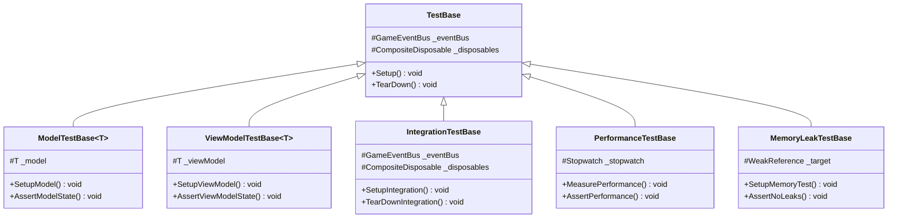
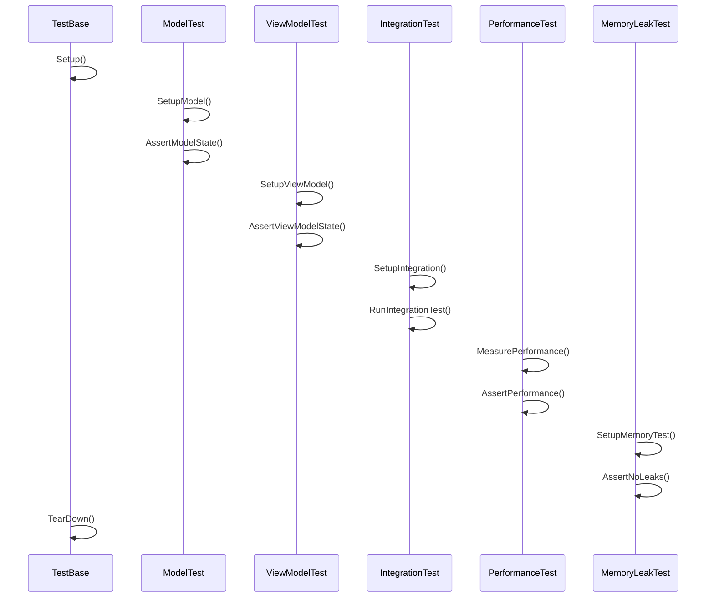

# テスト戦略詳細

## 1. 概要

### 1.1 目的

本ドキュメントは、MVVM + リアクティブプログラミングにおけるテスト戦略の実装詳細を定義し、以下の目的を達成することを目指します：

-   テストの自動化と効率化
-   テストカバレッジの向上
-   テストの保守性確保
-   開発チーム間でのテスト手法の統一

### 1.2 適用範囲

-   単体テスト
-   統合テスト
-   パフォーマンステスト
-   メモリリークテスト

## 2. クラス図



## 3. シーケンス図



## 4. 実装詳細

### 4.1 単体テスト

#### 4.1.1 モデル層のテスト

```csharp
[TestFixture]
public class PlayerModelTests : ModelTestBase<PlayerModel>
{
    [SetUp]
    public void Setup()
    {
        SetupModel();
    }

    [Test]
    public void TakeDamage_ReducesHealth()
    {
        // Arrange
        _model.Health.Value = 100;

        // Act
        _model.TakeDamage(20);

        // Assert
        Assert.AreEqual(80, _model.Health.Value);
    }

    [Test]
    public void Heal_IncreasesHealth()
    {
        // Arrange
        _model.Health.Value = 50;
        _model.MaxHealth.Value = 100;

        // Act
        _model.Heal(30);

        // Assert
        Assert.AreEqual(80, _model.Health.Value);
    }
}
```

#### 4.1.2 ビューモデル層のテスト

```csharp
[TestFixture]
public class PlayerViewModelTests : ViewModelTestBase<PlayerViewModel>
{
    [SetUp]
    public void Setup()
    {
        SetupViewModel();
    }

    [Test]
    public void HealthChanged_UpdatesUI()
    {
        // Arrange
        var model = new PlayerModel();
        _viewModel = new PlayerViewModel(model);

        // Act
        model.Health.Value = 75;

        // Assert
        Assert.AreEqual("75/100", _viewModel.HealthText.Value);
    }

    [Test]
    public void ShadowFragmentsChanged_UpdatesUI()
    {
        // Arrange
        var model = new PlayerModel();
        _viewModel = new PlayerViewModel(model);

        // Act
        model.ShadowFragments.Value = 5;

        // Assert
        Assert.AreEqual("5", _viewModel.ShadowFragmentText.Value);
    }
}
```

### 4.2 統合テスト

#### 4.2.1 モデルとビューモデルの統合テスト

```csharp
[TestFixture]
public class PlayerSystemIntegrationTests : IntegrationTestBase
{
    private PlayerModel _model;
    private PlayerViewModel _viewModel;

    [SetUp]
    public void Setup()
    {
        SetupIntegration();
        _model = new PlayerModel();
        _viewModel = new PlayerViewModel(_model);
    }

    [Test]
    public void ModelStateChange_UpdatesViewModel()
    {
        // Arrange
        _model.Health.Value = 100;

        // Act
        _model.TakeDamage(30);

        // Assert
        Assert.AreEqual("70/100", _viewModel.HealthText.Value);
    }

    [Test]
    public void EventPublished_UpdatesModel()
    {
        // Arrange
        var damageEvent = new PlayerDamageEvent(20);

        // Act
        GameEventBus.Publish(damageEvent);

        // Assert
        Assert.AreEqual(80, _model.Health.Value);
    }
}
```

### 4.3 パフォーマンステスト

#### 4.3.1 更新処理のパフォーマンステスト

```csharp
[TestFixture]
public class UpdatePerformanceTests : PerformanceTestBase
{
    [Test]
    public void UpdateProcessing_CompletesWithinTimeLimit()
    {
        // Arrange
        var model = new PlayerModel();
        var viewModel = new PlayerViewModel(model);

        // Act
        MeasurePerformance(() =>
        {
            for (int i = 0; i < 1000; i++)
            {
                model.Update(0.016f);
                viewModel.Update();
            }
        });

        // Assert
        AssertPerformance(100); // 100ms以内に完了
    }
}
```

### 4.4 メモリリークテスト

#### 4.4.1 メモリリークの検出

```csharp
[TestFixture]
public class MemoryLeakTests : MemoryLeakTestBase
{
    [Test]
    public void ViewModelDisposal_ReleasesResources()
    {
        // Arrange
        var model = new PlayerModel();
        var viewModel = new PlayerViewModel(model);
        _target = new WeakReference(viewModel);

        // Act
        viewModel.Dispose();
        GC.Collect();
        GC.WaitForPendingFinalizers();

        // Assert
        AssertNoLeaks();
    }
}
```

## 5. テストヘルパー

### 5.1 モックオブジェクト

```csharp
public class MockEventBus : IGameEventBus
{
    private readonly List<object> _publishedEvents = new();

    public void Publish<T>(T evt) where T : IGameEvent
    {
        _publishedEvents.Add(evt);
    }

    public IObservable<T> GetEventStream<T>() where T : IGameEvent
    {
        return _publishedEvents
            .OfType<T>()
            .ToObservable();
    }

    public void Clear()
    {
        _publishedEvents.Clear();
    }
}
```

### 5.2 ユーティリティ関数

```csharp
public static class TestUtils
{
    public static async Task WaitForCondition(Func<bool> condition, int timeoutMs = 1000)
    {
        var startTime = DateTime.Now;
        while (!condition())
        {
            if ((DateTime.Now - startTime).TotalMilliseconds > timeoutMs)
            {
                throw new TimeoutException("Condition not met within timeout");
            }
            await Task.Delay(10);
        }
    }

    public static void AssertEventPublished<T>(MockEventBus eventBus, Func<T, bool> predicate) where T : IGameEvent
    {
        var events = eventBus.GetEventStream<T>().ToList();
        Assert.IsTrue(events.Any(predicate), "Expected event was not published");
    }
}
```

## 6. テスト実行環境

### 6.1 セットアップとクリーンアップ

```csharp
public abstract class TestBase
{
    protected GameEventBus _eventBus;
    protected CompositeDisposable _disposables;

    [SetUp]
    public virtual void Setup()
    {
        _eventBus = new GameEventBus();
        _disposables = new CompositeDisposable();
    }

    [TearDown]
    public virtual void TearDown()
    {
        _disposables.Dispose();
        _eventBus = null;
    }
}
```

## 7. 変更履歴

| バージョン | 更新日     | 変更内容                                                                                                                   |
| ---------- | ---------- | -------------------------------------------------------------------------------------------------------------------------- |
| 0.1.0      | 2024-03-21 | 初版作成<br>- テスト戦略の実装詳細を定義<br>- 単体テスト、統合テスト、パフォーマンステスト、メモリリークテストの手法を記載 |
