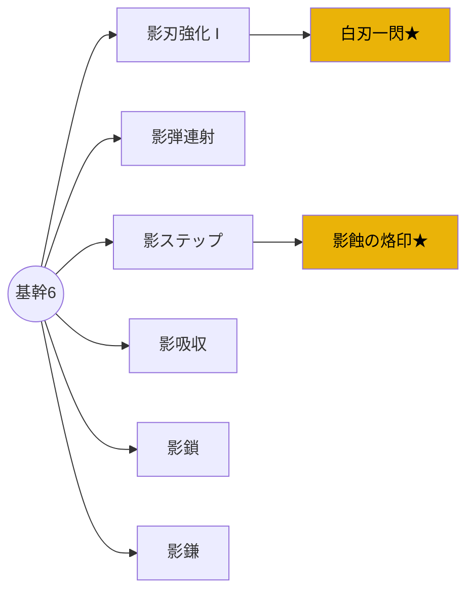

# 影使い ── Shadowbinder (初期ジョブ)

## 1. ジョブ概要

-   **ファンタジー**: 影を実体化し、伸縮自在の刃と分身で戦う闇の巡礼者。
-   **ロール**: 近〜中距離アタッカー／高機動・高フレームキャンセル性能。
-   **デザインピラー適合**: 瞬発アクション・無限ビルド・ダークポップの中心軸。

## 2. ベースステータス \<v0.1>

| ステータス | 初期値  | +10Lv   | 備考                 |
| ---------- | ------- | ------- | -------------------- |
| HP         | 120     | 180     | 軽装／被弾リスク高め |
| スタミナ   | 100     | 130     | 回避・影技で消費     |
| ATK        | 30      | 45      | 短剣基準ダメージ     |
| DEF        | 10      | 15      | 基本防御             |
| Crit 率    | 5 %     | 10 %    | スキルで伸ばしやすい |
| 移動速度   | 4.5 m/s | 5.0 m/s | ロール含まず         |

## 3. 初期装備

| 装備     | 説明                          | Frame       | 備考             |
| -------- | ----------------------------- | ----------- | ---------------- |
| **影刃** | 短剣。20F モーション、発生 4F | Base DMG 30 | 通常攻撃コンボ用 |
| **影弾** | スタミナ 10 消費の小射程弾    | 28F 発生 6F | DPS 補助／牽制   |

## 4. ユニークメカニクス

1. **影実体化**: スキル入力で影分身を最大 3 秒生成。分身はプレイヤー攻撃の 50%威力をミラー。
2. **影溜め (Shadow Charge)**: 長押し 0.6s。次攻撃+50%ダメ & ロール → 影閃ステップ(無敵 6F)に変化。
3. **影吸収**: 分身が与えたダメージの 20%を HP 吸収 (パッシブノード)。

## 5. スキルツリー骨格 (12 ノード)

-   **基幹ノード (6)**: 影刃強化 I/II, 影弾連射, 影ステップ, 影吸収, 影鎌
-   **分岐ノード (4)**: 影鎖, 影爆破, 影界侵入, 影弾跳弾
-   **条件解放 (2)**: ★ 白刃一閃 (ボスをノーダメ撃破), ★ 影蝕の烙印 (HP5%以下 3 分生存)

## 6. コンボ & キャンセルテーブル

| 連携          | ウィンドウ F | 説明                         |
| ------------- | ------------ | ---------------------------- |
| L1→L2→ ロール | 4‑6F         | 攻撃硬直を回避へキャンセル   |
| ロール → 影刃 | 3‑5F         | 回避終端から即攻撃で背後取り |
| 影溜め → 影鎌 | 0F           | 溜め完了で自動キャンセル発動 |

## 7. TTK 目標 & DPS 試算

-   **雑魚(HP100) 対影刃コンボ**: 2 ヒット ≒1.6s (ヒットストップ含む)
-   **ミニボス(HP600)**: 分身込み DPS 60 → TTK ≒10s (目標範囲内)

## 8. KPI 紐付けチェック

-   **入力 → ヒット遅延**: 発生 4F／60fps→0.067s で KPI≤0.10s を満たす。
-   **ビルド多様性**: 分岐 4 ノード × ルーン変化で DPS レンジ 3 倍以内に収束 (P2 目標)。

## 9. MVP 実装タスク

1. 影刃・影弾・ロールのアニメ&ヒットボックス実装。
2. SkillTreeResource テンプレ作成 & 12 ノード定数化。
3. 条件解放判定シグナルを `GameSession.gd` へ追加。
4. Autotest.gd の DPS 収集に影分身を含める。

## 10. 未決定・要検証ポイント

-   分身の AI 追従ルール (位置誤差 / 反転タイミング)。
-   スタミナ消費と回復速度 (テンポ調整)。
-   影界侵入中の被弾判定／UI 表現。

> **次ステップ**: v0.1 数値を Godot へ実装 → プロファイラでフレーム計測し、CoreExperienceSpec と突合。疑問が出たらこのドキュメントを更新してください。

---

## 参照

-   [[11_PlanDocs/11_07_content_architecture|最初のジョブ / スキルツリー骨格]]
-   [[11_PlanDocs/11_04_kpi_metrics|ジョブ一覧／影使い]]
-   [[11_PlanDocs/11_02_design_pillars|デザインピラー]]
-   [[11_PlanDocs/11_03_mvp_definition|MVP定義]]
