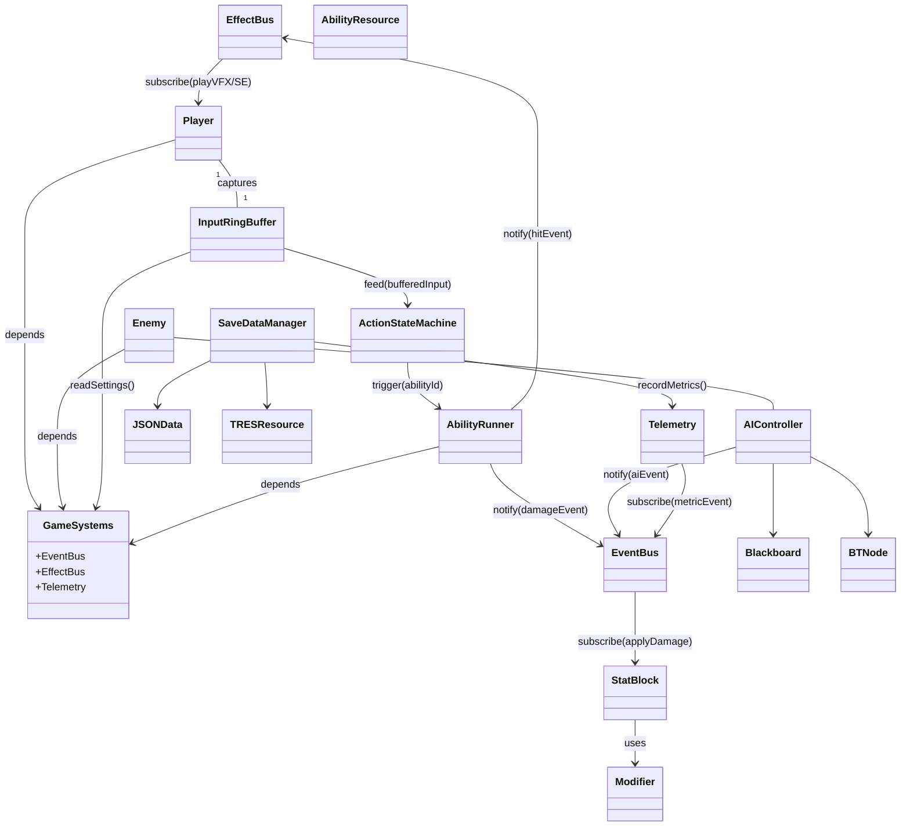

## 変更概要

| 修正項目                      | 内容                                                                                                               |
| ----------------------------- | ------------------------------------------------------------------------------------------------------------------ |
| **GameSystems 追加**          | AutoLoad シングルトンに主要ハブ (EventBus・EffectBus・Telemetry) を集約し、各ノードは `GameSystems` 経由で参照する |
| **EventBus / EffectBus 分離** | 演出系通知とロジック系通知を分割し、責務境界を明示 (`<<signalHub>>` ステレオタイプ)                                |
| **命名規約統一**              | `AiBlackboard` → `Blackboard`、`BtNode` → `BTNode` など PascalCase に統一                                          |
| **矢印ラベル追加**            | `notify` / `subscribe` / `feed` など動詞で関係を明確化                                                             |
| **ライフサイクル注記**        | コメントレベルで AutoLoad／子ノード配置を示し、実装者の迷いを削減                                                  |
| **データリソース表記**        | `.json` や `.tres` リソースを `<<resource>>` ステレオタイプでクラス図中に可視化                                    |

---
