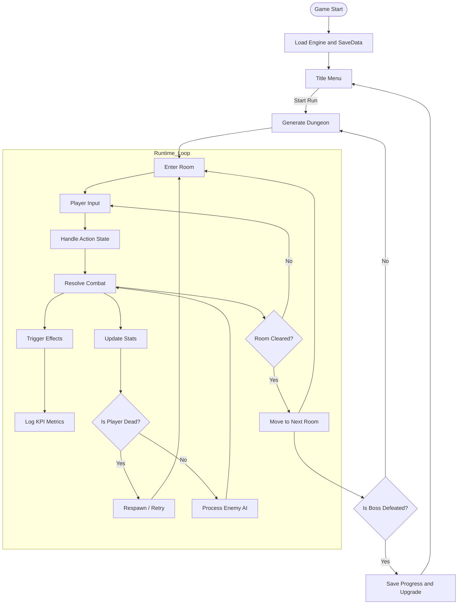

# Activity Diagram – Core Gameplay Loop

```mermaid
flowchart TD
    Start([Game Start])
    Init[Load Engine and SaveData]
    Title[Title Menu]
    Start --> Init --> Title
    Title -->|Start Run| Gen["Generate Dungeon"]
    Gen --> Room[Enter Room]

    subgraph Runtime_Loop
        direction TB
        Room --> Input[Player Input]
        Input --> Action[Handle Action State]
        Action --> Hit[Resolve Combat]
        Hit --> Stat[Update Stats]
        Hit --> Effects[Trigger Effects]
        Effects --> Telemetry[Log KPI Metrics]
        Stat --> DeadCheck{Is Player Dead?}
        DeadCheck -->|Yes| Retry[Respawn / Retry]
        Retry --> Room
        DeadCheck -->|No| AI[Process Enemy AI]
        AI --> Hit
        Hit --> ClearCheck{Room Cleared?}
        ClearCheck -->|No| Input
        ClearCheck -->|Yes| NextRoom[Move to Next Room]
        NextRoom --> Room
    end

    NextRoom --> ClearBoss{Is Boss Defeated?}
    ClearBoss -->|No| Gen
    ClearBoss -->|Yes| Meta["Save Progress and Upgrade"]
    Meta --> Title
```

