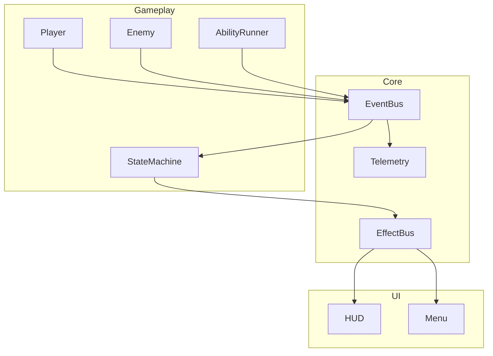

# リアクティブアーキテクチャ設計

本ドキュメントでは、リアクティブプログラミングを採用したシステム全体のアーキテクチャ方針をまとめます。既存の詳細設計書【14_DetailedDesign】を補完し、データフローと各モジュールの責務をより明確化します。

## 1. 目的

- イベント駆動型のデータフローを中心とした疎結合な構造を実現する。
- UI からゲームロジックまで一貫して Observable パターンで扱い、変更伝播を自動化する。

## 2. アーキテクチャ概要

- **EventBus** はリアクティブストリームのハブとして機能し、各コンポーネントは Observable で接続する。
- **EffectBus** は視覚・音響効果の通知専用に分離し、UI へもリアクティブに伝播させる。
- **Telemetry** は KPI 収集を担当し、ストリーム上で計測情報を流す。

## 3. 実施方針

1. `UniRx` などのライブラリを導入し、Godot C# スクリプトから利用可能にする。
2. 現在のクラス群を Observable 化し、状態変化をイベントとして発行する。
3. まずは UI 更新系から段階的に置き換え、安定性を確認しつつゲームロジックへ拡大する。
4. Telemetry のログ出力もストリーム上で処理し、自動テストと連携させる。

## 4. 今後の検討事項

- 非同期処理と組み合わせる際のスレッドセーフティ。
- 大規模なストリーム数によるパフォーマンスへの影響計測。

## 5. 変更履歴

| バージョン | 更新日     | 変更内容 |
| ---------- | ---------- | -------- |
| 0.1.0      | 2025-06-06 | 初版作成 |

