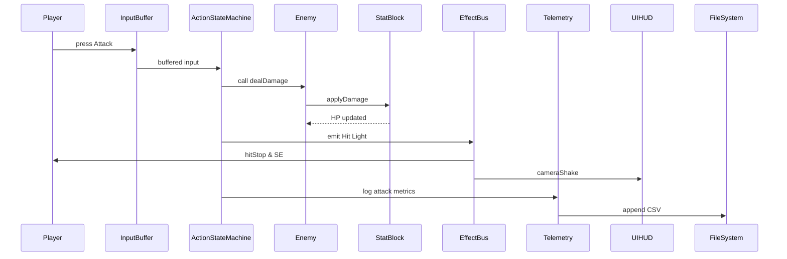

# Sequence Diagram – Player Attack Flow (MVP)

以下は **プレイヤーが通常攻撃を入力して敵にダメージを与え、演出と KPI 記録が走るまで** の典型的なフローを示すシーケンス図です。  
Obsidian では ```mermaid``` ブロックとして貼り付けると可視化できます。



---

## 説明

1. **InputBuffer** が 0.20 秒までの入力を保持し、`ActionStateMachine` に送出します。  
2. `ActionStateMachine` が攻撃フレームデータに基づき `Enemy` へ `dealDamage` を呼び出し。  
3. `Enemy` は自身の `StatBlock` にダメージを適用し、HP が減少。  
4. ヒット時に `EffectBus` が **ヒットストップ・SE・カメラシェイク** を各システムへ通知。  
5. 攻撃メトリクス（入力→ヒット遅延など）が `Telemetry` に記録され、CSV へ追記されます。  

この図を基にテストケースを洗い出し、`Autotest.gd` のシナリオに組み込むことで KPI を自動検証できます。
