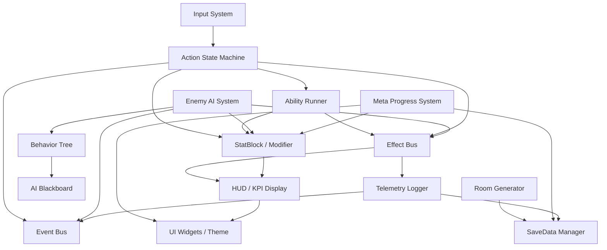

# Module Diagram – System Overview

以下は Mermaid 構文に準拠した **Godot モジュール構成図** です。  
主要システムの依存関係と通知経路（EventBus／EffectBus）を明示しています。

---

## 表記ルール

-   `-->` は「直接依存・参照」を表します。
-   中央の `EffectBus` / `EventBus` が横串の通知ハブです。
-   Obsidian の Mermaid Live Preview で正しく描画される構成になっています。
