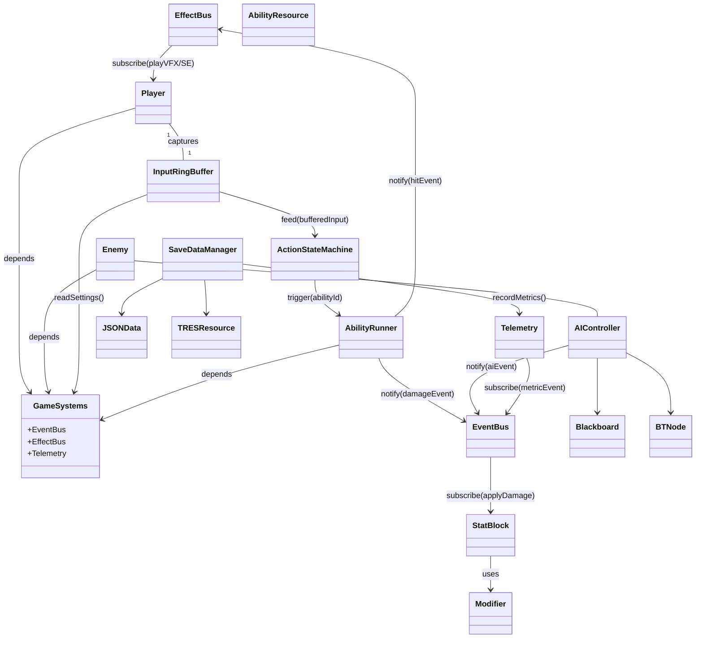
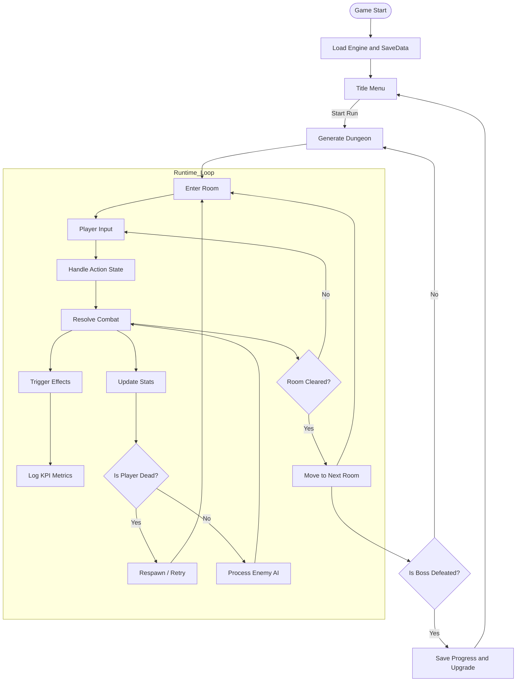
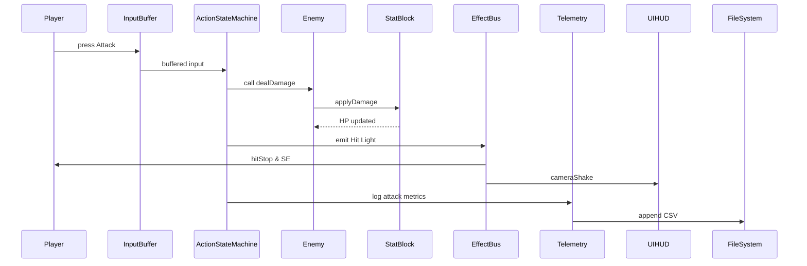
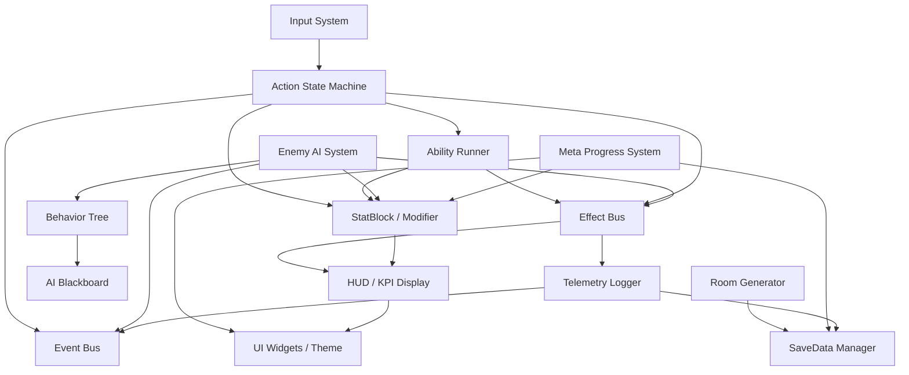

# 詳細設計書 – Shrine of the Lost Ones (仮)

## 目次
1. [はじめに](#はじめに)
2. [システムアーキテクチャ概要](#システムアーキテクチャ概要)
3. [クラス図](#クラス図)
4. [アクティビティ図 ― ゲームプレイループ](#アクティビティ図-ゲームプレイループ)
5. [シーケンス図 ― プレイヤー攻撃フロー](#シーケンス図-プレイヤー攻撃フロー)
6. [モジュール構成図](#モジュール構成図)
7. [設計原則とガイドライン](#設計原則とガイドライン)
8. [変更履歴](#変更履歴)

## はじめに
本書は、個人開発タイトル **“Shrine of the Lost Ones”** の詳細設計をまとめたものである。要件定義書 (14.1_Requirement) で定義された機能要求・非機能要求を満たすため、Godot 4.x 上に構築する各サブシステム（入力、アクション、AI、メタ進行など）の責務と依存関係を明示する。

## システムアーキテクチャ概要
- **GameSystems (AutoLoad)** を起点に `EventBus` / `EffectBus` / `Telemetry` を横断的に共有  
- プレイヤー・敵ともに **StateMachine + StatBlock** 構成を持ち、`EventBus` 経由で緩く結合  
- KPI 計測は **Telemetry** が一元記録し、CI( GitHub Actions ) による可視化を想定  

## クラス図

### 変更概要
| 修正項目                      | 内容                                                                                               |
| ----------------------------- | -------------------------------------------------------------------------------------------------- |
| **GameSystems 追加**          | AutoLoad シングルトンに主要ハブ (EventBus・EffectBus・Telemetry) を集約                         |
| **EventBus / EffectBus 分離** | 演出系通知とロジック系通知を分離し、責務境界を明示                                               |
| **命名規約統一**              | PascalCase に統一 (例: `BTNode`)                                                                  |
| **矢印ラベル追加**            | `notify` / `subscribe` など動詞で関係を明確化                                                     |
| **データリソース表記**        | `.json` や `.tres` をステレオタイプ表示                                                           |

## アクティビティ図 ― ゲームプレイループ

## シーケンス図 ― プレイヤー攻撃フロー
攻撃入力からダメージ適用・演出・KPI 記録までのフロー。

## モジュール構成図
Godot プロジェクトをモジュール単位で俯瞰する。

## 設計原則とガイドライン
- **疎結合 / 高凝集**：Signal ベースの通知と `Resource` データ駆動化で依存関係を最小化  
- **データ & 振る舞い分離**：`StatBlock` + `Modifier` で計算ロジックを統一  
- **テスト容易性**：`Bot` 操作によるインテグレーションテストを前提に、すべてのサブシステムが Headless 実行をサポート  
- **パフォーマンス最適化**：`NavigationServer` / Multi-threaded **PhysicsServer** を有効活用し 60 fps を保証  

## 変更履歴
| バージョン | 更新日       | 変更内容                 |
| --------- | ----------- | ------------------------ |
| 0.1       | 2025-05-29 | 初版作成（設計書の統合） |
