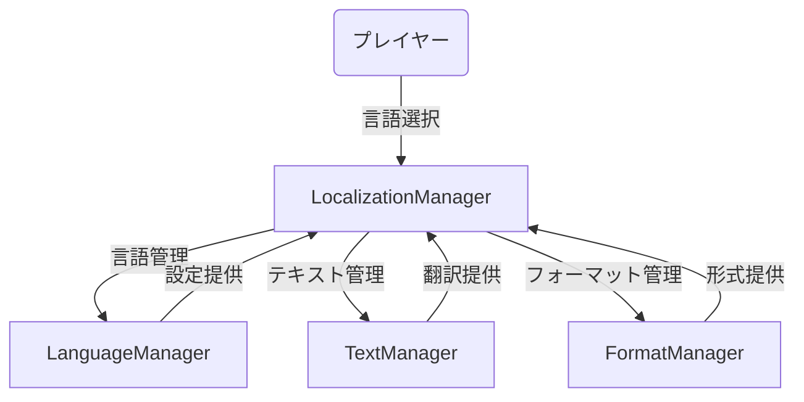
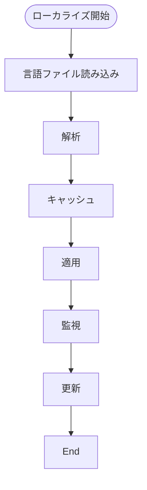
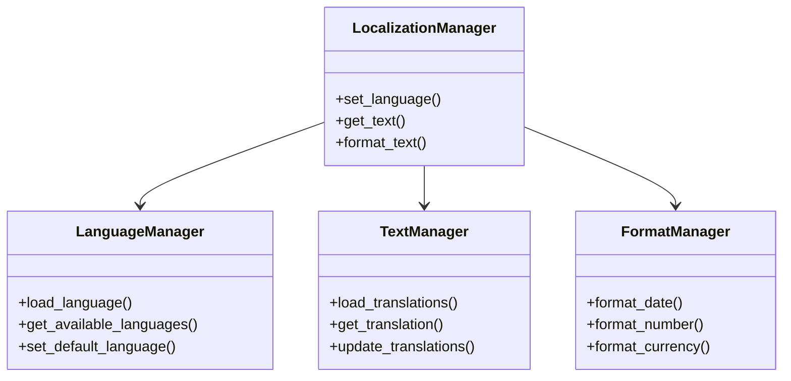

# 多言語対応実装仕様

## 目次

1. [概要](#概要)
2. [機能要件](#機能要件)
3. [実装詳細](#実装詳細)
4. [UI/UX設計](#uiux設計)
5. [テスト計画](#テスト計画)
6. [制限事項](#制限事項)
7. [変更履歴](#変更履歴)

## 概要

本ドキュメントは、ゲームの多言語対応に関する実装仕様を定義する。

## ユースケース図


## 状態遷移図
```mermaid
stateDiagram-v2
    [*] --> Default
    Default --> LanguageSelect : 言語選択
    LanguageSelect --> Loading : 読み込み
    Loading --> Active : 完了
    Active --> Reload : 更新
    Reload --> Active : 完了
    Active --> Default : リセット
```

## アクティビティ図


## クラス図


## 機能要件

### 1. 対応言語
- 日本語
  - 標準
  - 敬語
- 英語
  - 標準
  - 簡易

### 2. 翻訳対象
- UIテキスト
  - メニュー
  - ボタン
  - 説明文
- ゲーム内テキスト
  - アイテム名
  - スキル名
  - システムメッセージ
- 音声
  - ナレーション
  - 効果音
  - 環境音

### 3. 言語管理
- 言語設定
  - 自動検出
  - 手動選択
  - デフォルト設定
- フォント管理
  - 言語別フォント
  - フォールバック
  - サイズ調整
- レイアウト調整
  - テキスト長対応
  - 方向対応
  - スペース調整

## 実装詳細

### 1. クラス設計
```gdscript
class_name LocalizationSystem
extends Node

# 翻訳管理
var localization_manager: LocalizationManager
var translations: Dictionary
var current_language: String
var fallback_language: String

# フォント管理
var font_manager: FontManager
var language_fonts: Dictionary
var font_fallbacks: Dictionary
var font_settings: Dictionary

# レイアウト管理
var layout_manager: LayoutManager
var text_directions: Dictionary
var space_adjustments: Dictionary
var layout_presets: Dictionary

# 音声管理
var audio_manager: AudioManager
var voice_clips: Dictionary
var sound_effects: Dictionary
var ambient_sounds: Dictionary

# データ管理
var data_manager: DataManager
var translation_data: Dictionary
var font_data: Dictionary
var layout_data: Dictionary
```

### 2. 主要メソッド
```gdscript
# 翻訳管理
func set_language(language_code: String) -> void
func get_translation(key: String) -> String
func load_language_data(language_code: String) -> void
func update_translations() -> void

# フォント管理
func set_font(language_code: String, font_path: String) -> void
func adjust_font_size(size: int) -> void
func update_font_settings() -> void
func load_fonts() -> void

# レイアウト管理
func adjust_layout(direction: String) -> void
func update_text_spacing(spacing: float) -> void
func apply_layout_preset(preset_name: String) -> void
func optimize_layout() -> void

# 音声管理
func set_voice_language(language_code: String) -> void
func load_voice_clips() -> void
func update_audio_settings() -> void
func manage_audio_resources() -> void

# データ管理
func save_translation_data() -> void
func load_translation_data() -> void
func export_translations(format: String) -> void
func import_translations(data: Dictionary) -> void
```

### 3. ローカライゼーション設定
```gdscript
# 基本設定
var base_settings = {
    "languages": {
        "ja": {
            "name": "日本語",
            "code": "ja",
            "direction": "ltr",
            "font": "res://assets/fonts/ja_main.ttf"
        },
        "en": {
            "name": "English",
            "code": "en",
            "direction": "ltr",
            "font": "res://assets/fonts/en_main.ttf"
        }
    },
    "fonts": {
        "ja": {
            "main": "res://assets/fonts/ja_main.ttf",
            "fallback": "res://assets/fonts/ja_fallback.ttf",
            "size_range": [12, 24],
            "default_size": 16
        },
        "en": {
            "main": "res://assets/fonts/en_main.ttf",
            "fallback": "res://assets/fonts/en_fallback.ttf",
            "size_range": [12, 24],
            "default_size": 16
        }
    },
    "layout": {
        "text_direction": {
            "ja": "ltr",
            "en": "ltr"
        },
        "spacing": {
            "line_height": 1.2,
            "paragraph_spacing": 1.5,
            "character_spacing": 0.0
        },
        "alignment": {
            "default": "left",
            "rtl": "right"
        }
    },
    "audio": {
        "voice": {
            "enabled": true,
            "volume": 1.0,
            "priority": 1
        },
        "effects": {
            "enabled": true,
            "volume": 0.8,
            "priority": 2
        },
        "ambient": {
            "enabled": true,
            "volume": 0.6,
            "priority": 3
        }
    }
}

# 翻訳キー
var translation_keys = {
    "ui": {
        "menu": {
            "start": "START",
            "options": "OPTIONS",
            "quit": "QUIT"
        },
        "settings": {
            "language": "LANGUAGE",
            "volume": "VOLUME",
            "graphics": "GRAPHICS"
        }
    },
    "game": {
        "items": {
            "sword": "SWORD",
            "shield": "SHIELD",
            "potion": "POTION"
        },
        "skills": {
            "attack": "ATTACK",
            "defend": "DEFEND",
            "heal": "HEAL"
        }
    }
}
```

### 4. イベント処理
```gdscript
# シグナル定義
signal language_changed(language_code: String)
signal font_updated(font_path: String)
signal layout_updated(layout_data: Dictionary)
signal translation_loaded(language_code: String)

# イベントハンドラー
func _on_language_changed(language_code: String) -> void:
    emit_signal("language_changed", language_code)
    update_language_settings(language_code)

func _on_font_updated(font_path: String) -> void:
    emit_signal("font_updated", font_path)
    update_font_settings(font_path)

func _on_layout_updated(layout_data: Dictionary) -> void:
    emit_signal("layout_updated", layout_data)
    apply_layout_settings(layout_data)

func _on_translation_loaded(language_code: String) -> void:
    emit_signal("translation_loaded", language_code)
    update_translation_cache(language_code)
```

## UI/UX設計

### 1. 言語設定画面
- 言語選択
  - リスト表示
  - プレビュー
  - 自動検出
- フォント設定
  - サイズ調整
  - スタイル選択
  - プレビュー
- レイアウト設定
  - 方向設定
  - スペース調整
  - プレビュー

### 2. 翻訳管理画面
- 翻訳編集
  - キー/値編集
  - コンテキスト表示
  - メモ機能
- 翻訳検索
  - キーワード検索
  - フィルター
  - 一括編集
- 翻訳エクスポート
  - フォーマット選択
  - 範囲指定
  - バックアップ

### 3. プレビュー機能
- リアルタイムプレビュー
- レイアウト確認
- フォント確認

## テスト計画

### 1. 単体テスト
- 翻訳管理
  - 言語切り替え
  - 翻訳取得
  - データ読み込み
  - キャッシュ管理
- フォント管理
  - フォント設定
  - サイズ調整
  - フォールバック
  - リソース管理
- レイアウト管理
  - 方向設定
  - スペース調整
  - プリセット適用
  - 最適化処理
- 音声管理
  - 言語切り替え
  - クリップ管理
  - 設定更新
  - リソース管理

### 2. 統合テスト
- システム連携
  - 言語とフォント
  - レイアウトと音声
  - データ管理
  - イベント処理
- パフォーマンス
  - 負荷テスト
  - メモリ使用
  - 処理速度
  - エッジケース

## 制限事項

- 翻訳の一貫性維持
- パフォーマンスへの影響
- メモリ使用量の制限
1. 言語管理
   - サポート言語は最大10言語まで
   - 言語名の長さは最大32文字まで
   - フォールバック言語は1つのみ
2. テキスト管理
   - 翻訳キーは最大1000個まで
   - キャッシュサイズは最大1000エントリまで
   - カテゴリ数は最大10個まで
3. フォーマット管理
   - 日付フォーマットは最大32文字まで
   - 数値の小数点以下は最大4桁まで
   - 通貨記号は最大4文字まで
4. ローカライゼーション設定
   - 自動更新間隔は最小1時間まで
   - デバッグログは最大1MBまで
   - 設定ファイルサイズは最大10MBまで

## 変更履歴

| バージョン | 更新日     | 変更内容                 |
| ---------- | ---------- | ------------------------ |
| 0.3        | 2025-06-07 | 実装詳細の追加           |
| 0.4        | 2025-06-06 | 15.26の内容を統合        |
| 0.2        | 2025-05-29 | テンプレート統一化       |
| 0.1.0      | 2025-05-28 | 初版作成                 |
