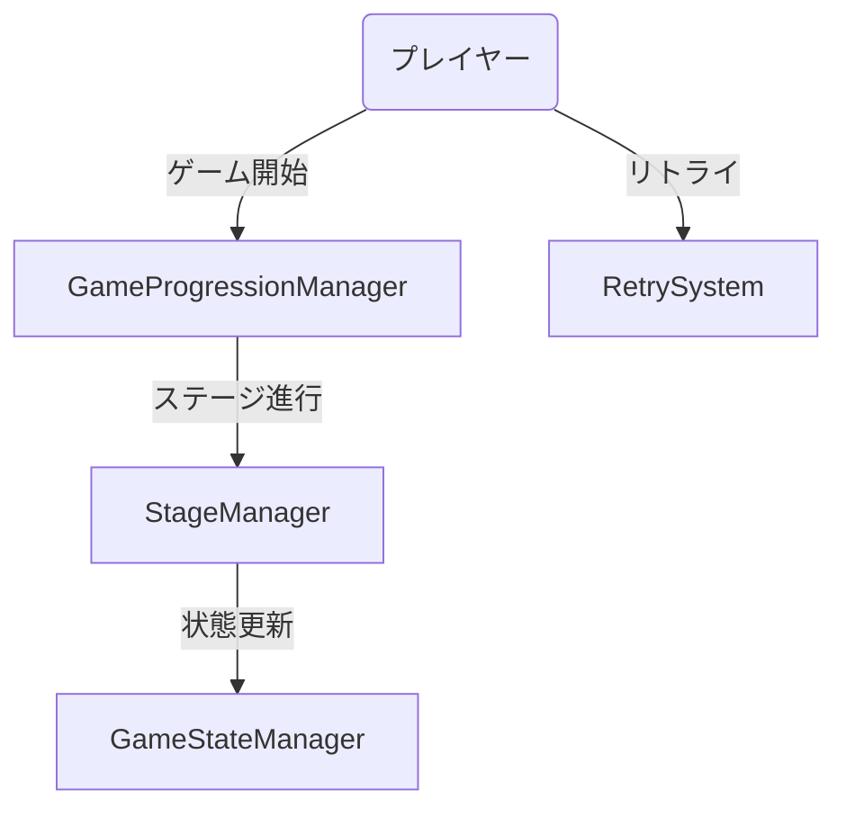
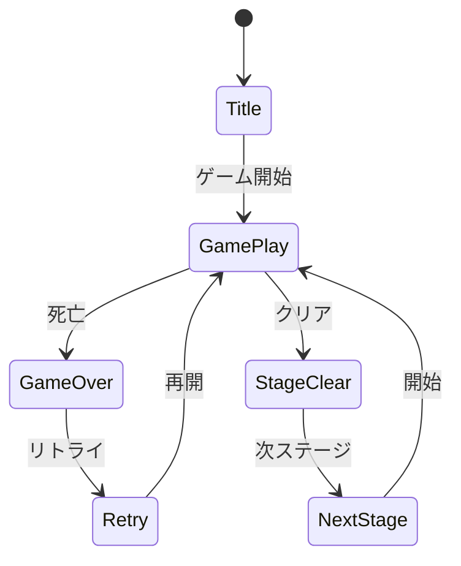
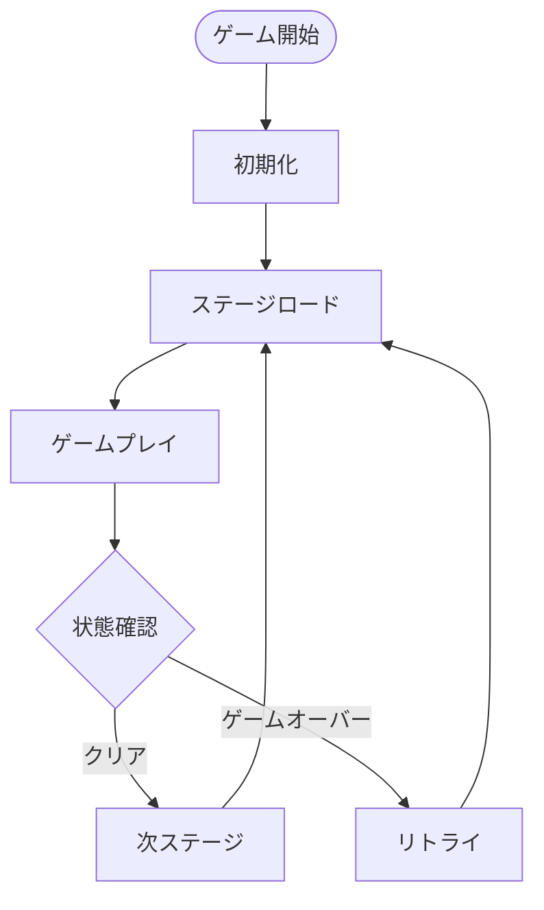
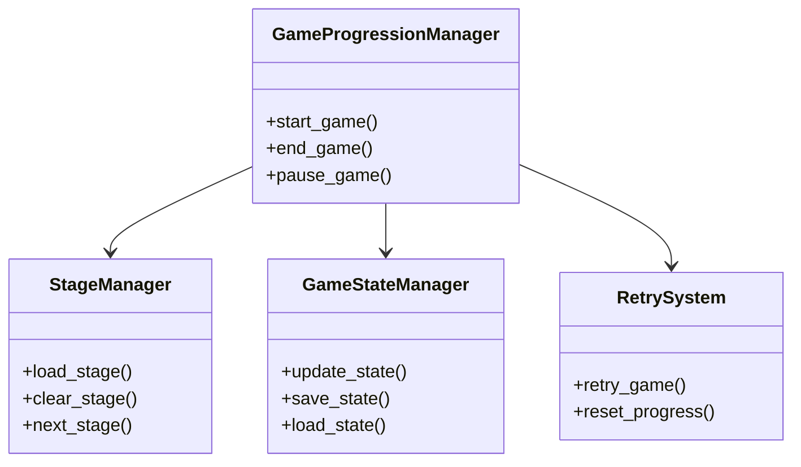

# ゲーム進行管理実装仕様

## 目次

1. [概要](#概要)
2. [ユースケース図](#ユースケース図)
3. [状態遷移図](#状態遷移図)
4. [アクティビティ図](#アクティビティ図)
5. [クラス図](#クラス図)
6. [実装詳細](#実装詳細)
7. [制限事項](#制限事項)
8. [変更履歴](#変更履歴)

## 概要

`GameProgressionManager`がゲームの進行状態を管理し、`StageManager`がステージの進行を制御する。`GameStateManager`がゲーム全体の状態を管理し、`RetrySystem`がリトライ機能を提供する。

## ユースケース図



## 状態遷移図



## アクティビティ図



## クラス図



## 実装詳細

### 1. クラス設計
```gdscript
class_name GameProgressionManager
extends Node

# ゲーム状態管理
var game_state: String
var current_stage: int
var total_stages: int
var game_progress: Dictionary

# ステージ管理
var stage_manager: StageManager
var stage_data: Dictionary
var stage_conditions: Dictionary
var stage_rewards: Dictionary

# ゲーム状態
var game_state_manager: GameStateManager
var save_data: Dictionary
var game_settings: Dictionary
var player_progress: Dictionary

# リトライシステム
var retry_system: RetrySystem
var retry_count: int
var retry_limit: int
var checkpoint_data: Dictionary
```

### 2. 主要メソッド
```gdscript
# ゲーム進行管理
func start_game() -> void
func end_game() -> void
func pause_game() -> void
func resume_game() -> void

# ステージ管理
func load_stage(stage_id: int) -> void
func clear_stage() -> void
func next_stage() -> void
func check_stage_conditions() -> bool

# 状態管理
func update_game_state() -> void
func save_game_state() -> void
func load_game_state() -> void
func reset_game_state() -> void

# リトライ処理
func retry_game() -> void
func reset_progress() -> void
func save_checkpoint() -> void
func load_checkpoint() -> void
```

### 3. ゲーム進行パラメータ
```gdscript
# 基本パラメータ
var base_params = {
    "max_stages": 10,
    "retry_limit": 3,
    "checkpoint_interval": 5,
    "clear_conditions": {
        "time_limit": 300,
        "score_goal": 1000,
        "enemy_clear": true
    }
}

# ステージ進行
var stage_progression = {
    "difficulty_curve": 1.2,
    "reward_multiplier": 1.5,
    "unlock_conditions": {
        "score_required": 1000,
        "items_collected": 5,
        "time_bonus": true
    }
}

# リトライ設定
var retry_settings = {
    "checkpoint_system": true,
    "partial_progress": true,
    "difficulty_adjustment": true,
    "reward_penalty": 0.8
}
```

### 4. イベント処理
```gdscript
# シグナル定義
signal game_started()
signal game_ended()
signal stage_cleared(stage_id: int)
signal game_overed()
signal retry_attempted()

# イベントハンドラー
func _on_game_started() -> void:
    emit_signal("game_started")
    initialize_game()

func _on_stage_cleared(stage_id: int) -> void:
    emit_signal("stage_cleared", stage_id)
    process_stage_clear(stage_id)

func _on_game_overed() -> void:
    emit_signal("game_overed")
    handle_game_over()
```

## 制限事項

1. ゲーム進行
- ステージ数は最大10まで
- リトライ回数は3回まで
- チェックポイントは5ステージごと

2. セーブデータ
- セーブデータは最大3スロット
- オートセーブは5分ごと
- セーブデータのサイズは1MB以下

3. パフォーマンス
- ステージロード時間は5秒以内
- リトライ時の再開は3秒以内
- メモリ使用量は100MB以下

## 変更履歴

| バージョン | 更新日     | 変更内容 |
| ---------- | ---------- | -------- |
| 0.1.0      | 2024-03-21 | 初版作成 |
