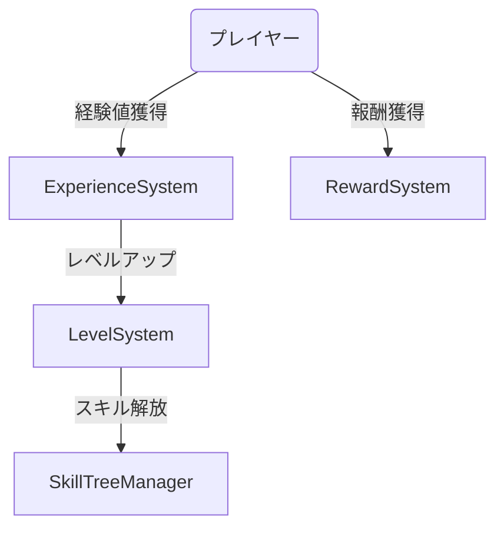
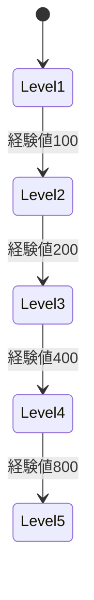
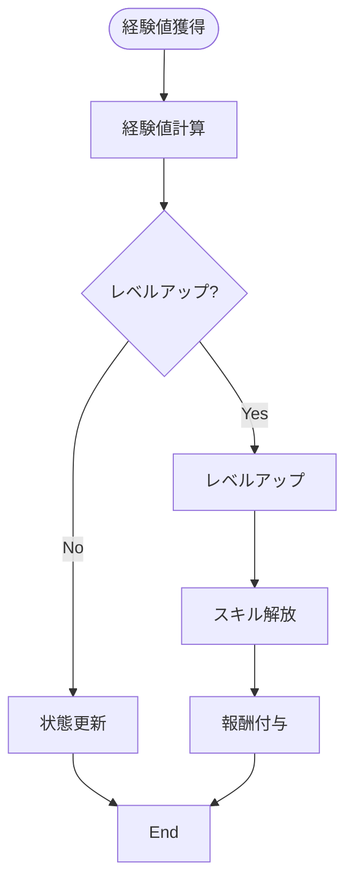
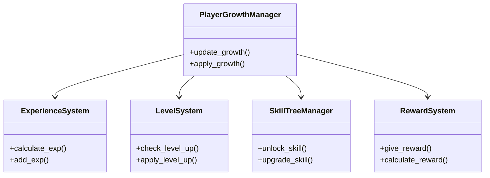

# プレイヤー成長実装仕様

## 目次

1. [概要](#概要)
2. [ユースケース図](#ユースケース図)
3. [状態遷移図](#状態遷移図)
4. [アクティビティ図](#アクティビティ図)
5. [クラス図](#クラス図)
6. [実装詳細](#実装詳細)
7. [制限事項](#制限事項)
8. [変更履歴](#変更履歴)

## 概要

`PlayerGrowthManager`がプレイヤーの成長を管理し、`ExperienceSystem`が経験値の計算を行い、`LevelSystem`がレベルアップを制御する。`SkillTreeManager`がスキルツリーの管理を行い、`RewardSystem`が報酬の付与を担当する。

## ユースケース図



## 状態遷移図



## アクティビティ図



## クラス図



## 実装詳細

### 1. クラス設計
```gdscript
class_name PlayerGrowthManager
extends Node

# 経験値管理
var experience_system: ExperienceSystem
var current_exp: int
var total_exp: int
var exp_to_next_level: int

# レベル管理
var level_system: LevelSystem
var current_level: int
var max_level: int
var level_stats: Dictionary

# スキルツリー
var skill_tree_manager: SkillTreeManager
var unlocked_skills: Array
var skill_points: int
var skill_tree_data: Dictionary

# 報酬管理
var reward_system: RewardSystem
var pending_rewards: Array
var reward_history: Dictionary
var reward_multipliers: Dictionary
```

### 2. 主要メソッド
```gdscript
# 経験値管理
func gain_experience(amount: int) -> void
func calculate_level_up_exp() -> int
func check_level_up() -> bool
func process_level_up() -> void

# スキル管理
func unlock_skill(skill_id: String) -> void
func upgrade_skill(skill_id: String) -> void
func reset_skill_tree() -> void
func calculate_skill_cost() -> int

# 報酬処理
func give_reward(reward_type: String) -> void
func calculate_reward_multiplier() -> float
func process_rewards() -> void
func save_reward_history() -> void
```

### 3. 成長パラメータ
```gdscript
# 経験値設定
var exp_settings = {
    "base_exp": 100,
    "exp_multiplier": 1.5,
    "max_level": 50,
    "exp_curve": "exponential"
}

# レベルアップ設定
var level_up_settings = {
    "stat_increase": {
        "health": 10,
        "attack": 5,
        "defense": 3,
        "speed": 1
    },
    "skill_points": 1,
    "unlock_requirements": {
        "level": 5,
        "quest_completion": true
    }
}

# スキルツリー設定
var skill_tree_settings = {
    "max_skill_points": 50,
    "skill_categories": [
        "combat",
        "defense",
        "utility",
        "passive"
    ],
    "prerequisites": {
        "required_level": 5,
        "required_skills": []
    }
}

# 報酬設定
var reward_settings = {
    "exp_multiplier": 1.2,
    "gold_multiplier": 1.5,
    "item_drop_rate": 1.1,
    "special_rewards": {
        "level_milestone": true,
        "achievement_bonus": true
    }
}
```

### 4. イベント処理
```gdscript
# シグナル定義
signal experience_gained(amount: int)
signal level_up(new_level: int)
signal skill_unlocked(skill_id: String)
signal reward_received(reward_type: String)

# イベントハンドラー
func _on_experience_gained(amount: int) -> void:
    emit_signal("experience_gained", amount)
    process_experience_gain(amount)

func _on_level_up(new_level: int) -> void:
    emit_signal("level_up", new_level)
    process_level_up_effects(new_level)

func _on_skill_unlocked(skill_id: String) -> void:
    emit_signal("skill_unlocked", skill_id)
    apply_skill_effects(skill_id)
```

## 制限事項

1. レベルシステム
- 最大レベルは50まで
- レベルアップに必要な経験値は指数関数的に増加
- スキルポイントはレベルアップごとに1ポイント

2. スキルツリー
- 最大スキルポイントは50まで
- スキルの解放にはレベル要件あり
- スキルのリセットは1回のみ可能

3. 報酬システム
- 報酬の倍率は最大2倍まで
- 特殊報酬はレベルマイルストーンでのみ
- 報酬履歴は最大100件まで保存

## 変更履歴

| バージョン | 更新日     | 変更内容 |
| ---------- | ---------- | -------- |
| 0.1.0      | 2024-03-21 | 初版作成 |
