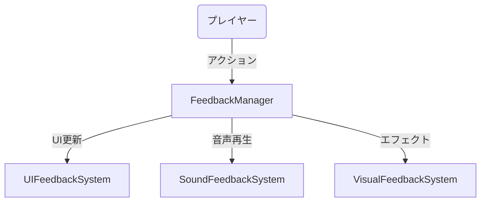
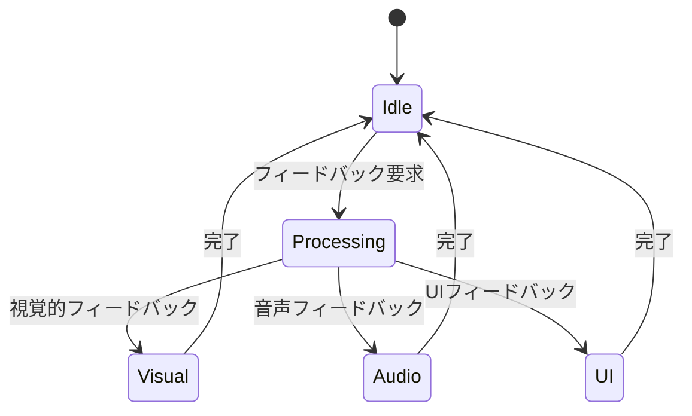
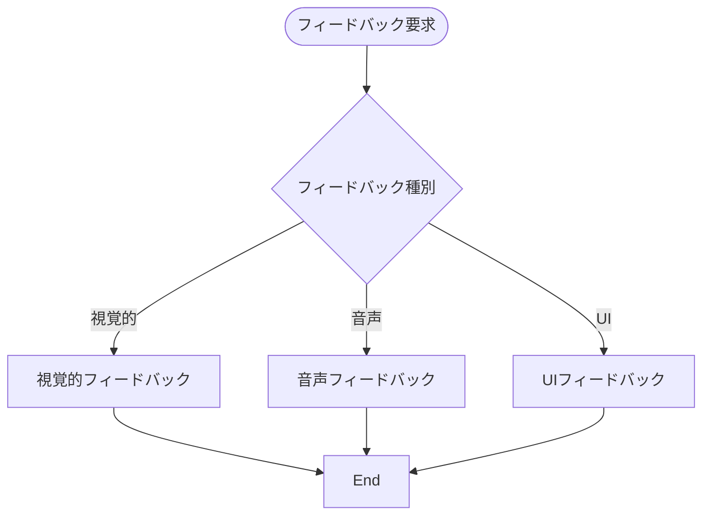
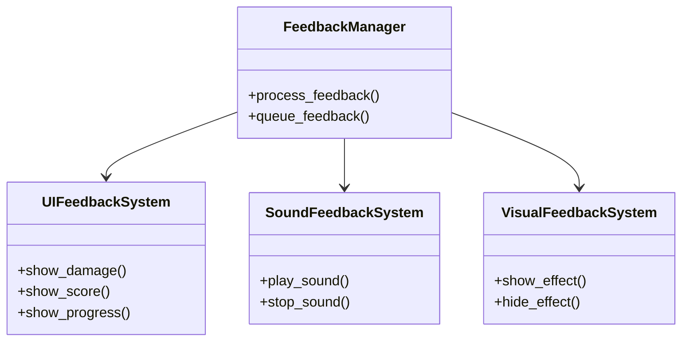

# フィードバックシステム実装仕様

## 目次

1. [概要](#概要)
2. [ユースケース図](#ユースケース図)
3. [状態遷移図](#状態遷移図)
4. [アクティビティ図](#アクティビティ図)
5. [クラス図](#クラス図)
6. [実装詳細](#実装詳細)
7. [制限事項](#制限事項)
8. [変更履歴](#変更履歴)

## 概要

`FeedbackManager`がプレイヤーへの視覚的・聴覚的フィードバックを管理し、`UIFeedbackSystem`がUI要素のフィードバックを制御する。`SoundFeedbackSystem`が音声フィードバックを管理し、`VisualFeedbackSystem`が視覚的エフェクトを制御する。

## ユースケース図



## 状態遷移図



## アクティビティ図



## クラス図



## 実装詳細

### 1. クラス設計
```gdscript
class_name FeedbackManager
extends Node

# UIフィードバック
var ui_feedback: UIFeedbackSystem
var damage_numbers: Array
var score_display: Label
var progress_bar: ProgressBar
var notification_queue: Array

# 音声フィードバック
var sound_feedback: SoundFeedbackSystem
var sound_effects: Dictionary
var music_tracks: Dictionary
var volume_settings: Dictionary

# 視覚的フィードバック
var visual_feedback: VisualFeedbackSystem
var particle_effects: Dictionary
var screen_effects: Dictionary
var animation_effects: Dictionary
```

### 2. 主要メソッド
```gdscript
# UIフィードバック
func show_damage_number(position: Vector2, amount: float) -> void
func update_score_display(score: int) -> void
func update_progress_bar(progress: float) -> void
func show_notification(message: String) -> void

# 音声フィードバック
func play_sound_effect(effect_name: String) -> void
func play_music(track_name: String) -> void
func adjust_volume(volume: float) -> void

# 視覚的フィードバック
func show_particle_effect(effect_name: String, position: Vector2) -> void
func show_screen_effect(effect_name: String) -> void
func play_animation(animation_name: String) -> void
```

### 3. フィードバックパラメータ
```gdscript
# UIパラメータ
var ui_params = {
    "damage_number_duration": 1.0,
    "score_update_speed": 0.5,
    "progress_bar_smoothness": 0.3,
    "notification_duration": 3.0
}

# 音声パラメータ
var sound_params = {
    "master_volume": 1.0,
    "music_volume": 0.8,
    "sfx_volume": 1.0,
    "fade_duration": 1.0
}

# 視覚的パラメータ
var visual_params = {
    "particle_lifetime": 2.0,
    "screen_effect_duration": 0.5,
    "animation_speed": 1.0,
    "blend_mode": "add"
}
```

### 4. イベント処理
```gdscript
# シグナル定義
signal feedback_processed(feedback_type: String)
signal sound_played(sound_name: String)
signal effect_shown(effect_name: String)

# イベントハンドラー
func _on_feedback_requested(feedback_data: Dictionary) -> void:
    process_feedback(feedback_data)
    emit_signal("feedback_processed", feedback_data.type)

func _on_sound_completed(sound_name: String) -> void:
    emit_signal("sound_played", sound_name)
    cleanup_sound(sound_name)

func _on_effect_completed(effect_name: String) -> void:
    emit_signal("effect_shown", effect_name)
    cleanup_effect(effect_name)
```

## 制限事項

1. パフォーマンス
- 同時表示可能なダメージ数値は最大10個
- パーティクルエフェクトは最大5つまで
- 音声は最大8チャンネルまで

2. メモリ使用
- エフェクトのキャッシュは最大50MB
- 音声ファイルのキャッシュは最大100MB
- UI要素のキャッシュは最大20MB

3. 表示制限
- 通知は最大3つまで同時表示
- スクリーンエフェクトは1つまで
- アニメーションは最大3つまで同時再生

## 変更履歴

| バージョン | 更新日     | 変更内容 |
| ---------- | ---------- | -------- |
| 0.1.0      | 2024-03-21 | 初版作成 |
| 0.2.0      | 2025-06-07 | 新規追加 |
