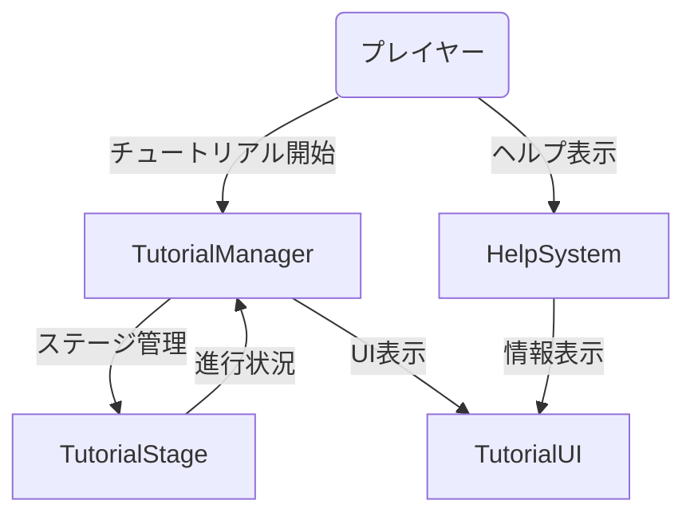
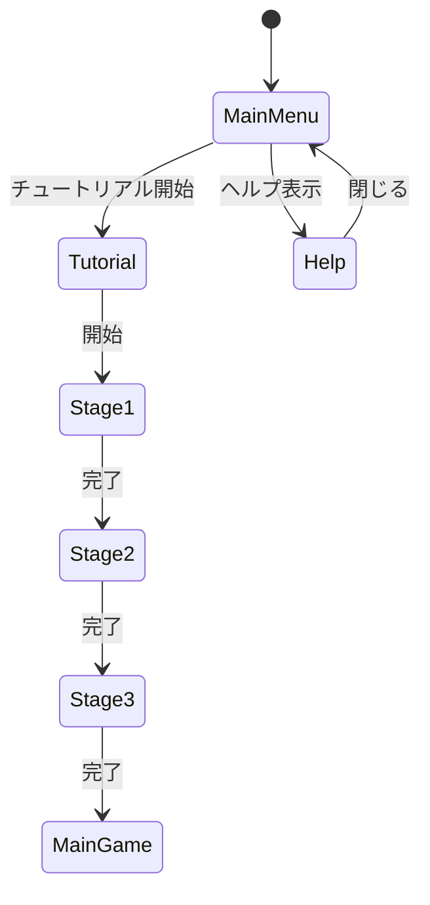
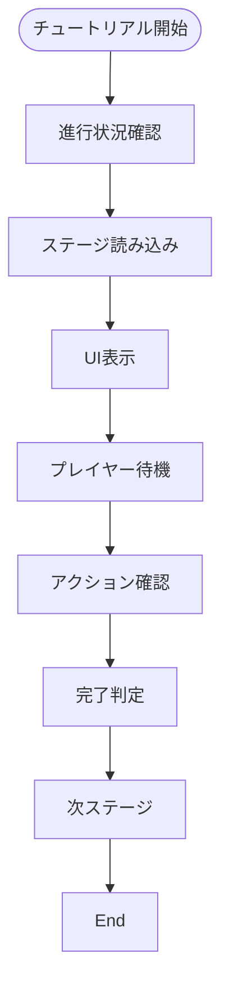
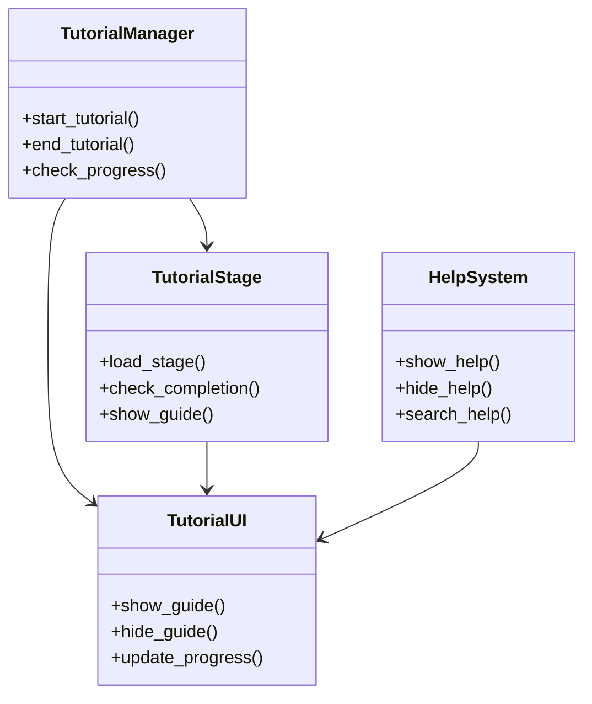

# チュートリアル/ヘルプシステム実装仕様

## 目次

1. [概要](#概要)
2. [ユースケース図](#ユースケース図)
3. [状態遷移図](#状態遷移図)
4. [アクティビティ図](#アクティビティ図)
5. [クラス図](#クラス図)
6. [実装詳細](#実装詳細)
7. [制限事項](#制限事項)
8. [変更履歴](#変更履歴)

## 概要

`TutorialManager`がチュートリアルを管理し、`TutorialStage`が各ステージを、`HelpSystem`がヘルプ機能を、`TutorialUI`がUI表示を担当する。

## ユースケース図



## 状態遷移図



## アクティビティ図



## クラス図



## 実装詳細

### 1. クラス設計
```gdscript
class_name TutorialManager
extends Node

# チュートリアル管理
var current_stage: TutorialStage
var stage_progress: Dictionary
var tutorial_settings: Dictionary
var stage_data: Dictionary

# ヘルプ管理
var help_system: HelpSystem
var help_topics: Dictionary
var help_settings: Dictionary
var search_index: Dictionary

# UI管理
var tutorial_ui: TutorialUI
var active_guides: Array
var ui_settings: Dictionary
var animation_queue: Array
```

### 2. 主要メソッド
```gdscript
# チュートリアル管理
func start_tutorial(tutorial_id: String) -> void
func end_tutorial() -> void
func check_progress() -> Dictionary
func load_stage(stage_id: String) -> void

# ステージ管理
func check_stage_completion() -> bool
func show_stage_guide() -> void
func hide_stage_guide() -> void
func update_stage_progress() -> void

# ヘルプ管理
func show_help(topic_id: String) -> void
func hide_help() -> void
func search_help(query: String) -> Array
func update_help_index() -> void

# UI管理
func show_guide(guide_id: String) -> void
func hide_guide(guide_id: String) -> void
func update_progress_display() -> void
func queue_animation(animation_id: String) -> void
```

### 3. チュートリアル設定
```gdscript
# ステージ設定
var stage_settings = {
    "basic_movement": {
        "title": "基本移動",
        "description": "キャラクターの移動方法を学びます",
        "objectives": [
            "WASDキーで移動",
            "スペースキーでジャンプ",
            "シフトキーでダッシュ"
        ],
        "completion_conditions": {
            "move_distance": 100,
            "jump_count": 3,
            "dash_count": 2
        }
    },
    "combat_basics": {
        "title": "戦闘の基本",
        "description": "基本的な戦闘方法を学びます",
        "objectives": [
            "左クリックで攻撃",
            "右クリックで防御",
            "Qキーでスキル使用"
        ],
        "completion_conditions": {
            "attack_count": 5,
            "block_count": 3,
            "skill_count": 2
        }
    },
    "advanced_skills": {
        "title": "上級スキル",
        "description": "高度な戦闘テクニックを学びます",
        "objectives": [
            "コンボ攻撃の実行",
            "カウンター攻撃の使用",
            "特殊スキルの発動"
        ],
        "completion_conditions": {
            "combo_count": 3,
            "counter_count": 2,
            "special_count": 1
        }
    }
}

# ヘルプ設定
var help_settings = {
    "controls": {
        "title": "操作説明",
        "sections": [
            "基本操作",
            "戦闘操作",
            "メニュー操作"
        ],
        "search_keywords": [
            "移動",
            "攻撃",
            "防御",
            "スキル"
        ]
    },
    "game_systems": {
        "title": "ゲームシステム",
        "sections": [
            "戦闘システム",
            "成長システム",
            "アイテムシステム"
        ],
        "search_keywords": [
            "戦闘",
            "レベル",
            "アイテム",
            "装備"
        ]
    },
    "tips": {
        "title": "ヒントとコツ",
        "sections": [
            "初心者向け",
            "中級者向け",
            "上級者向け"
        ],
        "search_keywords": [
            "ヒント",
            "コツ",
            "攻略",
            "テクニック"
        ]
    }
}

# UI設定
var ui_settings = {
    "guide_window": {
        "position": Vector2(100, 100),
        "size": Vector2(400, 300),
        "background_color": Color(0, 0, 0, 0.8),
        "text_color": Color.white
    },
    "progress_bar": {
        "position": Vector2(20, 20),
        "size": Vector2(200, 20),
        "background_color": Color(0.2, 0.2, 0.2),
        "fill_color": Color(0, 0.8, 0)
    },
    "highlight": {
        "color": Color(1, 1, 0, 0.3),
        "duration": 0.5,
        "scale": 1.2
    }
}
```

### 4. イベント処理
```gdscript
# シグナル定義
signal tutorial_started(tutorial_id: String)
signal tutorial_ended(tutorial_id: String)
signal stage_completed(stage_id: String)
signal help_shown(topic_id: String)
signal help_hidden(topic_id: String)

# イベントハンドラー
func _on_tutorial_started(tutorial_id: String) -> void:
    emit_signal("tutorial_started", tutorial_id)
    update_tutorial_status(tutorial_id)

func _on_stage_completed(stage_id: String) -> void:
    emit_signal("stage_completed", stage_id)
    update_stage_status(stage_id)

func _on_help_shown(topic_id: String) -> void:
    emit_signal("help_shown", topic_id)
    update_help_status(topic_id)
```

## 制限事項

1. チュートリアル
- 同時に表示できるガイドは最大3つまで
- ステージ数は最大10個まで
- 各ステージの持続時間は最大5分まで

2. ヘルプ
- 表示できるトピックは最大20個まで
- 検索結果は最大10件まで
- ヘルプウィンドウのサイズは最大800x600まで

3. UI
- 同時に表示できるアニメーションは最大5つまで
- テキストサイズは8ptから32ptの範囲
- ハイライト効果の持続時間は最大2秒まで

4. パフォーマンス
- チュートリアルデータのサイズは最大1MBまで
- ヘルプインデックスのサイズは最大500KBまで
- アニメーションのメモリ使用量は最大50MBまで

## 変更履歴

| バージョン | 更新日     | 変更内容 |
| ---------- | ---------- | -------- |
| 0.1.0      | 2024-03-21 | 初版作成 |
