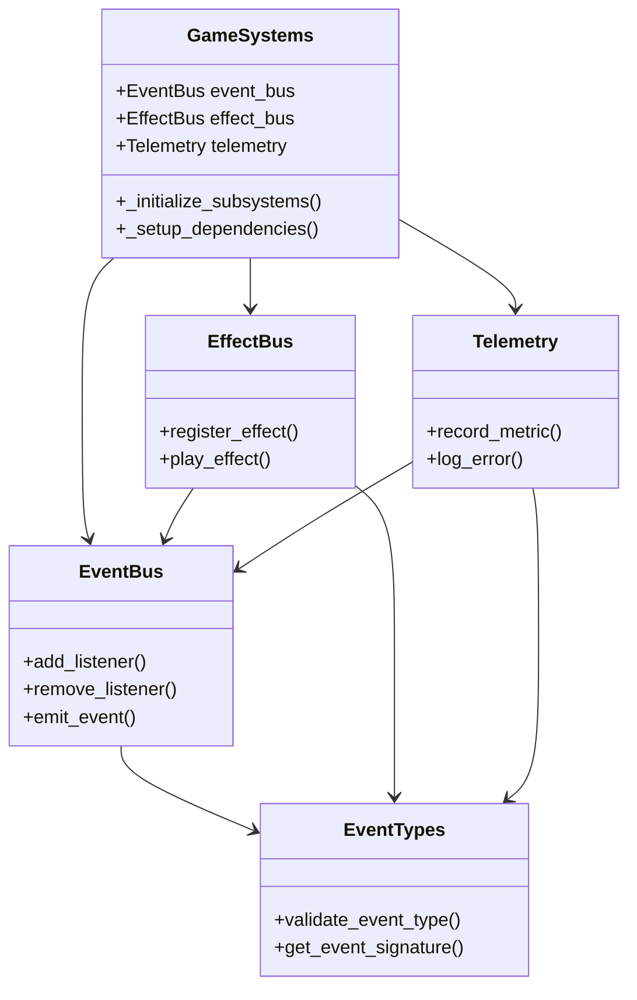

# 目次

1. [概要](#概要)
2. [システム構成](#システム構成)
3. [各サブシステムの詳細](#各サブシステムの詳細)
4. [使用方法](#使用方法)
5. [エラーハンドリング](#エラーハンドリング)
6. [制限事項](#制限事項)
7. [変更履歴](#変更履歴)

# GameSystems 実装仕様書

## 概要

GameSystems は、ゲームのコアとなる機能を提供するシングルトンシステムです。EventBus、EffectBus、Telemetry の 3 つの主要なサブシステムを管理し、ゲーム全体のイベント管理、エフェクト制御、メトリクス収集を担当します。

### 主な機能

-   イベント管理システム（EventBus）
-   エフェクト制御システム（EffectBus）
-   テレメトリ収集システム（Telemetry）

## システム構成

### クラス図



## 各サブシステムの詳細

### EventBus

#### 主要なイベントシグナル

```gdscript
# ゲーム状態
signal game_started
signal game_paused
signal game_resumed
signal game_ended

# プレイヤー関連
signal player_damaged(amount: float, source: Node)
signal player_healed(amount: float, source: Node)
signal player_died

# 敵関連
signal enemy_damaged(enemy: Node, amount: float, source: Node)
signal enemy_died(enemy: Node)

# ルーム関連
signal room_entered(room_id: String)
signal room_cleared(room_id: String)
```

#### 主要メソッド

-   `add_listener(event_name: String, listener: Callable)`: イベントリスナーの登録
-   `remove_listener(event_name: String, listener: Callable)`: イベントリスナーの解除
-   `emit_event(event_name: String, args: Array = [])`: イベントの発火

#### イベントタイプの検証

```gdscript
# イベント発火時の検証
func emit_event(event_name: String, args: Array = []) -> void:
    if not EventTypes.validate_event_type(event_name, args):
        push_error("EventBus: Invalid event type or arguments for '%s'" % event_name)
        return
    # イベントの発火処理
```

### EffectBus

#### 主要なエフェクトシグナル

```gdscript
signal effect_triggered(effect_name: String, params: Dictionary)
signal vfx_played(vfx_name: String, position: Vector3)
signal se_played(se_name: String)
signal camera_shake(intensity: float, duration: float)
```

#### 主要メソッド

-   `register_effect(effect_name: String, resource: Resource)`: エフェクトリソースの登録
-   `play_effect(effect_name: String, params: Dictionary = {})`: エフェクトの再生

### Telemetry

#### メトリクス種別

```gdscript
enum MetricType {
    PLAYER_DAMAGE,
    ENEMY_DAMAGE,
    ROOM_CLEAR_TIME,
    GAME_SESSION_TIME,
    ERROR_COUNT
}
```

#### 主要メソッド

-   `record_metric(metric_type: MetricType, value: float, context: Dictionary = {})`: メトリクスの記録
-   `log_error(error_message: String)`: エラーの記録

## 使用方法

### 初期化

GameSystems は AutoLoad として自動的に初期化されます。手動での初期化は不要です。

### イベントの発火と購読

```gdscript
# イベントの発火
GameSystems.instance.event_bus.emit_event("player_damaged", [10.0, self])

# イベントの購読
GameSystems.instance.event_bus.add_listener("player_damaged", _on_player_damaged)
```

### エフェクトの再生

```gdscript
# エフェクトの登録
GameSystems.instance.effect_bus.register_effect("player_hit", hit_effect_resource)

# エフェクトの再生
GameSystems.instance.effect_bus.play_effect("player_hit", {
    "amount": 10.0,
    "position": Vector3(0, 0, 0)
})
```

### メトリクスの記録

```gdscript
# メトリクスの記録
GameSystems.instance.telemetry.record_metric(
    Telemetry.MetricType.PLAYER_DAMAGE,
    10.0,
    {"source": "enemy_1"}
)
```

## エラーハンドリング

### エラー処理の流れ

1. エラー発生時に`_handle_error`メソッドが呼び出される
2. エラーメッセージが Telemetry に記録される
3. エラーが Godot のエラーシステムに報告される

### 主なエラーケース

-   重複した GameSystems インスタンスの作成
-   未登録のエフェクトの再生
-   ファイルアクセスエラー（Telemetry）

## 制限事項

### 現在の制限

-   エフェクトの具体的な再生処理は未実装（TODO）
-   テレメトリデータの可視化機能は未実装
-   マルチスレッド対応は未実装

### 今後の改善点

1. エフェクト再生システムの実装
2. テレメトリデータの可視化機能の追加
3. マルチスレッド対応の実装
4. ユニットテストの追加

## 変更履歴

| バージョン | 更新日     | 変更内容             |
| ---------- | ---------- | -------------------- |
| 0.1        | 2025-05-30 | 初版作成（基本実装） |
