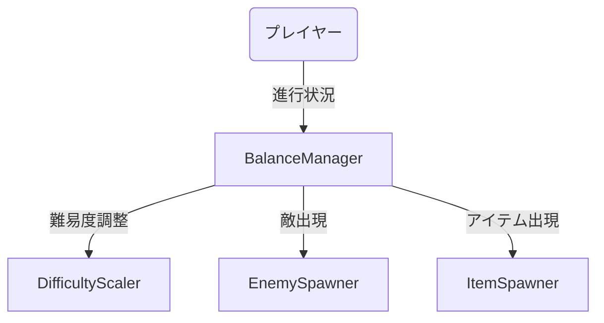
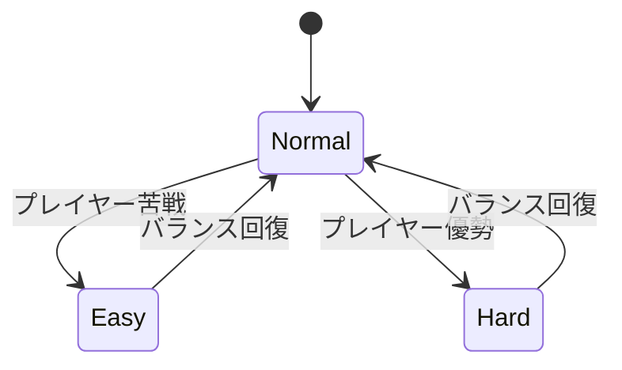
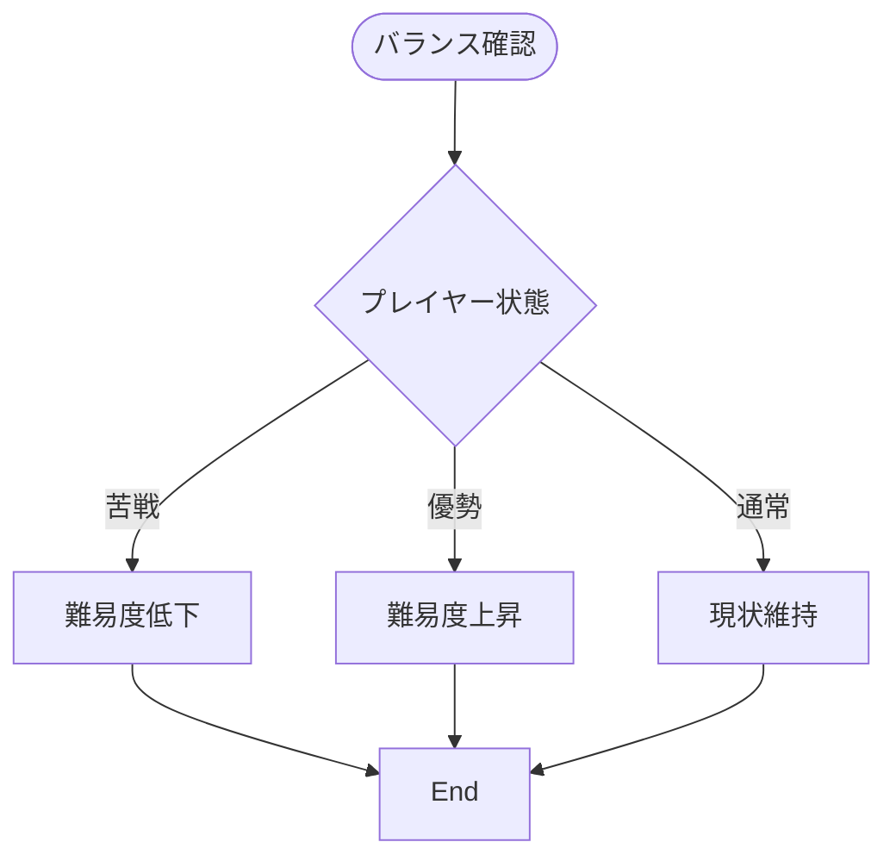
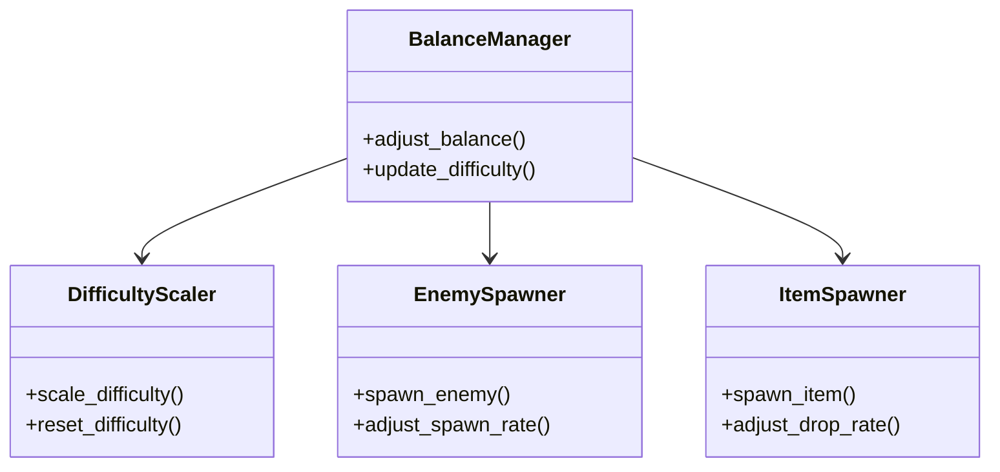

# バランス調整実装仕様

## 目次

1. [概要](#概要)
2. [ユースケース図](#ユースケース図)
3. [状態遷移図](#状態遷移図)
4. [アクティビティ図](#アクティビティ図)
5. [クラス図](#クラス図)
6. [実装詳細](#実装詳細)
7. [制限事項](#制限事項)
8. [変更履歴](#変更履歴)

## 概要

`BalanceManager`がゲームのバランス調整を管理し、`DifficultyScaler`が難易度の動的調整を担当する。`EnemySpawner`が敵の出現バランスを制御し、`ItemSpawner`がアイテムの出現バランスを管理する。

## ユースケース図



## 状態遷移図



## アクティビティ図



## クラス図



## 実装詳細

### 1. クラス設計
```gdscript
class_name BalanceManager
extends Node

# 難易度管理
var difficulty_scaler: DifficultyScaler
var current_difficulty: float
var difficulty_history: Array
var player_performance: Dictionary

# 敵出現管理
var enemy_spawner: EnemySpawner
var enemy_types: Dictionary
var spawn_rates: Dictionary
var enemy_scaling: Dictionary

# アイテム管理
var item_spawner: ItemSpawner
var item_types: Dictionary
var drop_rates: Dictionary
var item_scaling: Dictionary
```

### 2. 主要メソッド
```gdscript
# 難易度調整
func adjust_difficulty(player_stats: Dictionary) -> void
func calculate_difficulty_scale() -> float
func update_difficulty_history() -> void
func reset_difficulty() -> void

# 敵出現調整
func adjust_enemy_spawn_rate() -> void
func scale_enemy_stats() -> void
func update_enemy_pool() -> void
func balance_enemy_types() -> void

# アイテム出現調整
func adjust_item_drop_rate() -> void
func scale_item_stats() -> void
func update_item_pool() -> void
func balance_item_types() -> void
```

### 3. バランスパラメータ
```gdscript
# 難易度パラメータ
var difficulty_params = {
    "base_difficulty": 1.0,
    "max_difficulty": 2.0,
    "min_difficulty": 0.5,
    "adjustment_speed": 0.1
}

# 敵出現パラメータ
var enemy_params = {
    "base_spawn_rate": 1.0,
    "max_spawn_rate": 2.0,
    "min_spawn_rate": 0.5,
    "spawn_interval": 5.0
}

# アイテムパラメータ
var item_params = {
    "base_drop_rate": 0.1,
    "max_drop_rate": 0.3,
    "min_drop_rate": 0.05,
    "drop_interval": 10.0
}
```

### 4. イベント処理
```gdscript
# シグナル定義
signal difficulty_changed(new_difficulty: float)
signal enemy_spawn_rate_changed(new_rate: float)
signal item_drop_rate_changed(new_rate: float)

# イベントハンドラー
func _on_player_performance_changed(stats: Dictionary) -> void:
    adjust_difficulty(stats)
    emit_signal("difficulty_changed", current_difficulty)

func _on_enemy_spawn_required() -> void:
    adjust_enemy_spawn_rate()
    emit_signal("enemy_spawn_rate_changed", spawn_rates.current)

func _on_item_drop_required() -> void:
    adjust_item_drop_rate()
    emit_signal("item_drop_rate_changed", drop_rates.current)
```

## 制限事項

1. 難易度調整
- 難易度の変更は0.5から2.0の範囲
- 調整間隔は最小5秒
- 急激な変更は禁止

2. 敵出現
- 同時出現可能な敵は最大10体
- 出現間隔は最小3秒
- 敵の種類は最大5種類

3. アイテム出現
- 同時出現可能なアイテムは最大5個
- 出現間隔は最小5秒
- アイテムの種類は最大3種類

## 変更履歴

| バージョン | 更新日     | 変更内容 |
| ---------- | ---------- | -------- |
| 0.1.0      | 2024-03-21 | 初版作成 |
